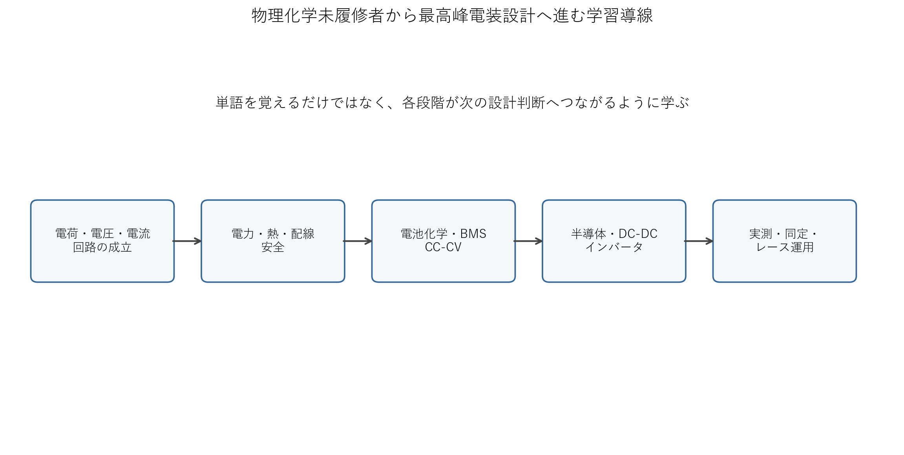
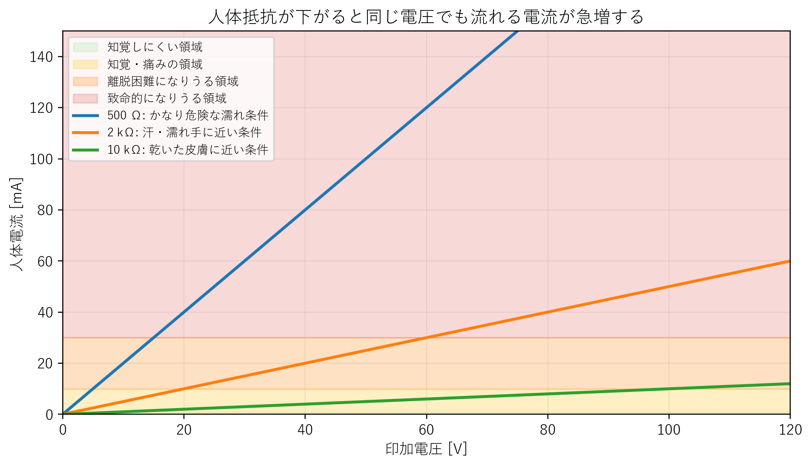
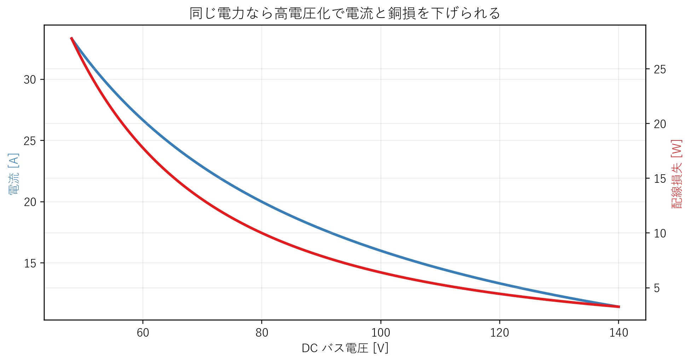
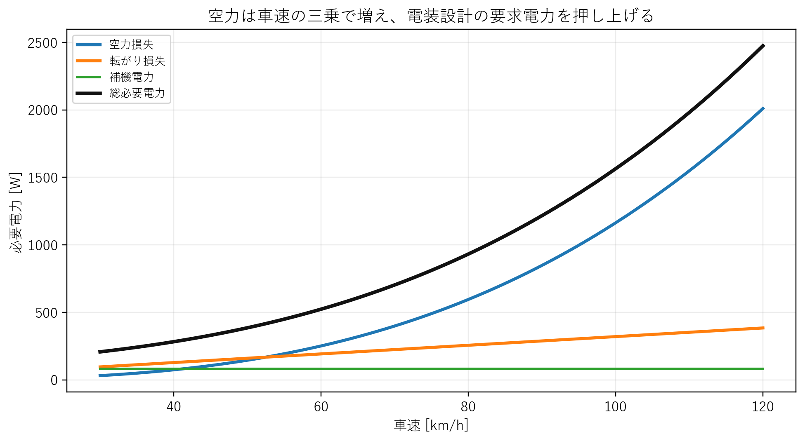
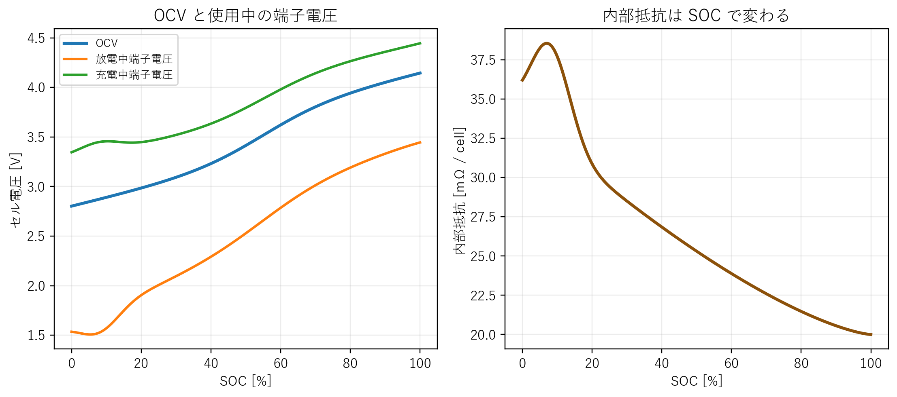
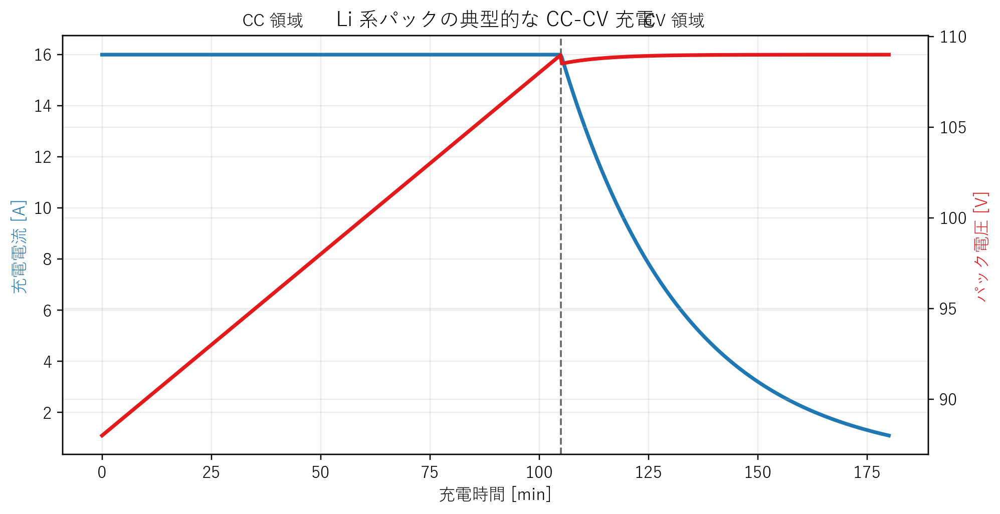
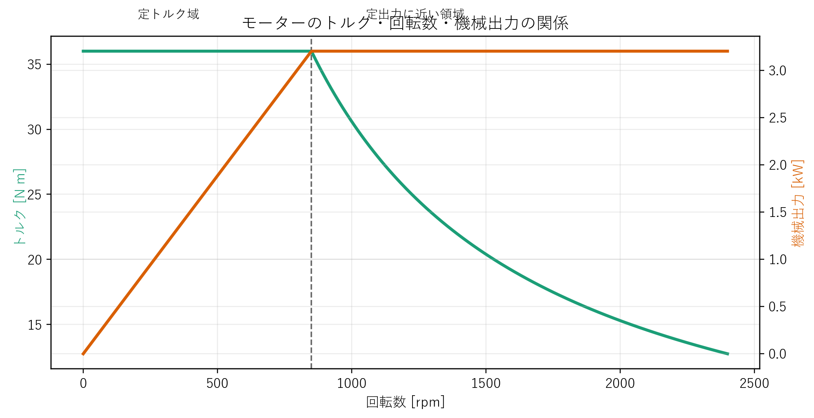
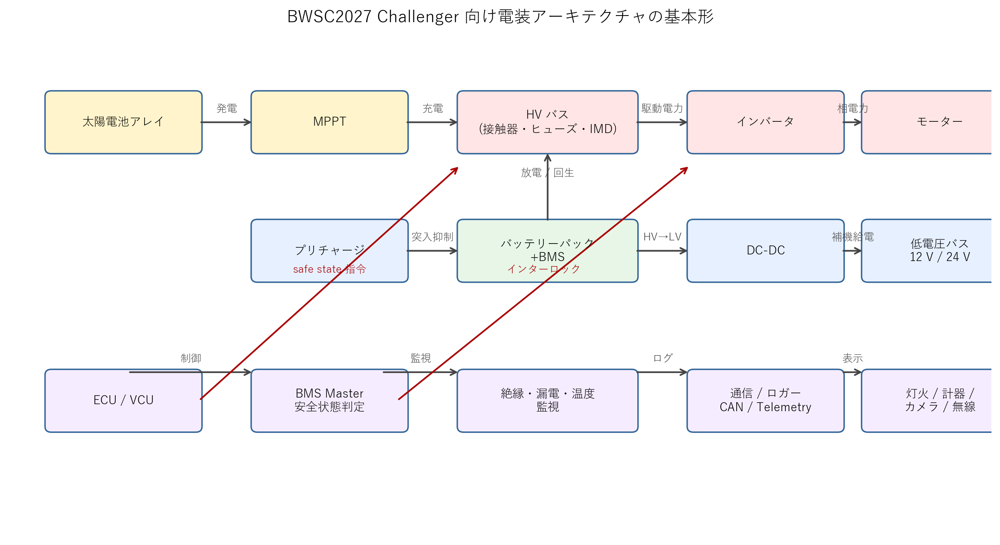
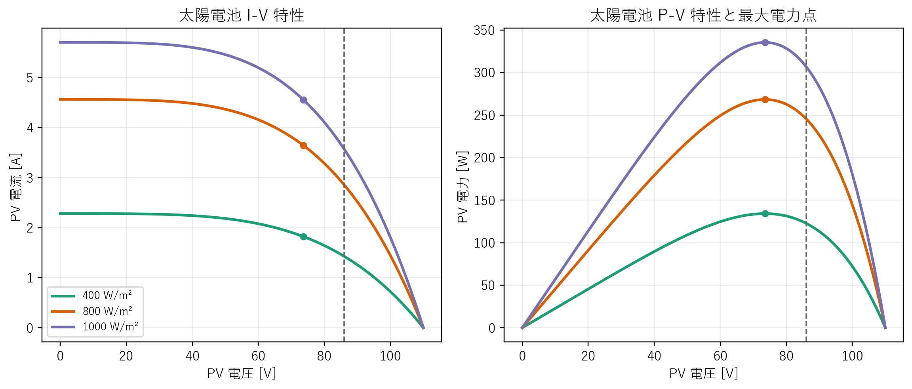

# はじめに

本書は、`0620_シャシダイナモメータを用いた最適エネルギーマネジメント手法の開発_前提知識資料.pdf` の文体と発想を下敷きにしつつ、**BWSC2027 Challenger 車両の電装系だけを、物理化学未履修者でも 1 から理解し、設計し、組み、壊さず、レースへ持ち込める**ように全面再構成した別冊である。

前提を最初に明確にする。

- 本書は MPC や特定ソフトウェア実装を前提にしない。
- 本書は電装系に集中する。ただし、電装系は空力、転がり、熱、重量、視界、安全、整備と切り離せないため、必要な範囲で力学、熱、材料、化学へ話を広げる。
- 本書は「用語集」ではなく「設計判断ができるようになる」ことを目的にする。
- 本書は 2026年6月21日時点で確認した BWSC2027 公式情報を土台にする[^reg2027][^guide2027]。

本書の狙いは単純である。電気を電気だけで閉じないことだ。元資料がところどころでエンジン、トルク、水、人体、発電機、化学へ話を広げていたのは、脱線ではない。**物理は本来つながっており、設計とはそのつながりを使って未来の故障と性能限界を先回りする仕事**だからである。

したがって本書では、各所に次の 3 つを置く。

- 何が起きているか
- それが BWSC2027 電装設計のどの判断に効くか
- その理解が浅いとどこで壊れるか

{ width=92% }

# 本書の読み方

最初から最後まで順番に読めば、電気以前の基礎から本番運用まで流れるように理解できる構成にしてある。ただし、開発の現場では次の使い方が実用的である。

- まだ単語が不安な人は、第 3 章から第 6 章までを丁寧に読む。
- すでに回路は少し分かるが車両設計に落ちない人は、第 7 章から第 13 章を先に読む。
- すでに電装を組み始めている人は、第 14 章以降の安全、EMC、試験、故障解析を重点的に読む。
- 主担当を育てる立場の人は、第 18 章のロードマップと第 19 章のチェックリストを運用の土台に使う。

> **つながりコラム 1: ソーラーカー電装は「配線の話」ではない**
>
> 初学者は電装系という言葉から、バッテリー、配線、スイッチ、ライト程度を連想しがちである。しかし BWSC2027 における電装系は、発電、蓄電、駆動、計測、保護、通信、表示、安全状態、充電、故障診断をすべて束ねた中枢である。空力の良い車体を作っても、BMS が甘ければ走れない。高効率モーターを選んでも、EMI で通信が化ければ危ない。電装設計とは、電流経路だけでなく、熱経路、故障経路、情報経路まで含む全体設計である。

# BWSC2027 で電装系が背負う最上位条件

ソーラーカーは、太陽電池で発電したエネルギーと、限られたバッテリーエネルギーを使って、数千 km の公道を走る。そのため電装系は「後から載せる装備」ではなく、車両成立条件そのものである。

2026年6月21日時点で確認できる BWSC2027 Challenger 主要条件は次の通りである[^reg2027][^guide2027]。

| 項目 | 2026年6月21日時点の確認内容 | 電装設計への意味 |
| --- | --- | --- |
| 開催期間 | `2027-08-22` から `2027-08-29` | 冬季の朝夕温度差、結露、低温時充電制約を考える必要がある。 |
| ルート | Darwin から Adelaide、約 `3020 km` | 一瞬の速さより、数日間の損失積算と故障率が支配的になる。 |
| 太陽電池面積上限 | `6 m^2` | 発電量を面積で逃げられない。セル選定、配線、MPPT の質が順位に効く。 |
| Challenger 蓄電上限 | `11 MJ` | 約 `3055 Wh` であり、バッテリーを大きくして誤差を吸収する設計はできない。 |
| safe state 要求 | 正負極両側接触器によるガルバニック遮断、PV 側自動遮断など | 高電圧系は物理遮断が必須であり、ソフトだけでは完結しない。 |
| 公道イベント | 通常交通下での競技 | 灯火、視界、表示、再始動、誤作動防止、整備性が重要になる。 |
| 日没後走行 | 不可 | 1 日の速度計画は「明日朝に残す SOC」まで含めて立てる必要がある。 |
| control stop | `17:00` 停止、翌 `08:00` 再開 | 夕方以降の封印と朝再始動を前提に安全系を作る。 |
| パック封印 | `19:15` までに封印、`06:15` まで開封不可 | 夜間に電池へ自由に触れられない。夜整備前提の設計は破綻する。 |

この表から分かることは多いが、電装系にとって本質的なのは次の 4 点である。

- 発電源は `6 m^2` に固定される。
- バッテリーで誤差を吸収する余地が小さい。
- safe state は飾りではなく、機械接点と監視回路を含む実体を持たねばならない。
- 数日間壊れないことが、単発の高効率より重要になる。

> **つながりコラム 2: 6 m² と 11 MJ は、設計自由度を削る数字ではなく、設計の中心軸である**
>
> 面積制限とエネルギー制限が厳しいということは、各部の数 % の損失がそのままレース結果へ現れるという意味である。言い換えると、軽いミスを大きなバッファで隠すことができない。だから BWSC の電装設計では、センサ 1 個のオフセット、コネクタ 1 個の接触抵抗、ファン 1 台の消費電力ですら意味を持つ。

# 物理はつながっているという見方

元資料の特徴は、オームの法則から人体、そこからアース、そこから漏電、さらに電源、CC-CV、バッテリー化学、そして発電機、トルク、馬力へと話を広げる点にあった。この広がり方は正しい。なぜなら設計では、次の等式群が同時に成立しているからである。

$$
P = VI
$$

$$
P = Fv
$$

$$
P = T \omega
$$

ここで、

- \(V\) は電圧
- \(I\) は電流
- \(F\) は力
- \(v\) は速度
- \(T\) はトルク
- \(\omega\) は角速度

である。式が 3 つあるように見えるが、どれも「単位時間あたりにどれだけエネルギーを流しているか」を別の言葉で書いているだけである。したがって、

- 車体の空力が悪くなって必要な力 \(F\) が増える
- 同じ車速 \(v\) を保つために必要な機械出力 \(P\) が増える
- モーターの必要トルク \(T\) と電流 \(I\) が増える
- バッテリーと配線の損失 \(I^2R\) が増える
- 発熱が増え、温度上昇で効率が落ちる
- さらに必要電力が増える

という連鎖になる。

つまり、空力設計と電装設計は別ではない。バッテリー化学とドライバー運転も別ではない。水濡れと感電も別ではない。**物理現象は 1 台の車の中で全部つながって同時に起きている**。本書はその前提で書く。

# 電気以前の基礎知識

## 原子、電子、電荷

物質は原子からできている。原子は陽子、中性子、電子からなる。陽子は正の電荷、電子は負の電荷を持つ。通常の物質は、陽子数と電子数が釣り合って全体として中性である。

電気を理解するには、まず「電荷」という概念を分けて考える必要がある。電荷とは、物体が持つ電気的性質である。電子はその電荷を担う粒子の一種である。金属では、ある種の電子が特定の原子に縛られず動ける。この動ける電子を自由電子と呼ぶ。

高校化学では、電子は電子殻に入ると教わる。これは理解のための模型である。実際には確率的な電子雲として扱う方が正確だが、初学段階では「電子の持ちやすさ、離しやすさが材料の性質を決める」と掴めば十分である。

## 電圧、電流、抵抗

電気を考える最小単位は次の 3 つである。

- 電圧: 電荷を動かそうとする差
- 電流: 電荷が実際に移動すること
- 抵抗: 電流の流れにくさ

オームの法則はこれらの関係を表す。

$$
V = RI
$$

$$
I = \frac{V}{R}
$$

ここで重要なのは、**電圧は掛かるものであり、電流は流れるものである**という区別である。絶縁体の両端にも電圧は掛かりうる。しかし自由電子やイオンが動けなければ大きな電流は流れない。

## 回路とは何か

回路とは、電流が出て、負荷を通り、戻る一周の経路である。回路が閉じていない限り、電圧が存在しても電流は流れない。感電も同じである。高電圧に触れただけで必ず感電するわけではない。**人体を通って戻る経路が成立したときに感電する**。

## 導体、絶縁体、半導体

金属は導体である。自由電子が動きやすいからである。ゴム、プラスチック、ガラス、乾いた木、空気は絶縁体として扱われる。条件次第で導電性は変わるが、通常は電子やイオンが動きにくい。

半導体はその中間である。条件や構造によって電流の通しやすさを大きく変えられる。この性質がダイオード、トランジスタ、MOSFET、IC、マイコン、センサの基礎になる。

## 水、イオン、人体

水道水や汗で電流が流れるのは、水そのものに自由電子が多いからではない。水に溶けたイオンが移動するからである。純水は比較的流しにくい。しかし現実の現場にあるのは純水ではなく、水道水、汗、泥水、結露、雨水である。これらはイオンや不純物を含み、十分危険である。

人体の内部には水分とイオンが多く含まれる。皮膚表面は比較的抵抗が高いが、汗や水、傷、圧着状態により大きく下がる。

{ width=86% }

したがって、同じ 80 V 級高電圧でも、

- 乾いた手で一瞬触れた場合
- 汗ばんだ手で強く掴んだ場合
- 濡れた床上で、他方が車体に接触している場合

では危険度が全く異なる。

> **つながりコラム 3: 人体は「負荷」である**
>
> 元資料の重要な視点は、人間も回路条件によっては負荷の一部になる、という見方である。これは比喩ではない。電源の高電位側と低電位側を人体が橋渡しすれば、人体は抵抗体として回路に入る。安全設計とは「人が気をつけること」ではなく、「人が回路の最低抵抗経路にならない構造を先に作ること」である。

# 電力、熱、重い負荷、軽い負荷

電装設計では、電圧と電流だけでなく、電力と熱まで見ないと判断を誤る。

$$
P = VI
$$

$$
P = I^2 R = \frac{V^2}{R}
$$

ここで \(P\) は電力である。電力は単位時間あたりのエネルギーであり、電装系ではほぼ常に「どこで熱になるか」とつながっている。

配線や接点の損失は \(I^2R\) で増える。したがって、同じ電力を送るなら電流を減らした方が有利である。高電圧化の理由はここにある。

{ width=84% }

また、元資料が使っていた「重い負荷」「軽い負荷」という表現は有用である。抵抗が小さく大電流を要求するものは重い負荷であり、電源や配線やコネクタやスイッチ素子に大きな負担をかける。

> **つながりコラム 4: なぜ大電流はシステムを巨大化させるのか**
>
> 電流が増えると、配線を太くし、端子を強くし、接触抵抗を下げ、放熱器を大きくし、ヒューズ定格を上げ、接触器も大きくせねばならない。すると質量が増える。質量が増えると転がり抵抗と加速エネルギーが増える。つまり、大電流は電装だけの問題ではなく、車両全体を重くし、さらに必要電力を増やす。

## 短絡と突入電流

短絡とは、ほぼ 0 Ω に近い経路で電源の高低電位がつながることである。理想電圧源なら無限大電流が必要になるが、現実の電源は限界を持つ。限界前に保護が入らなければ、発熱、焼損、溶断、アーク、火災になる。

突入電流も重要である。これは定常では安全でも、立ち上がり瞬間に危険が出る現象である。コンデンサ入力のインバータや DC-DC は、立ち上げ時に大電流を吸い込む。これを抑えるのがプリチャージである。

コンデンサの蓄えるエネルギーは次である。

$$
E_C = \frac{1}{2} C V^2
$$

したがって高電圧化すると、同じ容量でも突入時に処理すべきエネルギーが増える。高電圧化は良いことばかりではない。**電流を下げる利益と、絶縁・安全・突入の難しさが同時に増える**。

## 発熱と熱設計

発熱は電気回路を壊す最も一般的な原因の一つである。MOSFET、シャント、コネクタ、ヒューズ、コイル、DC-DC、インバータ、MPPT、バッテリーすべてが熱で壊れうる。

単純化した熱設計では、

$$
\Delta T = P_{loss} R_{\theta}
$$

と見なせる。ここで \(R_{\theta}\) は熱抵抗である。損失 \(P_{loss}\) が大きいか、熱抵抗が大きいと温度上昇は大きくなる。

{ width=86% }

この図は車速に対する必要電力を示しているが、同時に電装へ流れる電流の増加も意味する。車速が上がると空力損失が増え、それを補うために電装系の負担も増える。**熱は電装単体ではなく、車両要求電力の結果として現れる**。

# GND、アース、漏電、safe state

GND とアースは同じではない。

- GND: 回路内の基準電位
- アース: 大地とつながる接地
- 保護接地: 故障時に人体ではなく低抵抗経路へ電流を逃がすための接地

車両では、建物のような大地基準と異なり、浮いた系として設計する部分も多い。このとき重要なのは、故障時にどこへ電流が流れうるかを説明できることである。

漏電とは、本来の経路から外れて電流が別経路を通ることである。地絡とは大地や接地系へ接触してしまう故障である。短絡とは高低電位が低抵抗で直接つながる故障である。似ているが意味は異なる。

BWSC2027 が safe state を厳密に要求する理由は明快である。事故現場や車検で、救助者や審査員が「この車体外部に危険な高電圧が残っていない」と判断できなければならないからである。

> **つながりコラム 5: safe state は電装の倫理である**
>
> 技術的には動けばよい、では済まない。事故現場では、触る人が設計者より電装に詳しいとは限らない。だからこそ safe state は、設計者だけが理解できる状態ではなく、誰にとっても危険が減っている状態でなければならない。表示、接触器、放電時間、インターロック、配線露出、サービスプラグの位置はすべてここへ収束する。

# バッテリーを理解するための化学

## 電池は理想電圧源ではない

バッテリーは化学反応で電位差を作る装置である。電極、電解質、セパレータ、集電体、界面反応がすべて関与する。外から見ると電圧源に見えるが、内部では反応速度、イオン移動、温度、内部抵抗に制約される。

開放電圧 OCV は、外部に電流が流れていないときの電圧である。使用中の端子電圧は OCV と一致しない。

$$
V_{term} = OCV(SOC,T) - I R_{int}(SOC,T) - V_{pol}
$$

ここで \(V_{pol}\) は反応遅れや分極による項である。

{ width=90% }

## 酸化、還元、電位

化学では、電子を失うことを酸化、受け取ることを還元という。放電時、ある電極では電子が外部回路へ出て、別の電極では電子を受け取る。この電子の流れが回路電流になる。

ここで重要なのは、電位差は「電子の数が多い少ない」だけで決まるわけではないということである。材料種、結晶構造、界面、イオンの安定性、温度が関わる。したがって、電池の化学を知らずに電圧だけで設計すると破綻する。

## Ah、Wh、C レート

容量 Ah は、どれだけ電流をどれだけの時間流せるかという量である。エネルギー Wh は、どれだけ仕事ができるかという量である。

$$
E[\mathrm{Wh}] \approx V_{nom}[\mathrm{V}] \times Q[\mathrm{Ah}]
$$

BWSC2027 の上限 `11 MJ` は、およそ次に相当する。

$$
11 \times 10^6[\mathrm{J}] \div 3600 \approx 3055[\mathrm{Wh}]
$$

C レートとは、容量基準の充放電速度である。1C は 1 時間で空または満充電になる電流に相当する。5 Ah のセルなら 1C は 5 A である。

## CC-CV 充電

Li 系バッテリーは一般に CC-CV 充電を使う。最初は定電流で充電し、上限電圧に達したら定電圧へ移る。

{ width=86% }

ここで理解しておくべきことは、充電速度は単なる時間短縮の問題ではないという点である。速すぎる充電は、電池内部に無理な化学反応を強いる。結果として発熱、ガス発生、内部抵抗増加、寿命低下、析出、最悪では内部短絡につながる。

## 過充電、過放電、低温充電

Li 系セルの設計では、上限電圧と下限電圧を厳守する必要がある。過充電は電解液分解、発熱、膨張、発火につながる。過放電は SEI 膜破壊、銅溶出、内部抵抗増大、再充電時の内部短絡につながる。

低温時充電も危険である。低温ではイオン移動が遅くなり、充電で反応が追いつかない。これがリチウム析出のリスクを高める。BWSC は冬季開催であり、朝のパック温度と充電可否判定は重要である。

> **つながりコラム 6: バッテリーは「電気部品」である前に「化学反応器」である**
>
> 電装設計者が陥りやすい誤解は、セルを一定電圧・一定容量の箱とみなすことである。実際のセルは温度で性格を変え、SOC で内部抵抗を変え、電流履歴で端子電圧を変え、過去のダメージを蓄積する。バッテリーは回路図の中では電源だが、現実世界ではゆっくり反応する化学プラントである。

# 電磁気、モーター、発電機、トルク

## 発電の原理

発電とは、機械エネルギーを電気エネルギーへ変換することだ。モーターは電気から回転力を得る。発電機は回転力から電気を得る。原理はほぼ裏返しである。

磁界中で導体やコイルの状態が変化すると電圧が生じる。これが電磁誘導である。回転数を上げれば一般に誘起電圧は上がる。

## トルクと回転数と電力

機械出力は次で与えられる。

$$
P = T \omega
$$

この式が非常に重要である。電気側で大電流を取り出すとは、機械側で大きなトルク要求を生むこととつながっている。元資料がエンジンや馬力の話へ飛んでいたのはこのためである。

{ width=86% }

モーターの基礎式として、定数を簡略化すれば、

$$
T \propto I
$$

$$
e \propto \omega
$$

と見なせる。すなわち、トルクは電流と、逆起電力は回転数と強く結びつく。すると、

- 低速で大トルクがほしいと大電流が要る
- 高速では逆起電力が上がり、必要電圧が増える
- バス電圧が低いと高速域が苦しくなる
- 電流が増えると銅損と発熱が増える

という関係になる。

## 回生は常に得ではない

回生は、モーターを発電機として用い、運動エネルギーを電池へ戻すことである。しかし回生は魔法ではない。回生にはモーター損失、インバータ損失、配線損失、バッテリー充電損失がある。

$$
P_{regen,batt} = T_{regen} \omega \eta_{motor} \eta_{inv} \eta_{batt}
$$

低減速や交通に合わせた微妙な速度制御では、回生より惰性走行の方が有利な場合もある。したがって、回生があるからブレーキ戦略が雑でもよい、とはならない。

# ソーラーカーが必要とする力と電力

電装設計において、車体力学を知らないことは大きな不利になる。なぜなら必要電力の源泉は車体が受ける抵抗だからである。

## 空力抵抗

空力抵抗は次で与えられる。

$$
F_d = \frac{1}{2} \rho C_d A v^2
$$

必要電力はさらに車速を掛けて、

$$
P_d = F_d v = \frac{1}{2} \rho C_d A v^3
$$

となる。つまり空力起因の必要電力は車速の三乗で増える。

## 転がり抵抗

転がり抵抗は概ね次で表せる。

$$
F_r = C_{rr} m g
$$

必要電力は、

$$
P_r = C_{rr} m g v
$$

であり、車速に比例する。

## 登坂と加速

勾配角 \(\theta\) に対して登坂抵抗は、

$$
F_g = m g \sin \theta
$$

加速で必要な力は、

$$
F_a = m a
$$

である。したがって総必要力は、

$$
F_{req} = F_d + F_r + F_g + F_a
$$

必要機械出力は、

$$
P_{mech} = F_{req} v
$$

である。

{ width=88% }

この図が示す通り、高速になるほど空力損失が支配的になる。つまり、速く走ろうとするほど、電装系はより大きな電流と熱と安全リスクを背負う。**電装設計は、車体が必要とする電力のしわ寄せを最前線で受ける**。

> **つながりコラム 7: 空力の悪い車は、電装で帳尻を合わせられない**
>
> ときどき「電池を強くすればよい」「モーターを高出力にすればよい」と考えたくなる。しかし空力損失は速度三乗で増える。車体が悪いと、必要電力はすぐ大きくなる。すると電流、損失、熱、重量、安全要求が一気に重くなる。電装系は車体の弱さを隠せない。むしろ最も早く悲鳴を上げる。

# 電装系の要件定義

ここから先は、実際に BWSC2027 Challenger の電装系を定義するための章である。最初にやるべきことは部品探しではない。要求仕様を固定することである。

## 最初に固定すべき主要値

| 分類 | 最初に固定すべき値 |
| --- | --- |
| エネルギー | バッテリー上限 Wh、1 日当たり消費目標、予備率 |
| 高圧系 | 公称電圧、最大電圧、最小電圧、最大放電電流、最大回生電流 |
| 発電系 | アレイ構成、想定 Voc、想定 Isc、MPPT 入出力範囲 |
| 駆動系 | 巡航域出力、最大機械出力、最大相電流、回生制限 |
| 低圧系 | 12 V / 24 V の必要性、補機平均電力、ピーク電力 |
| 安全 | safe state 条件、インターロック条件、絶縁監視しきい値 |
| 環境 | 温度範囲、雨、砂、結露、振動、塩分、紫外線 |
| 運用 | 充電手順、封印対応、サービスアクセス、交換時間 |
| 計測 | 必須ロギング項目、更新周期、時刻同期、通信冗長性 |

## 要件定義の順番

1. 公式規則で固定される値を置く。
2. 車体側が要求する巡航速度帯と必要電力を置く。
3. その電力を安全に扱える電圧帯と電流帯を決める。
4. その条件で成立するバッテリー、接触器、ヒューズ、ケーブルを決める。
5. その上で MPPT、DC-DC、インバータ、BMS をつなぐ。
6. 最後に計測系、通信系、表示系を重ねる。

この順番が重要である。計測や表示を先に決めてはならない。なぜなら主系統が決まる前に補機電源構成を決めると、あとで GND、絶縁、ノイズ、ハーネス、消費電力が全部やり直しになるからである。

## 最高峰設計に必要な余裕の考え方

最高峰設計とは、限界ギリギリに削ることではない。**どこを攻め、どこに余裕を持たせるかの選び方がうまい設計**である。

- 車体必要電力の見積りには、風、温度、タイヤばらつき、路面悪化の余裕を入れる。
- 高圧部品の電圧定格は瞬時過電圧を含めて余裕を持つ。
- ケーブルとコネクタは連続電流だけでなく高温・密閉・接触劣化を含めて余裕を見る。
- BMS 制限値は「壊れない限界」ではなく「劣化させない限界」を用いる。
- テレメトリと表示は 1 系統故障しても最低限走れる構成にする。

# BWSC2027 電装アーキテクチャの基本形

{ width=96% }

基本ブロックは次の通りである。

- 太陽電池アレイ
- MPPT
- バッテリーパック
- BMS
- ヒューズ
- 正負極接触器
- プリチャージ回路
- 絶縁監視
- インバータ
- モーター
- DC-DC
- 低圧バス
- ECU / VCU
- 灯火、計器、カメラ、通信、ロガー

ここで重要なのは、主電力経路と監視経路を混同しないことだ。たとえば BMS は大電流を流す部品ではないが、接触器を開ける権限を持つため、主電力系の成立条件そのものを支配する。

> **つながりコラム 8: 主役は電力経路だが、勝敗を分けるのは監視経路である**
>
> 大きな電力はバッテリーからインバータへ流れる。しかし、その電力をいつ許可し、いつ止め、何を異常とみなすかは、比較的小さな信号系が決める。つまり電装系では、細い線が太い線の運命を決める。だから低圧信号系の信頼性を軽視してはならない。

# 太陽電池アレイと MPPT

## 太陽電池は定電圧源でも定電流源でもない

太陽電池は照度、温度、セル状態で I-V 特性が変わる発電素子である。

{ width=92% }

最大電力点 MPP が存在し、そこから外れると取り出せる電力は落ちる。MPPT はこの最大電力点付近へ動作点を追い込む変換器である。

## 直列、並列、部分影

直列を増やすと電圧が上がる。並列を増やすと電流が上がる。部分影があると、直列列全体の電流が制限されることがある。これがホットスポットと出力低下を生む。

バイパスダイオードは、影になった列を迂回する電流経路を作るために入れる。これは効率部品であると同時に保護部品でもある。

## 太陽電池温度

セル温度が上がると一般に開放電圧は下がり、発電効率も落ちる。したがって、夏だけでなく冬晴天でも、日射と低風速でパネル温度はかなり上がりうる。パネル裏面温度を観測していないと、発電低下の原因を日射だけで誤解しやすい。

## MPPT 設計で決めること

- 入力最大電圧と温度補正後 Voc の整合
- 入力最大電流と短絡電流の整合
- 出力電圧範囲とバッテリー範囲の整合
- 効率マップ
- 部分影時挙動
- 高温停止条件
- 通信とログ取得方法

## 最高峰設計の要点

- 発電量だけでなく、発電量の再現性を重視する。
- アレイ配線の接触抵抗と修理性を重視する。
- 部分影時の劣化モードを走行前に把握する。
- MPPT 1 台停止時にどこまで走れるかを確認する。

# バッテリーパックと BMS

## セル選定

セル選定で見るべきものは、単なるエネルギー密度ではない。

- 公称電圧
- 上限電圧、下限電圧
- 連続充放電電流
- 内部抵抗
- 温度特性
- 低温充電可否
- 寿命
- 安全データ
- 製造ばらつき
- 入手性とトレーサビリティ

## 直列数と電圧帯

直列数を増やすと、同じ電力でも電流を下げられる。しかし絶縁要求、接触器定格、充電器仕様、DC-DC 選定、保守時感電リスクは上がる。最適電圧帯は、車両必要電力、部品入手性、安全設計、レギュレーション、運用能力で決まる。

## BMS が必ず持つべき機能

- 全セル電圧監視
- 温度監視
- パック電流計測
- SOC / SOH 推定
- 過充電保護
- 過放電保護
- 過電流保護
- 低温充電禁止
- セルバランス
- 接触器制御インターフェース
- 異常ログ

## セルバランス

受動バランスは高いセルの余分なエネルギーを熱として捨てる。能動バランスはエネルギーを移送する。BWSC のように容量が限られ、かつ高信頼性が必要な場合は、複雑性と得られる利益を冷静に比較する必要がある。

## 内部抵抗と発熱

パック発熱は概ね次で増える。

$$
P_{loss,batt} = I^2 R_{int,pack}
$$

したがって、電流を半分にできれば電池損失は 4 分の 1 に近づく。これは車体設計、電圧帯設計、走行速度戦略の価値を示している。

## 接触器、ヒューズ、サービスプラグ

ヒューズは最終保護であり、普段の制御に使うものではない。接触器は通常遮断と safe state を担う。サービスプラグは整備分離のための明確な手段である。これらは見た目より重要で、整備手順書や車検手順に直結する。

## プリチャージ

インバータ入力コンデンサへ一気に接続すると突入電流が危険になる。そこでプリチャージ抵抗を通してゆっくり充電し、電位差が十分下がってから主接触器を閉じる。

プリチャージ設計では次を確認する。

- 抵抗値
- パルス耐量
- 充電時間
- 接触器シーケンス
- タイムアウト異常判定
- 主接点溶着時の故障モード

## 絶縁監視

車体に対する HV 系絶縁が低下すると、感電・誤作動・火災の危険が増える。IMD などの絶縁監視は、ただ付ければよいのではなく、しきい値、遅延、表示、ログ、safe state 連携まで含めて設計する必要がある。

> **つながりコラム 9: BMS は「電池の見張り」ではなく「電装系の司法」である**
>
> BMS は測るだけの装置ではない。何が違反かを判断し、どの制限をかけ、どの時点で駆動を止めるかを決める。つまり BMS は電池担当というより、電装系全体の安全と寿命を裁定する存在である。

# モーター、インバータ、回生系

## モーター選定

モーター選定では次を見る。

- 効率マップ
- 定格出力
- 最大トルク
- 定常発熱
- ピーク発熱
- 冷却方法
- 回生可能範囲
- 防水性
- ベアリング寿命
- 実走行速度域での効率

## インバータ選定

- 入力電圧範囲
- 最大相電流
- スイッチング損失
- 低負荷効率
- 回生受入れ制御
- 通信仕様
- 異常出力
- 絶縁要件
- 冷却要件

## 相電流とバッテリー電流は違う

初学者が混同しやすい点だが、インバータ内部では相電流と DC バス電流は一致しない。PWM や位相関係で変わる。したがって「バッテリー 40 A だから相線も 40 A でよい」とはならない。配線とセンサは、それぞれの実効条件で選ぶ必要がある。

## 逆起電力、インダクタンス、スイッチング

コイル電流を急に切ると逆起電力が出る。これはモーター、リレー、ソレノイドに共通する。インバータ設計では、MOSFET や IGBT のスイッチング損失、デッドタイム、dv/dt、di/dt が EMI と発熱に直結する。

$$
V = L \frac{di}{dt}
$$

であるから、電流を急激に変えようとするほど大きな電圧が現れる。これはノイズでもあり、素子ストレスでもある。

## 回生受入れ制限

回生は電池が受け入れられるときだけ成立する。高 SOC、低温、セルばらつき、BMS 制限、電圧上限付近では回生制限が必要になる。そのとき車両はどの減速度を維持するのか、機械ブレーキとの協調はどうするのかを決めておかねばならない。

# 低圧系、計測系、通信系

高圧主系統が目立つが、レースで車を走らせ続けるのは低圧系である。ここが弱いと車はまともに走れない。

## 低圧バス

12 V と 24 V のどちらを使うかは、補機電力、部品入手性、ライト、ファン、カメラ、通信機器で決まる。DC-DC は主系統電圧範囲全体で安定に動き、低負荷でも無駄に損失を出しすぎないものを選ぶ。

## 必須計測

最低限、次は必要である。

- パック電圧
- パック電流
- 全セル電圧
- 主要セル温度
- モーター温度
- インバータ温度
- MPPT 入出力
- 車速
- GPS 位置
- 日射または発電量
- 補機電力
- safe state 関連信号

## センサ選定

センサは精度だけで選んではならない。

- 絶対精度
- 再現性
- 温度ドリフト
- サンプリング帯域
- 絶縁要否
- EMI 耐性
- 故障時出力
- 校正方法

## 通信

車載通信では CAN 系が一般的であるが、重要なのはプロトコルよりも故障時挙動である。1 ノード沈黙、1 ノード暴走、配線断、終端抜け、GND 電位差に対して、何がどう見えるかを設計時に理解する。

## 表示とドライバー情報

表示器は派手である必要はない。必要なのは、日射下で読めること、異常時に誤解しないこと、起動が速いこと、情報量が適切であること、停止条件が明確であることだ。

> **つながりコラム 10: センサがあることと、測れていることは違う**
>
> 電圧センサが付いていても GND ノイズで飛べば意味がない。温度センサがあっても冷えた外側セルだけを見ていれば意味がない。GPS があっても時刻同期が崩れていれば戦略に使えない。計測とは、部品を付けることではなく、信頼できるデータを得ることである。

# 配線、コネクタ、グラウンド、EMC、防水

## 配線はただの銅線ではない

配線には抵抗、インダクタンス、容量、重量、発熱、ノイズ放射、機械疲労、振動故障がある。太くすれば安全というわけでもない。重く、硬く、取り回しが悪くなり、端子へ無理な力をかけることもある。

配線設計で見る項目は次である。

- 連続電流
- 瞬時電流
- 許容温度
- 電圧降下
- 被覆耐熱
- 曲げ半径
- 振動
- 耐摩耗
- 防水引き込み
- サービス性

## コネクタ

高電流コネクタでは接触抵抗が重要である。仮に接触抵抗が \(1 \mathrm{m}\Omega\) で 100 A 流れれば、そこで 10 W 発熱する。接触が少し悪くなるだけで局所加熱が進み、さらに抵抗が増え、また熱くなるという悪循環になる。

## グラウンドとリターン経路

ノイズ対策の本質は、欲しい信号の帰り道を理解することである。電流は行きだけでなく戻りでループを作る。したがって、

- モーター相線の近くにセンサ線を通さない
- 大電流ループ面積を小さくする
- アナログ GND とパワー GND の混ざり方を管理する
- シャーシ経由の予期しない帰還経路を作らない

ことが重要になる。

## EMC / EMI

PWM、インバータ、DC-DC、無線、カメラ、LED ドライバはノイズ源になる。EMI 問題は「たまに通信が変になる」程度に見えて、実際には誤作動、BMS 通信断、表示暴走、センサ誤読を起こしうる。

対策は地味だが王道である。

- ループ面積を小さくする
- 差動配線を使う
- シールドを適切に使う
- フィルタを入れる
- スイッチング波形を必要以上に鋭くしない
- 信号系と電力系を物理的に離す

## 防水、防塵、結露

BWSC では雨だけでなく、朝の結露、汗、洗車、粉塵、塩分、夜露がある。防水とは「絶対に入れない」だけではない。**入っても溜まらない、抜ける、乾く、腐食しにくい**まで含む。

車外コネクタは上向きにしない。ケーブルはドリップループを持たせる。ケースは通気と防水を両立させる。結露しうることを前提に、基板コーティングやベントを考える。

## 熱と防水の衝突

密閉すれば防水はしやすいが、熱がこもる。放熱を強めると、防水や粉塵耐性が難しくなる。したがって、MPPT、DC-DC、インバータ、BMS マスタなどの配置は、防水設計と熱設計を同時に見る必要がある。

# 半導体、電源回路、スイッチングの基礎

車両電装では、MOSFET、ダイオード、レギュレータ、コンバータの理解が必要になる。深い半導体物理までは不要だが、何が壊れる原因かは知っておくべきである。

## ダイオード

電流を一方向に流しやすい素子であり、逆接続保護、フライバック、整流、ORing などに使う。逆回復や順方向電圧降下を無視すると損失やノイズで痛い目を見る。

## MOSFET

ゲート電圧で導通を制御する素子である。オン抵抗 \(R_{DS(on)}\) が低いほど導通損失は小さくなるが、ゲート駆動、スイッチング速度、熱設計、耐圧、SOA も重要である。

## リニア電源とスイッチング電源

リニアは静かだが損失が大きい。スイッチングは効率が高いがノイズを出しやすい。高圧から低圧を作る車両ではスイッチングが中心になるが、センサ基準や微小信号には後段でリニアを重ねる構成もありうる。

## 逆起電力と保護

コイル負荷を切ると逆起電力が出る。フライバックダイオード、スナバ、TVS などで逃がす。これを怠ると、スイッチ素子だけでなく周辺通信系まで巻き込んで壊す。

# 安全設計と状態遷移

電装系では、通常動作を考えるだけでは不十分である。異常時にどこへ遷移するかを先に決める必要がある。

## 代表的な状態

- 完全停止
- サービス作業
- プリチャージ中
- 駆動許可
- 走行中
- 充電中
- 回生制限中
- safe state
- 緊急停止後確認中

各状態で、何が許可され、何が禁止されるかを文書化する。

## safe state へ遷移させる条件の例

- 衝突信号
- 絶縁低下
- 接触器異常
- BMS 危険温度
- 過電圧
- 過電流
- 手動 E-stop
- HVIL 断
- 車検・整備要求

## safe state からの復帰

復帰条件を曖昧にしてはならない。一瞬しきい値をまたいだからといって自動復帰すると危険である。手動確認、ラッチ、ログ保存、温度回復、絶縁回復確認などが必要になる。

> **つながりコラム 11: 安全設計は異常検知より状態遷移設計で決まる**
>
> センサしきい値だけでは安全は作れない。異常を見つけた後、どの順番で何を切り、何を残し、何を表示し、誰がどう復帰させるかまで決まって初めて安全機能になる。設計とは、正常時のフロー図ではなく、異常時の順序を定義することでもある。

# 試験、同定、検証

最高峰設計は、良い理論だけでは作れない。良い理論を、壊さず、再現よく、測り、更新するループで作る。

## 試験の順番

1. セル単体試験
2. BMS 単体試験
3. 接触器・プリチャージ試験
4. MPPT 単体効率試験
5. DC-DC 単体試験
6. インバータ・モーター台上試験
7. パック統合試験
8. HV 安全試験
9. 低圧統合試験
10. 実車静止試験
11. 低速走行試験
12. 実路長時間試験

## 必ず取るべきログ

- 時刻
- パック電圧
- パック電流
- 全セル最小 / 最大電圧
- セル温度
- モーター温度
- インバータ温度
- MPPT 電圧、電流、電力
- 補機電流
- 車速
- GPS
- 異常フラグ

## 効率測定

発電、充電、放電、駆動、回生の各段で効率を測る。総合効率は個別効率の積で決まる。

$$
\eta_{total} = \eta_{pv} \eta_{mppt} \eta_{batt} \eta_{inv} \eta_{motor} \eta_{drivetrain}
$$

どこか 1 か所の 2 % 悪化は、総合で見ると無視できない。

## 故障注入

本当に強いチームは、壊れたときのふるまいを事前に知っている。次の試験をやるべきである。

- センサ断線
- センサ短絡
- CAN 断
- 接触器溶着模擬
- DC-DC 停止
- MPPT 1 台停止
- IMD 警報
- 低温充電条件

# よくある破綻パターン

## 電圧は合っているが、電流を見ていない

公称電圧だけで部品を選ぶと、加速、登坂、回生、プリチャージで電流限界に当たる。

## センサはあるが、配置が悪い

セル温度を外側だけ見て内側の過熱を見落とす。パネル温度を取らず発電低下原因を誤る。GND 配置が悪く電流センサが飛ぶ。

## 防水したつもりで熱停止する

密閉ケースにして安心し、実走行で DC-DC や MPPT が熱停止する。

## 高効率部品を寄せ集めて、全体効率を落とす

個別効率だけ見て、配線長、コネクタ、冷却、動作点ずれで総合を落とす。

## safe state があるつもりで、実際には残留電圧が残る

接触器を開いても入力コンデンサが残る。PV 側遮断が遅い。表示が誤解を招く。

# 本番運用の考え方

レースでは、設計値そのものよりも、運用の一貫性が効く。

## 毎朝確認すること

- パック温度
- セル電圧ばらつき
- 絶縁状態
- MPPT 起動確認
- DC-DC 起動確認
- 灯火確認
- カメラ / 表示確認
- 通信確認
- 異常ログ有無

## 毎夕確認すること

- その日の最大温度
- 最低セル電圧
- 最大電流
- 回生制限発生回数
- 通信断履歴
- 水侵入有無
- コネクタ緩み
- ケーブル擦れ

## レース中に監視すべき量

- 残エネルギー
- 発電電力
- 現在消費電力
- セル最小電圧
- セル温度上昇傾向
- インバータ温度
- 通信喪失有無
- 異常フラグ

## ドライバーとエンジニアの役割分担

ドライバーには多すぎる情報を渡してはいけない。ドライバーに必要なのは、行動へ直結する少数の情報である。一方、伴走側には詳細ログが必要である。表示階層を分けるべきである。

# 物理化学未履修者から最高峰設計へ進む学習ロードマップ

最後に、最短で力を付ける順番を整理する。

## 第 1 段階

電圧、電流、抵抗、電力、回路、導体、絶縁体、感電を理解する。

## 第 2 段階

バッテリーの OCV、端子電圧、C レート、CC-CV、過充電、過放電を理解する。

## 第 3 段階

配線損失、コネクタ発熱、プリチャージ、接触器、ヒューズ、安全状態を理解する。

## 第 4 段階

太陽電池 I-V 特性、MPPT、部分影、パネル温度、発電予測を理解する。

## 第 5 段階

モーター、インバータ、トルク、逆起電力、回生、効率マップを理解する。

## 第 6 段階

センサ、CAN、時刻同期、EMI、GND、シールド、防水、熱設計を理解する。

## 第 7 段階

実測、ログ解析、故障注入、レース運用へ進む。

> **つながりコラム 12: 深い理解とは、別分野へ飛べることである**
>
> 本当に理解できているとき、人はオームの法則から配線発熱へ飛べる。配線発熱から接点寿命へ飛べる。接点寿命からレース中の停止リスクへ飛べる。空力から電流へ飛べる。電池化学から朝の充電可否へ飛べる。つまり理解の深さとは、単語数ではなく、概念のあいだを往復できる力である。

# 開発レビュー用チェックリスト

## 要件定義

- 規則由来の制約値を文書化したか
- 電圧帯と電流帯を説明できるか
- 最高温、最低温、雨、結露条件を入れたか
- 封印運用を考慮したか

## 発電系

- Voc と温度補正後最大電圧が MPPT 定格内か
- 部分影時の挙動を把握したか
- 発電量ログを取れるか
- パネル温度を見ているか

## バッテリー / BMS

- 全セル電圧と温度を見ているか
- 低温充電禁止条件があるか
- 過充電 / 過放電 / 過電流 / 絶縁異常で止まるか
- 接触器、ヒューズ、サービスプラグがあるか

## 駆動系

- 巡航域効率を説明できるか
- 回生受入れ限界を知っているか
- 相電流とバス電流を区別しているか
- モーターとインバータ温度を見ているか

## 低圧 / 通信

- DC-DC 停止時の影響を理解しているか
- 主要信号はログへ残るか
- 通信断で危険側に行かないか
- ドライバー表示は日射下で読めるか

## 配線 / EMC / 防水

- 大電流ループ面積を抑えたか
- センサ線と相線を離したか
- コネクタ向きと排水を考えたか
- 密閉による熱停止を検討したか

## 安全

- safe state 条件と復帰条件を文書化したか
- 残留電圧の放電時間を確認したか
- E-stop 動作を試験したか
- 故障注入試験をしたか

# おわりに

BWSC2027 の電装系開発は、配線をつなぐ仕事ではない。太陽、空力、転がり、重量、電池化学、半導体、熱、通信、人体安全、運用を一つの系として整える仕事である。

だからこそ、物理化学未履修であっても悲観する必要はない。必要なのは、難しい言葉を最初から全部知っていることではない。**一つの現象を別の現象へつなげて考える癖**を身につけることである。電圧から電流へ、電流から熱へ、熱から故障へ、故障から設計変更へ、設計変更からレース結果へとつなげて考えられるようになれば、もうその人は電装設計者である。

本書は、そのための最短導線として作った。今後は実測値、部品選定履歴、故障事例、車検指摘、レースログをこの構造へ重ねていけば、そのままチームの電装設計標準書へ育てられる。

# 出典

[^reg2027]: Bridgestone World Solar Challenge, *2027 Event Regulations* (Version 1.0, published 2026-05-07), https://assets.worldsolarchallenge.org/app/uploads/2026/05/06130905/2027-BWSC-Event-Regulations-V1.0-Published-07052026.pdf, accessed 2026-06-21.

[^guide2027]: Bridgestone World Solar Challenge, *2027 Team Manager's Guide* (Version 1, published 2026-05-07), https://assets.worldsolarchallenge.org/app/uploads/2026/05/06130911/2027-BWSC-Team-Managers-Guide-V1-Published-07052026.pdf, accessed 2026-06-21.

本書の再構成に利用した元資料:

- `0620_シャシダイナモメータを用いた最適エネルギーマネジメント手法の開発_前提知識資料.pdf`
- Bridgestone World Solar Challenge, `Route Map`, https://worldsolarchallenge.org/about-us/route-map, accessed 2026-06-21
