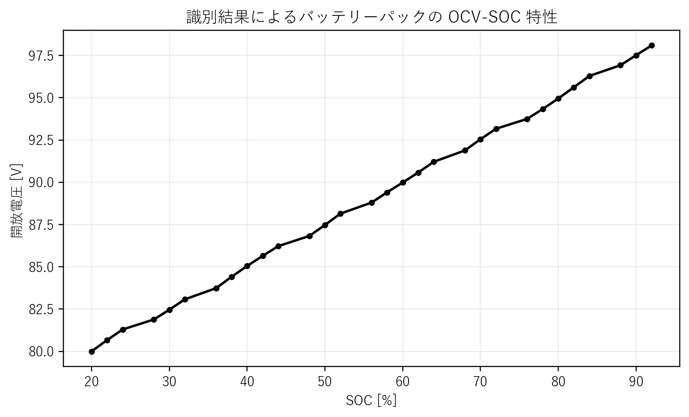
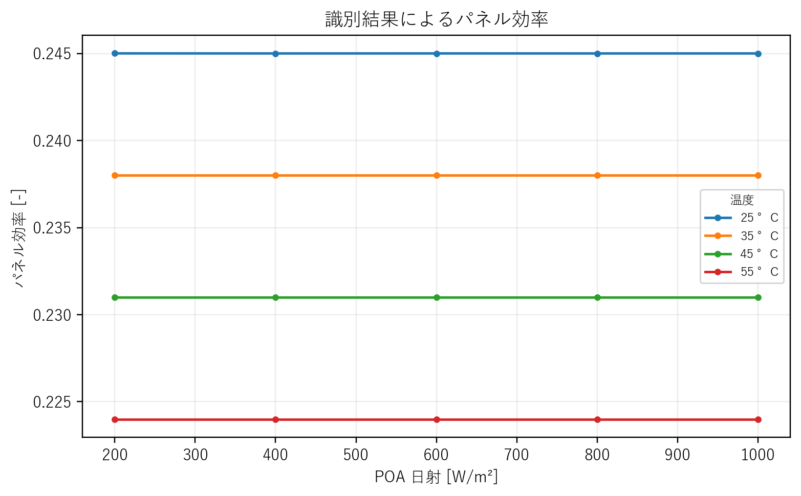
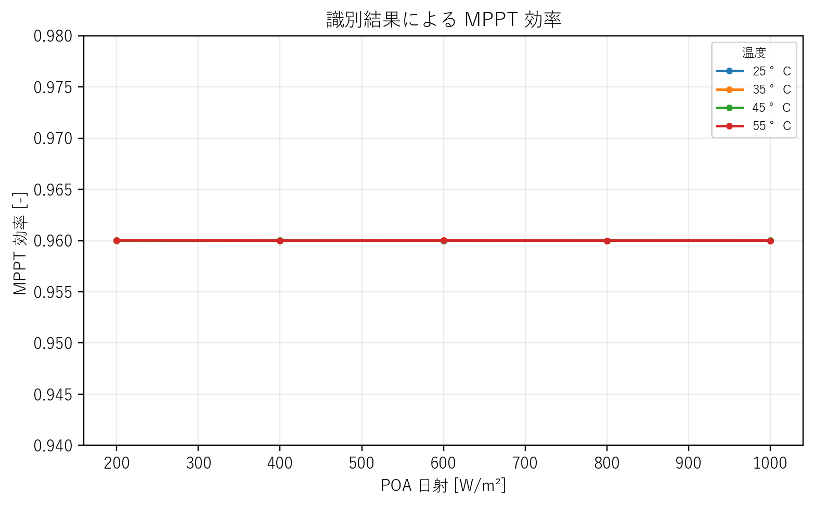
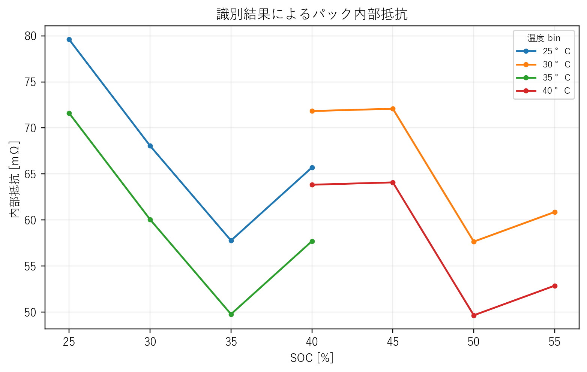

# 使い方

本書は辞書として使う。最初から読むこともできるが、基本的には「大分類」を開き、その中の項目を順に参照する構成である。説明は、元資料の文体を保ち、余計な装飾を避けて、定義、式、意味、設計上の注意へ進む形で書く。

本書に入れる図は、根拠のあるものだけに限定する。概念図で済ませず、可能なものは `outputs/identification` や `maps` にある識別結果・モデルデータから作図する。したがって、図の数は多くないが、入っている図には出典を付ける。

BWSC2027 に関する公式条件は、2026年6月21日時点で確認した `2027 Event Regulations` と `2027 Team Manager's Guide` に基づく[^reg2027][^guide2027]。ただし、本書の中心は規則要約ではなく、電圧とは何か、電流とは何か、というレベルから電装系全体までを分類して説明することである。

# 第1部 電気と物質の辞書

## 第1章 電気の最小概念と安全

### 1．電気を考えるための最小単位

電気を理解するためには，最初に「電荷」「電子」「電圧」「電流」「抵抗」を分けて考える必要がある．これらは日常ではまとめて「電気」と呼ばれるが，物理的には別の量である．電荷とは，物質が持つ電気的な性質である．電荷にはプラスとマイナスがある．原子の中には，プラスの電荷を持つ陽子と，マイナスの電荷を持つ電子が存在する．通常の物質では，陽子のプラス電荷と電子のマイナス電荷が打ち消し合っているため，全体としては電気的に中性である．電子はマイナスの電荷を持つ粒子である．金属の中では，電子の一部が特定の原子に強く固定されず，金属全体の中を移動できる状態になっている．この移動しやすい電子を自由電子と呼ぶ．電流とは，電荷が移動する現象である．金属では，主に自由電子が移動することで電流が流れる．一方，水道水や汗のような液体では，主にイオンが移動することで電流が流れる．イオンとは，電子を失ったり受け取ったりして，プラスまたはマイナスの電荷を持った原子または分子である．電圧とは，電荷を移動させようとする「電気的な高さの差」である．水にたとえるなら，高い場所にある水は低い場所へ流れようとする．このとき，高さの差が大きいほど水を流そうとする力が大きい．電気でも同じで，電圧が大きいほど，電荷を動かそうとする力が大きい．したがって，電圧は「流れる」ものではなく，「掛かる」ものである．電流は「掛かる」ものではなく，「流れる」ものである．抵抗とは，電流の流れにくさである．抵抗が大きい物体では，同じ電圧を掛けても電流は小さい．抵抗が小さい物体では，同じ電圧を掛けると大きな電流が流れる．抵抗の単位はΩ，すなわちオームである．これらの関係を表す式が，オームの法則である．

$$
V=RI
$$

ここで，(V) は電圧，(R) は抵抗，(I) は電流である．この式は，「電圧は，抵抗と電流の積で決まる」という意味である．同じ式を変形すると，

$$
I=\frac{V}{R}
$$

となる．これは，「電流は，電圧が大きいほど大きくなり，抵抗が大きいほど小さくなる」という意味である．したがって，電圧が存在するだけでは電流は流れない．電流が流れるためには，電荷が移動できる物体があり，さらに電流が一周して戻る経路，すなわち回路が成立している必要がある．

### 2．回路とは何か

回路とは，電流が出発点から出て，負荷を通り，出発点に戻る一周の経路である．電池で考えると，電流は電池の片方の端子から出て，豆電球やモーターなどを通り，もう片方の端子に戻る．この一周の経路が成立しているとき，回路は閉じているという．回路が閉じていない場合，電圧が存在しても電流は流れない．例えば，電池のプラス端子とマイナス端子の間に豆電球を接続すれば電流が流れて豆電球は光る．しかし，途中の線が切れていれば，電流は一周できないため豆電球は光らない．したがって，感電や漏電を考えるときにも，「電圧があるか」だけでは足りない．「人体を通って電流が一周する経路が成立しているか」を考える必要がある．

### 3．導体，絶縁体，半導体

導体とは，電流を流しやすい物質である．金属は代表的な導体である．銅，アルミニウム，鉄，銀などは電流を流しやすい．金属が電流を流しやすい理由は，自由電子を持つからである．絶縁体とは，電流を流しにくい物質である．ゴム，プラスチック，ガラス，陶器，乾いた木，空気などは絶縁体として扱われる．絶縁体では，電子が原子や分子に強く束縛されており，自由に動けない．そのため，電圧を掛けても電流が流れにくい．ただし，現実の絶縁体は完全に無限大の抵抗ではない．非常に小さい漏れ電流は流れる．また，非常に大きな電圧を掛けると，絶縁体の中の電子が強い電場によって引き剥がされ，急に電流が流れる状態になる．これを絶縁破壊という．絶縁破壊とは，絶縁体が絶縁体として機能しなくなる現象である．空気中で火花が飛ぶ現象も，空気の絶縁破壊である．普段の空気は電流を流さないが，非常に高い電圧が掛かると，空気中に電流の通り道ができる．雷も大規模な絶縁破壊である．半導体とは，導体と絶縁体の中間的な性質を持つ物質である．シリコンは代表的な半導体である．半導体は，条件によって電流の流れやすさを変えられる．この性質を利用して，ダイオード，トランジスタ，マイクロコントローラ，CPU，センサなどが作られる．

### 4．金属中の電流

金属中では，自由電子が電流を担う．金属原子は，原子同士が規則正しく並んだ結晶構造を作っている．この中で，価電子と呼ばれる外側の電子の一部が，特定の原子だけに属さず，金属全体に広がって存在する．これを金属結合という．金属結合では，金属原子がプラスのイオンに近い状態で並び，その間を自由電子が動ける状態になっている．この自由電子があるため，金属は電気をよく流す．金属線の両端に電圧を掛けると，金属内部に電場ができる．電場とは，電荷に力を及ぼす空間の状態である．自由電子はマイナスの電荷を持つため，この電場から力を受けて動く．この電子の移動が金属中の電流である．ここで重要なのは，電子が勝手に一方向へ走っているのではないという点である．電圧が掛かっていない金属中でも，電子は熱運動によってバラバラに動いている．しかし，バラバラなので全体としての電流はゼロである．電圧を掛けると，電子のバラバラな運動に加えて，特定方向へのわずかな偏りが生じる．この偏った移動が電流として現れる．

### 5．液体中の電流

液体の中でも電流が流れる．ただし，金属と液体では，電流を担うものが異なる．金属では自由電子が電流を担う．水道水，汗，海水のような液体では，主にイオンが電流を担う．イオンとは，電荷を持った粒子である．原子や分子が電子を失うとプラスの電荷を持つ陽イオンになる．電子を受け取るとマイナスの電荷を持つ陰イオンになる．例えば，食塩は塩化ナトリウム $\mathrm{NaCl}$ であり，水に溶けると $\mathrm{Na^+}$ と$\mathrm{Cl^-}$ に分かれる．$\mathrm{Na^+}$ はプラスのイオン，$\mathrm{Cl^-}$はマイナスのイオンである．水道水や汗には，ナトリウムイオン，塩化物イオン，カルシウムイオン，マグネシウムイオンなどが含まれる．これらのイオンは，水の中を移動できる．液体に電圧を掛けると，プラスのイオンはマイナス側へ移動し，マイナスのイオンはプラス側へ移動する．このイオンの移動が，液体中の電流である．純水は電流を流しにくい．純水とは，不純物をほとんど含まない水である．純水の中にも$\mathrm{H^+}$ と $\mathrm{OH^-}$ はわずかに存在するが，その量は少ない．そのため，純水の抵抗は大きい．水道水や汗が電流を流しやすいのは，水そのものではなく，水に溶けているイオンのためである．したがって，「水は電気をよく流す」という表現は正確ではない．正確には，「イオンを含む水は，イオンの移動によって電流を流す」である．水道水，汗，海水，雨水，泥水は，イオンや不純物を含むため，感電の危険を大きくする．油は電流を流しにくい．油はイオンをほとんど含まず，分子も電荷を運びにくいからである．液体金属は電流を流しやすい．液体であっても金属であるため，自由電子によって電流を流すからである．同じ液体でも，電流を運ぶものがイオンであるか，自由電子であるか，そもそも電荷を運ぶものがないかによって，導電性は大きく変わる．

### 6．水と感電

人体は完全な絶縁体ではない．人体の内部には水分とイオンが多く含まれている．血液，細胞液，汗には，ナトリウムイオン，カリウムイオン，塩化物イオンなどが含まれる．そのため，人体内部は電流を流す．一方，皮膚の表面は人体内部より抵抗が大きい．乾いた皮膚は電流を流しにくい．しかし，皮膚が汗や水で濡れると，皮膚表面にイオンを含む水の膜ができる．この膜が電流の通り道になる．その結果，人体全体としての抵抗が下がる．人体の抵抗は一定ではない．乾燥した皮膚では抵抗は大きい．濡れた皮膚では抵抗は小さい．傷がある皮膚では，皮膚表面の絶縁性が失われるため抵抗はさらに小さくなる．電極を強く押し付けた場合も，接触面積が増えるため抵抗は下がる．人体抵抗は，乾燥状態では数十 kΩ 以上になり，濡れた状態や接触条件が悪い場合には数 kΩ から 500Ω 級まで下がる．オームの法則 $I=V/R$ から，同じ電圧であれば，抵抗が小さいほど電流は大きくなる．したがって，濡れた手で電気機器に触れると危険である．水が人体の抵抗を下げ，同じ電圧でも人体を流れる電流を大きくするからである．感電の危険性は，電圧だけで決まらない．人体を流れる電流，電流が通る経路，通電時間，電流の種類，皮膚状態によって決まる．心臓を通る経路，例えば右手から左手，手から足へ流れる経路は危険度が高い．心臓の電気信号が乱されるからである．

### 7．直流と交流

電流には直流と交流がある．直流とは，電流の向きが時間によって変わらない電気である．英語では Direct Current といい，DC と略す．乾電池，リチウムイオンバッテリー，直流安定化電源の出力は直流である．直流では，プラス端子とマイナス端子が決まっており，電流の向きは一定である．交流とは，電圧と電流の向きが時間とともに周期的に入れ替わる電気である．英語ではAlternating Current といい，AC と略す．家庭用コンセントは交流である．日本では，地域によって 50Hz または 60Hz の交流が使われる．Hz はヘルツと読み，1 秒間に何回周期が繰り返されるかを表す単位である．50Hz なら 1 秒間に 50 回，60Hz なら 1 秒間に 60 回，電圧と電流の向きが周期的に変化する．交流では，「プラス端子とマイナス端子が固定されている」と考えると誤解する．交流では，ある瞬間には片方が高い電位になり，次の瞬間には逆側が高い電位になる．つまり，電圧の向きが時間で入れ替わる．そのため，電流の向きも時間で入れ替わる．直流を水流でたとえるなら，水が一方向に流れ続ける状態である．交流を水流でたとえるなら，水が管の中を行ったり来たりする状態である．ただし，家庭用交流では，エネルギーはきちんと負荷へ送られる．電流の向きは入れ替わるが，電力は電気機器に供給される．

### 8．相，単相，三相，単相交流

単相交流という言葉は，「単相」と「交流」に分けると理解できる．まず，交流とは，電圧と電流の向きが時間とともに周期的に入れ替わる電気である．次に，相とは，交流の波の時間的な位置関係を表す言葉である．交流の電圧は，時間とともに波のように増えたり減ったりする．この波のずれ方を相という．単相とは，交流の波が一組だけで構成されている方式である．家庭用コンセントで使われる 100V 交流は，単相交流である．単相交流では，基本的に二本の線で電力を送る．一方の線をライブ線，もう一方をニュートラル線と呼ぶ．ライブ線は電圧が時間的に大きく変化する線であり，ニュートラル線は基準電位，すなわち大地に近い電位に保たれる線である．ただし，交流では電流の向きが周期的に反転するため，「ライブ線から出てニュートラル線へ戻る」という説明は，瞬間ごとの向きを簡略化した表現である．正確には，二本の線を通る電流は同じ大きさで逆向きになり，電気機器に電力を供給する．三相交流とは，交流の波が三組ある方式である．三つの交流波は，互いに時間的に 120 度ずつずれている．三相交流は，大きなモーター，工場設備，送電，産業機械で使われる．三相交流は，単相交流より大きな電力を効率よく送れる．したがって，単相交流とは，「一組の交流波を使って電力を送る方式」である．家庭用コンセントの多くは単相交流である．漏電遮断器の説明で単相交流という言葉が出るのは，家庭用電源で行きと戻りの電流を比較する代表例として扱いやすいからである．

### 9．GND，グラウンド，アース

GND とは，Ground の略であり，グラウンドと読む．ただし，GND には複数の意味がある．ここを混同すると，感電や漏電の理解が崩れる．一つ目の意味は，回路上の基準電位である．電子回路では，どこか一点を 0V と決めて，他の点の電圧をその基準から測る．この基準点を GND と呼ぶ．この意味の GND は，必ずしも地面につながっているわけではない．二つ目の意味は，大地である．建物や設備では，地面に埋めた接地極に導線を接続し，電気的に大地とつなぐ．これを接地またはアースという．アースは，感電防止やノイズ対策，雷対策に使われる．三つ目の意味は，保護接地である．保護接地とは，電気機器の金属ケースなどをアース線で大地に接続し，故障時に人体ではなくアース線へ電流を流す仕組みである．したがって，GND とアースは常に同じではない．電子回路の GND は，単なる 0V 基準である．アースは，大地につながる保護用の導線である．実験用の直流安定化電源では，マイナス端子がアースにつながっているものもあれば，アースから浮いているものもある．「浮いている」とは，その回路が大地に直接つながっていない状態である．

### 10．感電が起こる条件

感電とは，人体を通って電流が流れる現象である．電圧のある場所に触れただけで必ず感電するのではない．人体を通る回路が成立したときに感電する．例えば，直流安定化電源のプラス端子に触れ，同時に体の別の部分がマイナス端子，GND，アース，大地のいずれかに接続されると，人体を通る回路が成立する．このとき，人体が負荷の一部になる．電流は，電源のプラス端子から人体を通り，マイナス端子または大地側へ戻る．これが感電である．一方，電圧のある一点だけに触れても，戻り道がなければ大きな電流は流れない．鳥が一本の電線に止まっても感電しないのは，鳥の両足の間に大きな電位差がなく，体を通る回路が成立しないからである．ただし，同時に別の電線や鉄塔に触れると，鳥の体を通る電位差が生じ，感電する．したがって，感電を考えるときには，次の三点を確認する必要がある．第一に，人体が触れている点の電圧である．第二に，人体の別の部分がどこにつながっているかである．第三に，人体を通る閉回路が成立しているかである．

### 11．アース線の役割

アース線は，人体より低抵抗の安全な電流経路を作るための導線である．アース線はただの導線だが，安全上の役割は大きい．電気機器の内部で故障が起こり，電源の高電位側が金属ケースに接触したとする．この金属ケースがアースされていない場合，人が金属ケースに触れると，人体を通って大地へ電流が流れる．これが感電である．一方，金属ケースがアース線で大地に接続されている場合，故障電流は人体ではなくアース線を通って流れる．アース線は人体より抵抗が小さいため，電流は抵抗の小さい経路を主に通る．この結果，大きな故障電流が流れ，ヒューズ，ブレーカ，漏電遮断器が動作する．これは実質的に短絡に近い状態である．短絡とは，抵抗の小さい経路で電源の二点がつながり，大電流が流れる状態である．短絡は危険だが，保護装置を確実に動作させるためには，故障時に十分な電流を流して遮断させる設計が必要である．アース線は，故障時に安全な場所へ大電流を逃がし，保護装置を動作させるための経路である．

### 12．漏電とは何か

漏電とは，本来流れるべき経路から外れて，別の経路に電流が漏れることである．通常，電気機器では，電源から出た電流は負荷を通り，電源へ戻る．この経路だけで電流が完結していれば正常である．しかし，絶縁不良，水濡れ，破損，汚れ，劣化によって，電流が機器ケース，人体，水，床，大地，アース線へ流れると，漏電になる．例えば，電源のプラス側またはライブ線が，濡れた機器ケースに触れているとする．その機器ケースに人が触れ，人の足が床や大地につながっていると，電流は機器ケースから人体を通って大地へ流れる．これは本来の負荷を通る経路ではない．したがって漏電であり，感電でもある．漏電は，火災の原因にもなる．漏れた電流が小さくても，長時間流れると発熱する．絶縁物が劣化し，炭化し，さらに電流が流れやすくなる．このように，漏電は感電だけでなく発火にも関係する．

### 13．漏電遮断器の原理

漏電遮断器は，漏電を検出して電気を遮断する装置である．家庭の分電盤にも使われる．単相交流の例で考える．単相交流とは，一組の交流波で電力を送る方式であり，家庭用コンセントの代表的な方式である．単相交流では，ライブ線とニュートラル線の二本で電気機器に電力を送る．

正常な状態では，ライブ線を流れる電流とニュートラル線を流れる電流は，同じ大きさである．交流なので電流の向きは時間で反転するが，二本の線をまとめて見ると，出ていく電流と戻ってくる電流は常に釣り合っている．つまり，電源から出た電流は，すべて電源へ戻っている．漏電が起こると，一部の電流がニュートラル線ではなく，人体，水，機器ケース，アース線，大地などを通って戻る．このとき，ライブ線を流れる電流とニュートラル線を流れる電流が一致しなくなる．この差を差分電流という．漏電遮断器は，この差分電流を検出する．ライブ線とニュートラル線を同じ検出器の中に通し，二本の電流が完全に釣り合っているかを見る．正常なら差はゼロである．漏電があると差が出る．差が規定値を超えると，漏電遮断器は回路を遮断する．ここで重要なのは，漏電遮断器は「GND 線に電流が流れているか」だけを見ているわけではないという点である．代表的な漏電遮断器は，行きの電流と戻りの電流の差を見ている．したがって，人体を通って大地へ漏れる電流も検出できる．直流回路でも，漏電検知は成立する．例えば，直流安定化電源のプラス端子から負荷へ電流が流れ，負荷からマイナス端子へ戻る構成を考える．正常なら，電流はプラス端子，負荷，マイナス端子の経路だけを通る．GND 線やアース線に電流は流れない．もし GND線やアース線に電流が流れているなら，負荷以外の場所を通る異常経路ができている．これを検出すれば，漏電または地絡を検知できる．地絡とは，電源の一部が大地またはアースに接触してしまう故障である．短絡は，電源のプラスとマイナス，または交流の二線が低抵抗で直接つながる故障である．漏電，地絡，短絡は近い概念だが，意味は異なる．漏電は本来の経路から電流が漏れること，地絡は電源線が大地側へ接触すること，短絡は低抵抗経路で二点が直接つながることである．

### 14．電圧源とは何か

電圧源とは，端子間の電圧を一定に保とうとする電源である．理想的な電圧源は，どのような負荷を接続しても電圧を一定に保つ．ただし，理想的な電圧源は現実には存在しない．現実の電源には，内部抵抗，出力電流の上限，発熱限界，保護回路がある．そのため，負荷が重くなりすぎると，電圧を維持できなくなる．バッテリーは，実用上は電圧源に近い挙動を示す．乾電池やリチウムイオンバッテリーは，ある程度一定の電圧を出す．しかし，バッテリーにも内部抵抗があり，放電状態，温度，劣化，電流の大きさによって端子電圧が変わる．したがって，バッテリーは理想電圧源ではなく，内部抵抗を持つ実在の電圧源として扱う．直流安定化電源の CV モードも，電圧源に近い動作である．CV は Constant Voltage の略であり，定電圧という意味である．CV モードでは，電源は設定した電圧を保つように動作する．

### 15．CV モードと CC モード

直流安定化電源には，CV モードと CC モードがある．CV モードとは，定電圧モードである．電源は設定した電圧を維持する．例えば，5V に設定すれば，負荷に 5V を掛けるように動作する．負荷抵抗が大きければ電流は小さい．負荷抵抗が小さければ電流は大きい．CC モードとは，定電流モードである．CC は Constant Current の略であり，電流を一定に保つという意味である．CC モードでは，電源は設定した電流を超えないように出力電圧を調整する．例えば，電源を 5V，1A 制限に設定したとする．負荷が軽く，0.2A しか流れないなら，電源は 5V を維持する．この状態は CV モードである．負荷が重く，そのままでは 2A 流れようとするなら，電源は 1A を超えないように電圧を下げる．この状態が CC モードである．CC モードは，過電流を防ぐために重要である．過電流とは，回路や部品が許容する値を超える電流である．突入電流とは，電源投入直後に一瞬だけ大きく流れる電流である．コンデンサの充電，モーターの起動，ランプの点灯直後などで突入電流が発生する．CC モードは，このような大電流を制限し，電源，配線，負荷を保護する．

### 16．短絡と重い負荷

負荷とは，電源から電力を受け取るもの全体を指す．抵抗，LED，モーター，マイコン，センサ，ヒーター，充電中のバッテリー，すべて負荷である．軽い負荷とは，電源から少ない電流しか要求しない負荷である．抵抗値が大きい負荷は軽い負荷である．重い負荷とは，電源から大きな電流を要求する負荷である．抵抗値が小さい負荷は重い負荷である．導線で電源のプラスとマイナスをつなぐ状態は，極端に重い負荷である．この状態を短絡という．オームの法則より，抵抗が 0Ω に近いと，電流は非常に大きくなる．理想的な電圧源であれば，0Ω 負荷に対して電圧を維持するために無限大の電流を流す必要がある．現実の電源は無限大の電流を出せない．そのため，電圧が下がるか，電流制限が働くか，ヒューズや保護回路が動作する．保護が働かなければ，配線や部品が発熱して焼損する．したがって，導線や低抵抗負荷は危険である．抵抗が小さいほど安全ということではない．抵抗が小さいほど，同じ電圧で大きな電流が流れる．大電流は発熱，焼損，発火，電源故障を引き起こす．

### 17．電力，W，電圧，電流

電力とは，単位時間あたりに使われるエネルギーである．単位は W，すなわちワットである．式では，電力を (P) と書く．

$$
P=VI
$$

ここで，(P) は電力，(V) は電圧，(I) は電流である．例えば，10V で 2A 流れている場合，電力は 20W である．100V で 0.2A 流れている場合も，電力は 20W である．同じ電力でも，高電圧なら小電流で済み，低電圧なら大電流が必要になる．大電流を扱うには，太い配線，大きなスイッチ素子，低い接触抵抗，十分な放熱が必要になる．配線には抵抗があるため，電流が大きいと配線自身が発熱する．発熱は $I^2R$ に比例する．これは，電流が 2 倍になると発熱は 4 倍になるという意味である．したがって，大電流はシステムを大型化させる．このため，電力を送るシステムでは，高電圧化が使われる．同じ電力を送るなら，電圧を高くした方が電流を小さくでき，配線の発熱を減らせるからである．送電線が高電圧である理由もここにある．

## 第2章 電池と電気化学

### 18．バッテリーとは何か

バッテリーは，化学反応によって電圧を発生させる装置である．バッテリーの内部では，片方の電極で電子を出しやすい反応が起こり，もう片方の電極で電子を受け取りやすい反応が起こる．この差によって電位差が生じる．電極とは，バッテリー内部で化学反応が起こり，外部回路と電子をやり取りする部分である．電解質とは，バッテリー内部でイオンを移動させる媒体である．セパレータとは，正極と負極が直接接触して短絡しないように分ける膜である．バッテリーは，外部回路には電圧源のように見える．しかし，内部では化学反応，イオン移動，電子移動が同時に起こっている．そのため，取り出せる電流には限界がある．限界を超えると，発熱，劣化，膨張，内部短絡，発火につながる．

### 19．酸化，還元，電位

化学では，電子を失うことを酸化という．電子を受け取ることを還元という．バッテリーの放電では，片方の電極で酸化が起こり，電子が外部回路へ出る．もう片方の電極では還元が起こり，外部回路から電子を受け取る．この電子の流れが，外部回路の電流になる．電位とは，電子にとってのエネルギー状態を表す量である．電子を放出しやすい材料は低い電位側になり，電子を受け取りやすい材料は高い電位側になる．この二つの電極の電位差が，バッテリーの電圧である．ただし，電位は単純に「電子を何個持っているか」だけで決まるものではない．材料の種類，結晶構造，イオンの入り方，電解質との界面，温度，充電状態によって決まる．直感的には，電子を出したい側と，電子を受け取りたい側の差が電圧になる，と理解すればよい．電子を滑り台にたとえると，バッテリーは電子にとって高低差を作る装置である．高い位置にある電子は，外部回路を通って低い位置へ移動しようとする．この流れを利用して，モーターを回したり，LED を光らせたり，マイコンを動かしたりする．

### 20．原子，電子殻，イオン化エネルギー

物質は原子からできている．原子は，中心にある原子核と，その周囲に存在する電子からできている．原子核の中には，プラスの電荷を持つ陽子と，電荷を持たない中性子がある．電子はマイナスの電荷を持つ．高校化学では，電子は原子核の周りにある電子殻に入ると説明される．内側から K 殻，L殻，M 殻と呼ばれる．最も外側の電子殻にある電子を価電子という．この価電子が，化学反応や結合の性質を大きく決める．ただし，これは理解のための模型である．より正確には，電子は惑星のように円軌道を回っているのではなく，原子核の周囲に確率的な広がりとして存在する．化学結合では，原子軌道，混成軌道，分子軌道という考え方が必要になる．イオン化エネルギーとは，原子やイオンから電子を一つ取り去るために必要なエネルギーである．イオン化エネルギーが小さい元素は，電子を失いやすい．電子を失うと，プラスの電荷を持つ陽イオンになる．電子親和力とは，原子が電子を受け取るときのエネルギー変化である．電子を受け取りやすい元素は，マイナスの電荷を持つ陰イオンになりやすい．周期表の左側にあるアルカリ金属，例えばリチウム，ナトリウム，カリウムは，価電子を一つ失いやすい．そのため，陽イオンになりやすい．周期表の右側にあるハロゲン，例えばフッ素，塩素，臭素は，電子を一つ受け取りやすい．そのため，陰イオンになりやすい．最右端の希ガスは，電子配置が安定しているため，反応性が低い．

### 21．LiPo バッテリー

LiPo は，Lithium Polymer Battery の略である．日本語ではリチウムポリマーバッテリーと呼ばれる．LiPo はリチウムイオン電池の一種である．LiPo の「Po」はポリマーを意味する．これは，電解質やセル構造にポリマー系材料を使うことに由来する．LiPo では，パウチ型の柔らかい外装が使われることが多い．模型，ドローン，ロボット，ソーラーカー，ラジコンなどで使われるのは，高い出力密度と軽量性を持つからである．リチウムイオン電池では，充放電時にリチウムイオンが正極と負極の間を移動する．放電時には，リチウムイオンが負極側から電解質中を通って正極側へ移動する．同時に，電子は外部回路を通って負極から正極へ移動する．充電時には，この移動が逆向きになる．LiPo セルの代表的な公称電圧は 1 セルあたり 3.7V である．満充電電圧は 1 セルあたり4.2V である．この 4.2V を超えて充電すると，過充電になる．過充電では，電解液分解，ガス発生，発熱，膨張，発火が起こる．したがって，リチウムイオン系セルでは上限電圧を厳密に守る必要がある．下限電圧も重要である．LiPo セルでは，1 セルあたり 2.7V から 3.0V を下回る領域は過放電として扱う．過放電では，負極側の SEI 膜が壊れ，銅集電体が溶け出し，内部抵抗が増加し，セルの安全性が失われる．過放電したセルを再充電すると，内部短絡につながる析出物が発生する．したがって，過放電したリチウムイオン系セルは再使用不可として扱う．ここで，リチウム析出は主に低温時，高充電状態時，大電流充電時，過充電時に起こる負極側の異常である．過放電で中心になる損傷は，リチウム析出ではなく，銅集電体の溶出，SEI 膜破壊，電解液分解，内部抵抗増加である．

### 22．OCV と使用中の端子電圧

OCV とは，Open Circuit Voltage の略である．日本語では開放電圧という．開放とは，外部に負荷をつながず，電流を流していない状態である．したがって，OCV は，電流を流していないときのバッテリー端子電圧である．バッテリーの OCV は，正極材料，負極材料，電解質，充電状態，温度によって決まる．素材によって電圧特性が決まるというのは，この OCV 特性が材料の組み合わせに強く支配されるという意味である．ただし，バッテリーは使用中に常に OCV を維持するわけではない．負荷をつないで電流を流すと，内部抵抗による電圧降下が起こる．内部抵抗とは，バッテリー内部に存在する抵抗成分である．電流が大きいほど，内部抵抗による電圧降下も大きくなる．放電中の端子電圧は，OCV から内部抵抗による低下分と反応の遅れによる低下分を引いた値になる．充電中の端子電圧は，OCV より高くなる．これは，内部抵抗と反応の遅れに逆向きの電圧を掛けて，無理にイオンを戻しているからである．したがって，バッテリーを電圧源として見ることは有効だが，理想電圧源として見るのは不正確である．バッテリーは，内部抵抗と化学反応の制約を持つ実在の電圧源である．

{ width=82% }

図1: 識別結果によるバッテリーパックの OCV-SOC 特性。出典: `outputs/identification/ocv_soc_curve_identified.csv`。

### 23．C レート，Ah，Wh

C レートとは，バッテリー容量を基準にした充放電電流の単位である．1C とは，そのバッテリーを 1 時間で満充電から空にする電流，または空から満充電にする電流である．例えば，容量が 5Ah のバッテリーでは，1C は 5A である．0.2C は 1A である．2C は 10Aである．容量が 20Ah のバッテリーでは，1C は 20A である．同じ 1C でも，バッテリー容量が違えば電流値は変わる．Ah とは，アンペアアワーと読む．これは，電流と時間を掛けた量である．1Ah は，1A の電流を 1 時間流せる容量を意味する．ただし，実際に取り出せる容量は，放電電流，温度，劣化状態，終止電圧によって変わる．Wh とは，ワットアワーと読む．これは，エネルギー量を表す単位である．電力 W に時間h を掛けた量である．バッテリーのエネルギー量は，公称電圧と容量 Ah を掛けて概算する．例えば，3.7V，5Ah のセルなら，エネルギー量は 18.5Wh である．

$$
3.7\mathrm{V}\times5\mathrm{Ah}=18.5\mathrm{Wh}
$$

ただし，バッテリー電圧は放電中に変化する．そのため，正確な Wh は放電曲線を積分して求める．実用上は，公称電圧と Ah を掛けて概算する．C レートは，バッテリー素材だけで決まるものではない．同じ LiPo でも，許容充電 C レートと許容放電 C レートは製品ごとに異なる．これは，電極面積，電極厚み，集電体，セパレータ，電解質，放熱性，内部抵抗，セル構造，設計思想によって決まる．したがって，「LiPo だから何 C で充電してよい」とは言えない．データシートまたはメーカー指定の最大充電電流，最大連続放電電流，最大パルス放電電流を守る必要がある．0.2C 充電が適切なセルもあり，1C 充電が許容されるセルもあり，高出力用途ではさらに大きな放電 C レートを持つセルもある．

### 24．バッテリー充電と CC-CV

リチウムイオン系バッテリーの充電では，CC-CV 充電が使われる．CC-CV とは，Constant Current と Constant Voltage の組み合わせである．日本語では定電流定電圧充電という．最初は CC モードで充電する．つまり，決められた電流を流して充電する．この段階では，セル電圧は徐々に上がる．セル電圧が上限電圧，例えば LiPo の 1 セルあたり 4.2V に達すると，充電器は CV モードに切り替える．つまり，電圧を 4.2V に固定する．その後，バッテリー内部の反応が進むにつれて，充電電流は自然に小さくなる．電流が規定値以下になったところで充電を終了する．充電電流が大きすぎると，バッテリー内部でイオン移動と化学反応が追いつかない．電極表面だけに反応が集中し，内部に均一にリチウムイオンが入らない．その結果，発熱，内部抵抗増加，SEI 膜の異常成長，ガス発生，膨張，容量低下が起こる．さらに条件が悪いと，リチウム析出や内部短絡が起こる．したがって，バッテリーの充電では，電圧上限と電流上限の両方を守る必要がある．電圧だけを見ても不十分であり，電流だけを見ても不十分である．リチウムイオン系バッテリーでは，セルごとの電圧監視，バランス充電，温度管理，過充電保護，過放電保護が必要である．

### 25．過充電と過放電

過充電とは，バッテリーを上限電圧を超えて充電することである．LiPo セルでは，1 セルあたり 4.2V を超える充電が過充電である．過充電では，正極材料が過度に酸化され，電解液が分解し，ガスが発生し，セルが膨張する．さらに進むと，発熱，内部短絡，熱暴走，発火に至る．過放電とは，バッテリーを下限電圧より下まで使うことである．LiPo セルでは，1 セルあたり 2.7V から 3.0V を下回る領域を過放電として扱う．過放電では，負極側の電位が通常使用範囲から外れ，SEI 膜や銅集電体が損傷する．SEI 膜とは，負極表面に形成される薄い保護膜である．リチウムイオンは通すが，電解液の分解を抑える役割を持つ．この膜が壊れると，電解液がさらに分解し，内部抵抗が増加し，バッテリー性能が低下する．銅集電体とは，負極で電子を集めるための薄い銅箔である．過放電では，この銅が溶け出す．その後，再充電すると，溶け出した銅が別の場所に析出し，内部短絡を作る．この内部短絡は外から見えないため危険である．したがって，過放電したリチウムイオン系セルは，見た目が正常でも再使用不可として扱う．膨張していなくても，内部で不可逆的な損傷が進行している．

## 第3章 発電と機械のつながり

### 26．発電の原理

発電とは，機械的な運動エネルギーを電気エネルギーに変換することである．発電機は，モーターを逆に使ったものとして理解できる．モーターは，電気を流すことで回転力を生み出す装置である．発電機は，外から回転力を与えることで電気を生み出す装置である．どちらも，磁石，コイル，電流，磁界の相互作用を利用している．磁界とは，磁石の力が働く空間である．コイルとは，導線を巻いたものである．磁界の中でコイルを動かす，またはコイルの近くで磁石を動かすと，コイルの中に電圧が発生する．これを電磁誘導という．発電機では，回転によってコイルと磁界の関係が時間的に変化する．この変化によって電圧が発生する．回転が速いほど，磁界の変化も速くなるため，発生する電圧は大きくなる．したがって，発電機の電圧は主に回転数に関係する．小型の発電機でも，高回転で回せば高い電圧を得られる．ただし，高い電圧を得ることと，大きな電流を取り出すことは別である．

### 27．トルク，回転数，馬力，電力

トルクとは，物体を回そうとする力である．ドアを押して開けるとき，蝶番から遠い場所を押すほど開けやすい．これは，回転させる力，すなわちトルクが大きくなるからである．回転数とは，1 分間または 1 秒間に何回転するかを表す量である．エンジンでは rpm という単位が使われる．rpm は revolutions per minute の略であり，1 分間の回転数を表す．機械的な出力は，トルクと回転速度の積で決まる．つまり，大きな力でゆっくり回しても出力は得られるし，小さな力でも非常に速く回せば出力を得られる．エンジンでいう馬力は，この出力を表す言葉である．発電機でも同じである．発電機を速く回すと電圧を稼げる．しかし，大きな電流を取り出すと，発電機は回転を妨げる向きの力を発生する．これを負荷トルクという．大電流を取り出すほど，発電機を回すために大きなトルクが必要になる．したがって，電圧を高くするには回転数を上げる方法がある．一方，電流を大きくするには，発電機が大きなトルクを受け取り，大きな電磁力に耐えられる構造である必要がある．そのためには，磁石，コイル，鉄心，軸，軸受，冷却，配線を大きく強く作る必要がある．結果として，システムは大型化する．この話は，電源と負荷の関係にもつながる．重い負荷は大電流を要求する．大電流を供給するには，電源側も発電側も強い構造を持つ必要がある．軽い負荷は小電流しか要求しないため，電源への負担が小さい．

### 28．全体の整理

電圧は，電荷を動かそうとする電気的な高さの差である．電流は，電荷が実際に移動する現象である．抵抗は，電流の流れにくさである．オームの法則 $V=RI$ によって，電圧，電流，抵抗は関係する．金属では，自由電子が電流を担う．水道水や汗では，イオンが電流を担う．純水や油はイオンが少ないため電流を流しにくい．液体金属は，自由電子を持つため電流を流す．絶縁体は，通常の電圧範囲では電流を流しにくい．しかし，非常に高い電圧では絶縁破壊が起こり，電流が流れる．人体は内部に水分とイオンを含むため電流を流す．乾いた皮膚は抵抗が高いが，水や汗で濡れると抵抗が下がる．そのため，同じ電圧でも濡れた状態では人体を流れる電流が大きくなる．直流は，電流の向きが一定の電気である．交流は，電流と電圧の向きが周期的に入れ替わる電気である．単相交流は，一組の交流波で電力を送る方式であり，家庭用コンセントの代表的な方式である．GND は，回路上の 0V 基準を指す場合と，大地への接続を指す場合がある．アースは，機器の金属ケースなどを大地に接続し，故障時に人体ではなく低抵抗の導線へ電流を流すための安全機構である．感電は，人体を通って電流が流れることで起こる．電圧のある一点に触れるだけではなく，人体を通る閉回路が成立したときに感電する．アース線は，人体より低抵抗の経路を作り，故障電流を流して保護装置を動作させる．漏電は，本来の経路から外れて電流が流れることである．漏電遮断器は，行きの電流と戻りの電流の差を検出する．正常なら差はゼロである．漏電があると，人体，水，大地，アース線などへ電流が逃げるため，行きと戻りの電流に差が出る．この差が規定値を超えると，漏電遮断器が回路を遮断する．電圧源は，電圧を一定に保とうとする電源である．直流安定化電源の CV モードは定電圧動作であり，CC モードは定電流動作である．CC モードは，過電流，突入電流，バッテリー充電時の過大電流を抑えるために使われる．バッテリーは，化学反応によって電位差を作る電源である．バッテリーは理想電圧源ではなく，内部抵抗と化学反応の限界を持つ．C レートは，バッテリー容量 Ah を基準にした電流の尺度である．Wh は，バッテリーが持つエネルギー量である．LiPo バッテリーでは，1 セルあたり 4.2V が満充電電圧であり，2.7V から 3.0V を下回る領域は過放電として扱う．過充電では電解液分解，ガス発生，発熱，発火が起こる．過放電では SEI 膜破壊，銅集電体溶出，内部抵抗増加，内部短絡が起こる．そのため，過充電も過放電も避ける必要がある．発電は，機械的な回転エネルギーを電気エネルギーに変える現象である．発電機の電圧は主に回転数に関係し，取り出す電流は必要なトルクに関係する．大電流を取り出すには，大きなトルク，大きなコイル，大きな磁石，太い配線，十分な冷却が必要になる．このため，大電流を扱うシステムは大型化する．結局，電気を理解する中心は，電圧，電流，抵抗，経路である．電圧は電流を流そうとする差であり，電流は閉じた経路があるときだけ流れる．抵抗はその流れにくさであり，水，人体，金属，絶縁体，バッテリー，発電機は，それぞれ異なる仕組みでこの三者に関係している．能動素子，受動素子，ノイズ，過渡現象，制御理論，フィルタ，マイコン，PWM，テスター測定の基礎

# 第2部 電子回路・計測・制御の辞書

## 第4章 回路部品と半導体

### 29．電子回路を構成する部品の分類

電子回路を理解するためには，まず部品を分類する必要がある．回路に登場する部品は，大きく受動素子と能動素子に分けられる．受動素子とは，外部から与えられた電力を，蓄えたり，消費したり，変換したりする部品である．受動素子は，基本的に信号を自分で増幅しない．代表例は，抵抗，コンデンサ，コイル，トランス，ダイオードである．能動素子とは，外部から供給された電源エネルギーを使って，信号を増幅したり，スイッチングしたり，演算したり，制御したりする部品である．代表例は，トランジスタ，MOSFET，オペアンプ，電圧レギュレータ，ロジック IC，マイコンである．ここで重要なのは，「半導体であるかどうか」と「能動素子であるかどうか」は同じではないという点である．ダイオードや LED は半導体であるが，通常は能動素子ではなく，受動素子に近い非線形素子として扱う．一方，トランジスタやオペアンプは，半導体であり，かつ能動素子である．能動素子と受動素子の違いは，「外部電源を使って信号のエネルギーを増やせるか」で判断すると分かりやすい．抵抗は信号を小さくするだけである．コンデンサやコイルはエネルギーを一時的に蓄えるが，増幅はしない．トランジスタは，小さな入力信号で大きな出力電流を制御できる．このため，トランジスタは能動素子である．

### 30．受動素子の基本

受動素子には，抵抗，コンデンサ，コイル，トランス，ダイオードがある．それぞれの役割は異なる．抵抗は，電流を流れにくくする部品である．コンデンサは，電荷を蓄える部品である．コイルは，電流によって磁界を作り，磁気エネルギーを蓄える部品である．トランスは，交流電圧を変換する部品である．ダイオードは，一方向に電流を流しやすく，逆方向には流しにくい部品である．これらはすべて，電源のエネルギーを利用して信号を能動的に増幅するわけではない．したがって，受動素子として扱う．ただし，ダイオードは単純な抵抗とは違い，電圧と電流の関係が直線ではない．このような素子を非線形素子と呼ぶ．

### 31．抵抗

抵抗は，電流の流れにくさを作る部品である．抵抗の単位は Ω，すなわちオームである．抵抗の基本式は，オームの法則である．

$$
V=RI
$$

ここで，(V) は抵抗の両端に掛かる電圧，(R) は抵抗値，(I) は抵抗を流れる電流である．この式から，抵抗を流れる電流は次のように表せる．

$$
I=\frac{V}{R}
$$

つまり，同じ電圧を掛けたとき，抵抗値が大きいほど電流は小さくなり，抵抗値が小さいほど電流は大きくなる．抵抗では，電気エネルギーが熱に変換される．抵抗で消費される電力は次の式で表される．

$$
P=VI
$$

オームの法則を使うと，次のようにも表せる．

$$
P=I^2R
$$

$$
P=\frac{V^2}{R}
$$

この式から，抵抗に大電流を流すと発熱が急激に増えることが分かる．特に $P=I^2R$ であるため，電流が 2 倍になると発熱は 4 倍になる．このため，大電流回路では抵抗値が小さい配線や接点でも発熱が無視できない．抵抗は，電流制限，分圧，プルアップ，プルダウン，電力消費，フィルタ，センサ回路に使われる．分圧とは，二つ以上の抵抗を直列に接続し，電圧を分けることである．二つの抵抗$R_1$，$R_2$ を直列に接続し，全体に電圧 $V_{in}$ を掛けたとき，$R_2$ に掛かる電圧 $V_{out}$ は次のようになる．

$$
V_{out}=V_{in}\frac{R_2}{R_1+R_2}
$$

この式は，マイコンの ADC 入力に高い電圧を直接入れないための電圧変換，センサ出力の調整，基準電圧の生成に使われる．プルアップとは，信号線を抵抗を通じて電源電圧側に接続し，何も接続されていないときに信号を High に保つ方法である．プルダウンとは，信号線を抵抗を通じて GND 側に接続し，何も接続されていないときに信号を Low に保つ方法である．何も接続されていない入力端子は，空中に浮いた状態になり，ノイズで勝手に High や Low に変わる．これを防ぐためにプルアップまたはプルダウンを使う．

### 32．コンデンサ

コンデンサは，電荷を蓄える部品である．二枚の導体板を向かい合わせ，その間に絶縁体を挟んだ構造として理解できる．コンデンサの単位は F，すなわちファラドである．コンデンサに蓄えられる電荷 (Q) は，静電容量 (C) と電圧 (V) によって決まる．

$$
Q=CV
$$

ここで，(Q) は電荷，(C) は静電容量，(V) はコンデンサの両端電圧である．コンデンサを流れる電流は，電圧の変化速度で決まる．

$$
i=C\frac{dv}{dt}
$$

これは非常に重要な式である．この式は，「コンデンサは，電圧が変化するときに電流を流す」という意味である．電圧が一定であれば，$\frac{dv}{dt}=0$ であるため，理想コンデンサには電流は流れない．したがって，直流が十分に安定した後，コンデンサは直流を遮断するように見える．一方，電圧が急に変わると，$\frac{dv}{dt}$ が大きくなるため，大きな電流が流れる．この性質により，コンデンサはノイズ除去，電源安定化，信号の交流成分だけを通す結合，タイミング回路に使われる．コンデンサに蓄えられるエネルギーは次の式で表される．

$$
E=\frac{1}{2}CV^2
$$

この式から，容量が大きいほど，電圧が高いほど，蓄えられるエネルギーが大きいことが分かる．特に電圧は二乗で効くため，高電圧のコンデンサは危険である．電源を切っても電荷が残っていれば，触れた瞬間に放電して感電する．交流に対するコンデンサの抵抗のような量を容量性リアクタンスと呼ぶ．

$$
X_C=\frac{1}{2\pi fC}
$$

ここで，(f) は周波数である．周波数が高いほど，$X_C$ は小さくなる．つまり，コンデンサは高周波を通しやすく，低周波を通しにくい．この性質が，ノイズ除去とフィルタ回路の基本になる．

### 33．コイル

コイルは，導線を巻いた部品である．インダクタとも呼ぶ．コイルは，電流が流れると磁界を作り，磁気エネルギーを蓄える．コイルの単位は H，すなわちヘンリーである．コイルの基本式は次である．

$$
v=L\frac{di}{dt}
$$

ここで，(v) はコイルの両端電圧，(L) はインダクタンス，(i) は電流である．この式は，「コイルは，電流の変化を嫌う」という意味である．電流を急に増やそうとすると，コイルはそれを妨げる向きに電圧を発生する．電流を急に減らそうとしても，同じくそれを妨げる向きに電圧を発生する．したがって，コイルに流れる電流は急には変化しない．この性質は，電源回路，モーター，リレー，フィルタ，昇圧回路，降圧回路に使われる．コイルに蓄えられるエネルギーは次である．

$$
E=\frac{1}{2}LI^2
$$

電流が大きいほど，蓄えられる磁気エネルギーは大きくなる．このため，モーターやリレーなどのコイルに流れていた電流を急に切ると，コイルは電流を維持しようとして高い電圧を発生する．これを逆起電力と呼ぶ．逆起電力は，スイッチ，トランジスタ，マイコンを破壊する．そのため，リレーやモーターをトランジスタで駆動する場合には，フライバックダイオードを入れる．フライバックダイオードは，コイル電流が途切れたときに，電流の逃げ道を作るためのダイオードである．これにより，高電圧が発生せず，スイッチ素子が保護される．交流に対するコイルの抵抗のような量を誘導性リアクタンスと呼ぶ．

$$
X_L=2\pi fL
$$

周波数が高いほど，$X_L$ は大きくなる．つまり，コイルは高周波を通しにくく，低周波を通しやすい．この性質も，フィルタ回路とノイズ対策に使われる．

### 34．トランス

トランスは，交流電圧を別の交流電圧に変換する部品である．日本語では変圧器と呼ぶ．トランスは，二つ以上のコイルと磁心から構成される．一次側コイルに交流電流を流すと，磁心の中に変化する磁界が発生する．この変化する磁界が二次側コイルに電圧を発生させる．これが電磁誘導である．トランスの理想的な電圧比は，巻数比で決まる．

$$
\frac{V_2}{V_1}=\frac{N_2}{N_1}
$$

ここで，$V_1$ は一次側電圧，$V_2$ は二次側電圧，$N_1$ は一次側巻数，$N_2$ は二次側巻数である．二次側の巻数が一次側より多ければ昇圧し，少なければ降圧する．理想トランスでは，電力は保存される．

$$
V_1I_1=V_2I_2
$$

したがって，電圧を上げると電流は下がり，電圧を下げると電流は上がる．家庭用 AC アダプタや電源装置では，トランスやスイッチング回路を使って必要な電圧に変換する．トランスは直流では動作しない．トランスは磁界の変化によって電圧を発生するため，電流が時間的に変化する交流が必要である．直流をそのまま一次側に入れても，電流が一定になった後は磁界が変化しないため，二次側に電圧は発生しない．

### 35．ダイオード

ダイオードは，一方向には電流を流しやすく，逆方向には流しにくい部品である．ダイオードにはアノードとカソードという二つの端子がある．アノード側を高く，カソード側を低くすると，順方向となり電流が流れる．逆にすると逆方向となり，ほとんど電流が流れない．ダイオードの電流と電圧の関係は，抵抗のような直線ではない．理想化した式はショックレー方程式で表される．

$$
I=I_S\left(e^{\frac{V_D}{nV_T}}-1\right)
$$

ここで，(I) はダイオード電流，$I_S$ は逆方向飽和電流，$V_D$ はダイオード電圧，(n)は理想係数，$V_T$ は熱電圧である．

この式は難しく見えるが，要点は単純である．ダイオードは，ある程度以上の順方向電圧が掛かると，電流が急激に増える．シリコンダイオードでは，順方向電圧はおおよそ 0.6Vから 0.7V である．LED では色によって異なり，赤色なら約 1.8V から 2.2V，青色や白色なら約 3V 前後になる．ダイオードは，整流，逆接続保護，フライバック保護，電圧クランプ，信号検波，LED 発光に使われる．整流とは，交流を一方向の電流に変えることである．家庭用交流を直流電源に変換するとき，ダイオードブリッジを使う．逆接続保護では，電池を逆につないだときに電流が流れないようにする．フライバック保護では，コイルの逆起電力からトランジスタを守る．

### 36．能動素子の基本

能動素子は，外部から供給された電源エネルギーを使い，小さな信号で大きな信号を制御する部品である．この性質により，増幅，スイッチング，演算，制御ができる．代表的な能動素子は，BJT，MOSFET，オペアンプ，コンパレータ，電圧レギュレータ，ロジック IC，マイコンである．BJT は電流で電流を制御する素子である．MOSFET は電圧で電流を制御する素子である．オペアンプは二つの入力電圧の差を非常に大きく増幅する素子である．コンパレータは二つの電圧を比較して High または Low を出す素子である．電圧レギュレータは電源電圧を一定に保つ素子である．マイコンはプログラムに従って入力を読み，演算し，出力を制御する小型コンピュータである．能動素子は電源を必要とする．電源がなければ，能動素子は正しく動作しない．マイコンに信号線だけを接続しても，電源と GND が接続されていなければ動かない．オペアンプも，入力信号だけでは動作せず，正負電源または単電源が必要である．

### 37．BJT

BJT は，Bipolar Junction Transistor の略である．日本語ではバイポーラトランジスタと呼ぶ．BJT には，ベース，コレクタ，エミッタという三つの端子がある．BJT の基本的な考え方は，小さなベース電流で，大きなコレクタ電流を制御することである．

$$
I_C=\beta I_B
$$

ここで，$I_C$ はコレクタ電流，$I_B$ はベース電流，$\beta$ は電流増幅率である．例えば，$\beta=100$ のトランジスタに 1mA のベース電流を流すと，理想的には 100mAのコレクタ電流を流せる．このため，BJT は増幅やスイッチングに使われる．BJT をスイッチとして使う場合，ベースに十分な電流を流すと，コレクタとエミッタの間が導通する．ベース電流を止めると，コレクタとエミッタの間はほぼ遮断される．BJT のベースとエミッタの間は，ダイオードのような構造である．そのため，NPN トランジスタでは，ベースエミッタ間に約 0.6V から 0.7V が掛かるとベース電流が流れ始める．テスターで BJT を測ると，この内部ダイオード構造が見える．

### 38．MOSFET

MOSFET は，Metal Oxide Semiconductor Field Effect Transistor の略である．日本語では金属酸化膜半導体電界効果トランジスタと呼ぶ．MOSFET には，ゲート，ドレイン，ソースという三つの端子がある．MOSFET は，ゲートに掛ける電圧によって，ドレインとソースの間に流れる電流を制御する素子である．BJT がベース電流で動くのに対して，MOSFET はゲート電圧で動く．N チャネル MOSFET では，ゲート電圧がソースより十分高くなると，ドレインとソースの間に電流が流れる通路ができる．この通路をチャネルと呼ぶ．ゲートとソースの間の電圧を $V_{GS}$ と呼ぶ．MOSFET が動き始める境界の電圧をしきい値電圧 $V_{th}$ と呼ぶ．ただし，$V_{GS}$ が $V_{th}$ を超えたからといって，すぐに大電流を低損失で流せるわけではない．MOSFET をスイッチとして使う場合には，データシートで指定された十分なゲート電圧を掛け，オン抵抗 (R_{DS(on)}) が小さくなる領域で使う必要がある．MOSFET がオンのときの損失は，おおよそ次で表される．

$$
P=I_D^2R_{DS(on)}
$$

ここで，$I_D$ はドレイン電流，(R_{DS(on)}) はオン抵抗である．大電流を流すと，損失は電流の二乗で増える．そのため，大電流用 MOSFET では，オン抵抗の小ささ，放熱，ゲート駆動が重要になる．MOSFET のゲートは絶縁膜でできているため，直流的にはほとんど電流が流れない．しかし，ゲートはコンデンサのように振る舞う．ゲートをオンにするには，このゲート容量を充電する必要がある．オフにするには放電する必要がある．そのため，高速に PWM 駆動する場合には，ゲートドライバが必要になる．

### 39．オペアンプ

オペアンプは，Operational Amplifier の略である．日本語では演算増幅器と呼ぶ．オペアンプは，二つの入力電圧の差を非常に大きく増幅する能動素子である．オペアンプには，非反転入力，反転入力，出力，電源端子がある．非反転入力を (+)，反転入力を (-) と表す．理想オペアンプの出力は次で表される．

$$
V_{out}=A(V_+ - V_-)
$$

ここで，(A) は開ループ利得である．理想オペアンプでは，(A) は無限大と考える．現実のオペアンプでも，開ループ利得は非常に大きい．

オペアンプはそのまま使うと，わずかな入力差でも出力が電源電圧の上限または下限に張り付く．そのため，多くの場合，負帰還を使う．負帰還とは，出力の一部を反転入力に戻し，入力差が小さくなるように動作させることである．負帰還が成立している理想オペアンプでは，次の二つの近似が使える．

$$
I_+ \approx I_- \approx 0
$$

これは，「二つの入力端子の電圧はほぼ同じになる」「入力端子にはほとんど電流が流れない」という意味である．非反転増幅回路の利得は次である．

$$
A_v=1+\frac{R_2}{R_1}
$$

反転増幅回路の利得は次である．

$$
A_v=-\frac{R_2}{R_1}
$$

オペアンプは，センサ信号の増幅，フィルタ，バッファ，差動増幅，積分，微分，電流電圧変換に使われる．ただし，現実のオペアンプには，入力オフセット電圧，入力バイアス電流，出力電流制限，スルーレート，帯域幅，電源電圧範囲がある．これらを無視すると，回路は設計通りに動作しない．

### 40．コンパレータ

コンパレータは，二つの電圧を比較し，どちらが大きいかを High または Low で出力する能動素子である．例えば，入力電圧 $V_{in}$ と基準電圧 $V_{ref}$ を比較し，$V_{in}>V_{ref}$ ならHigh，$V_{in}<V_{ref}$ なら Low を出力する．コンパレータは，しきい値判定，過電流検出，過電圧検出，センサのデジタル化，ゼロクロス検出に使われる．ノイズがある信号をそのまま比較すると，しきい値付近で出力が高速にバタつく．これをチャタリングまたは出力発振と呼ぶ．この対策として，ヒステリシスを入れる．ヒステリシスとは，上昇時のしきい値と下降時のしきい値を別にすることである．ヒステリシスを持つ入力回路をシュミットトリガと呼ぶ．シュミットトリガは，ノイズを含むゆっくりした信号を，安定したデジタル信号に変換するために使われる．

### 41．電圧レギュレータ

電圧レギュレータは，入力電圧が変動しても，出力電圧を一定に保つ能動素子である．マイコンやセンサには安定した電源電圧が必要であるため，電圧レギュレータを使う．電圧レギュレータには，リニアレギュレータとスイッチングレギュレータがある．リニアレギュレータは，余分な電圧を熱として捨てて出力電圧を下げる方式である．構造が単純でノイズが小さい．ただし，入力電圧と出力電圧の差が大きく，電流が大きいと発熱が大きい．損失は次で表される．

$$
P_{loss}=(V_{in}-V_{out})I
$$

例えば，12V から 5V を作り，1A 流すと，損失は 7W になる．7W は小さな IC では大きすぎる発熱であり，放熱なしでは破壊される．スイッチングレギュレータは，MOSFET を高速にオンオフし，コイルとコンデンサを使って電圧を変換する方式である．効率が高く，大電流に向く．ただし，高速スイッチングによるノイズが発生する．このため，基板レイアウト，入力コンデンサ，出力コンデンサ，インダクタ，ダイオードまたは同期整流 MOSFET の選定が重要になる．

### 42．ロジック IC

ロジック IC は，High と Low の二値信号を処理する能動素子である．AND，OR，NOT，NAND，NOR，XOR，フリップフロップ，カウンタ，シフトレジスタなどがある．High とは，論理的な 1 を表す電圧範囲である．Low とは，論理的な 0 を表す電圧範囲である．例えば，5V 系のロジックでは，0V 付近を Low，5V 付近を High として扱う．ただし，実際にはしきい値範囲があり，何 V 以上を High，何 V 以下を Low と認識するかはIC の仕様で決まる．ロジック IC では，入力電圧が中途半端な領域にあると，High とも Low とも判定しにくい．この領域では内部トランジスタが同時に中途半端にオンし，消費電流が増え，ノイズに弱くなる．したがって，デジタル入力は明確に High または Low に固定する必要がある．プルアップ抵抗やプルダウン抵抗が必要になる理由はここにある．

### 43．マイコンとは何か

マイコンは，Microcontroller の略である．日本語ではマイクロコントローラと呼ぶ．マイコンは，小型のコンピュータを 1 つの IC にまとめた能動素子である．マイコンの中には，CPU，メモリ，入出力ポート，タイマ，ADC，通信回路，割り込み制御回路，クロック回路が入っている．CPU は，命令を読み，計算し，判断し，処理を進める部分である．メモリは，プログラムやデータを保存する部分である．入出力ポートは，外部のセンサや LED やモーター駆動回路と信号をやり取りする部分である．タイマは，時間を測ったり，PWM を発生させたりする部分である．ADC は，アナログ電圧をデジタル値に変換する回路である．通信回路は，UART，I2C，SPI，CAN などの通信を行う部分である．割り込み制御回路は，外部信号や内部イベントが起きたときに，通常処理を一時停止して別の処理を実行する仕組みである．マイコンは，単なる抵抗ではない．内部には多数の MOSFET，ダイオード，容量，保護素子，配線，メモリセルが集積されている．そのため，マイコンの端子をテスターで測ると，単純な抵抗値ではなく，内部回路の状態に応じた見かけの抵抗が表示される．

### 44．マイコンの入力端子

マイコンの入力端子は，外部の電圧を読み取る端子である．デジタル入力では，端子電圧が Low か High かを判断する．アナログ入力では，端子電圧を ADC で数値に変換する．理想的な入力端子には電流が流れない．しかし，現実の入力端子には，微小な入力漏れ電流が流れる．また，端子を保護するために，内部には保護ダイオードが入っている．この保護ダイオードは，端子電圧が電源電圧より高すぎたり，GND より低すぎたりしたときに，内部回路を守るために電流を逃がす．多くのマイコン入力端子には，次のような保護構造がある．端子から電源 $V_{DD}$ に向かうダイオード，端子から GND に向かうダイオード，直列抵抗または内部 MOS 構造である．このため，端子に電源電圧を超える電圧を入れると，保護ダイオードを通じて電源側へ電流が流れる．端子に GND より低い電圧を入れると，GND 側へ電流が流れる．この保護構造は，静電気や軽い過電圧から IC を守るために存在する．しかし，保護ダイオードに大電流を流してよいという意味ではない．外部から過電圧が入る回路では，必ず直列抵抗，クランプ，レベル変換，絶縁を入れる．

### 45．マイコンの出力端子

マイコンの出力端子は，High または Low を外部へ出す端子である．出力端子の内部には，通常，電源側につながる P チャネル MOSFET と，GND 側につながる N チャネルMOSFET がある．この構造を CMOS 出力と呼ぶ．High を出すときは，電源側の MOSFET がオンし，端子を $V_{DD}$ 側へ引き上げる．Low を出すときは，GND 側の MOSFET がオンし，端子を GND 側へ引き下げる．出力端子は無限に電流を出せるわけではない．マイコンの GPIO には，1 ピンあたりの最大電流，全体の最大電流が決められている．LED を直接光らせる場合でも，必ず電流制限抵抗が必要である．モーター，リレー，大電流 LED を直接マイコン端子で駆動してはならない．これらはトランジスタ，MOSFET，ドライバ IC を使って駆動する．

### 46．PWM とは何か

PWM は，Pulse Width Modulation の略である．日本語ではパルス幅変調と呼ぶ．PWMは，電圧を高速にオンオフし，オン時間の割合を変えることで，平均的な出力を制御する方法である．

PWM では，周期 (T) の中で，オンになっている時間を $T_{on}$ とする．オン時間の割合をデューティ比という．

$$
D=\frac{T_{on}}{T}
$$

ここで，(D) はデューティ比である．$D=0$ なら常にオフ，$D=1$ なら常にオン，$D=0.5$ なら半分の時間だけオンである．PWM の平均電圧は，理想的には次で表される．

$$
V_{avg}=DV_{in}
$$

例えば，5V を PWM し，デューティ比を 0.6 にすると，平均電圧は 3V になる．

$$
V_{avg}=0.6\times5=3\mathrm{V}
$$

ただし，これは負荷が PWM を平均化して見ている場合の話である．モーターでは，機械的な慣性とコイルのインダクタンスにより，高速なオンオフが平均的なトルクとして現れる．LED では，人間の目の残像により，高速点滅が明るさの違いとして見える．ヒーターでは，熱容量があるため，オンオフが平均温度として現れる．PWM 周波数が低すぎると，モーターでは振動や音が出る．LED ではちらつく．ヒーターでは温度変動が大きくなる．PWM 周波数が高すぎると，MOSFET のスイッチング損失，ゲート駆動損失，EMI ノイズが増える．したがって，PWM 周波数は負荷と回路に応じて決める．

### 47．PWM と MOSFET 駆動

マイコンは，大電流負荷を直接 PWM 駆動しない．マイコンの PWM 出力は，MOSFETやドライバ IC に入力し，MOSFET がモーターや LED やヒーターの電流をオンオフする．N チャネル MOSFET をローサイドスイッチとして使う場合，負荷を電源側に接続し，MOSFET を負荷と GND の間に置く．マイコンがゲートを High にすると MOSFET がオンし，負荷に電流が流れる．マイコンがゲートを Low にすると MOSFET がオフし，電流が止まる．モーターやリレーのようなコイル負荷を PWM する場合，電流を急に切ると逆起電力が出る．このため，フライバックダイオード，TVS ダイオード，スナバ回路，適切なMOSFET 定格が必要になる．MOSFET のスイッチングでは，オン損失とスイッチング損失がある．オン損失は，オン抵抗による発熱である．

$$
P_{on}=I^2R_{DS(on)}
$$

スイッチング損失は，オンとオフの切り替え中に電圧と電流が同時に存在することで生じる損失である．簡易的には次のように見積もる．

$$
P_{sw}\approx \frac{1}{2}VI(t_r+t_f)f_{sw}
$$

ここで，$t_r$ は立ち上がり時間，$t_f$ は立ち下がり時間，$f_{sw}$ はスイッチング周波数である．PWM 周波数を上げると，スイッチング損失は増える．

### 48．テスターで能動素子やマイコンを測ると抵抗値が出る理由

テスターの抵抗測定モードは，対象物に小さな電流を流し，そのときの電圧を測って，オームの法則から抵抗値を表示する機能である．つまり，テスターは部品に完全に何もせず測っているわけではない．テスター自身が内部電池を使い，測定対象に電流を流している．単純な抵抗を測る場合，電圧と電流の関係が $V=RI$ に従うため，正しい抵抗値が表示される．しかし，マイコン，トランジスタ，MOSFET，ダイオード，オペアンプのような能動素子や半導体素子では，内部が単純な抵抗ではない．内部にはダイオード，MOSFET，保護素子，容量，PN 接合がある．そのため，テスターが流した小さな電流は，内部の保護ダイオードや半導体接合を通って流れる．テスターはその電圧降下を抵抗に換算して表示する．したがって，表示される抵抗値は，部品の本当の抵抗ではなく，「テスターがその条件で見た見かけの抵抗」である．マイコンの端子と GND の間を抵抗モードで測ると，かなり低い抵抗値が出ることがある．これは，端子から GND 側の保護ダイオード，内部 MOS 構造，ESD 保護回路，電源ライン，周辺回路を通って電流が流れるためである．また，基板上に他の部品が接続されている場合，マイコン単体ではなく基板全体を測っている．そのため，LED，抵抗，プルアップ，センサ，電源 IC，コンデンサ，通信 IC を経由した並列経路が見える．並列接続では，合成抵抗は小さくなる．複数の経路があると，テスターから見た抵抗値は低く表示される．このため，基板上でマイコン端子を測ると，予想より低い抵抗値になる．コンデンサが接続されている場合，抵抗値が時間とともに変化することがある．テスターの電流でコンデンサが充電され，最初は低抵抗のように見え，徐々に高抵抗のように見える．これはコンデンサが直流を最終的に遮断するためである．したがって，テスターの抵抗モードで能動素子やマイコンを測って出た値を，単純な抵抗値として解釈してはならない．半導体素子では，ダイオードモード，導通モード，電源投入時の電圧測定，オシロスコープ観測，データシート確認を組み合わせて判断する必要がある．

### 49．テスター測定で壊れる場合

テスターの抵抗モードや導通モードでは，テスター内部から電圧と電流が出る．通常は小さいが，測定対象が精密 IC，低電圧マイコン，センサ，通信 IC である場合，この電圧で内部保護ダイオードが導通する．電源が入っていないマイコンの端子にテスターから電流が入ると，保護ダイオードを通じてマイコンの電源ラインに電流が流れる．これにより，マイコンが部分的に給電されることがある．部分給電とは，本来の電源端子からではなく，信号端子を通じて内部回路に電流が入る状態である．これはラッチアップや誤動作の原因になる．ラッチアップとは，CMOS 内部に寄生的に存在するサイリスタ構造がオンし，大電流が流れ続ける破壊的現象である．一度ラッチアップが起こると，電源を切るまで大電流が流れ，IC が破壊される．過電圧，負電圧，静電気，電源投入順序の不整合によって起こる．したがって，マイコンや IC の端子を抵抗モードで不用意に測るのは避ける．特に基板に電源が入っている状態で抵抗モードを使ってはならない．抵抗モードは，原則として電源オフの回路に対して使う．電源オンの回路では，電圧測定モードを使う．

## 第5章 ノイズと過渡現象

### 50．ノイズとは何か

ノイズとは，本来欲しい信号に重なって入る不要な変動である．電子回路では，センサ値が揺れる，通信が化ける，マイコンがリセットする，モーターが誤動作する，ADC 値が安定しない，オーディオに雑音が乗る，PWM で周囲の回路が乱れる，といった現象として現れる．信号とは，回路が扱いたい意味のある電圧や電流である．ノイズとは，その意味のある信号に混ざる不要な電圧や電流である．例えば，温度センサが本来 1.500V を出しているとする．しかし，実際の ADC 入力が1.490V から 1.510V の間で揺れるなら，この揺れがノイズである．ノイズ対策の基本は，次の四つである．第一に，ノイズを発生させない．第二に，ノイズを伝えない．第三に，ノイズを受けない．第四に，受けたノイズを回路やソフトウェアで取り除く．

### 51．熱雑音

熱雑音は，抵抗の中の電子が熱運動することによって発生するノイズである．すべての抵抗は，温度がある限り熱雑音を持つ．熱雑音の電圧の二乗平均は次で表される．

$$
v_n^2=4kTRB
$$

ここで，(k) はボルツマン定数，(T) は絶対温度，(R) は抵抗値，(B) は帯域幅である．

この式から，熱雑音は抵抗値が大きいほど増え，温度が高いほど増え，測定する周波数範囲が広いほど増えることが分かる．熱雑音対策は，抵抗値を必要以上に大きくしないこと，帯域幅を必要な範囲に制限すること，低雑音部品を使うこと，信号レベルを大きくすること，増幅前の信号経路を短くすることである．帯域幅を制限するとノイズが減る理由は，広い周波数範囲のノイズを見なくなるからである．欲しい信号が 10Hz までしか変化しないなら，100kHz の成分を通す必要はない．100kHz まで通すと，不要な高周波ノイズまで ADC に入る．そのため，ローパスフィルタで高周波を落とす．

### 52．ショット雑音

ショット雑音は，電流が電子という粒の集まりであるために発生するノイズである．電流は連続した液体のように見えるが，実際には電子一個一個の移動である．そのため，微視的にはゆらぎが生じる．ショット雑音の電流の二乗平均は次で表される．

$$
i_n^2=2qIB
$$

ここで，(q) は電子の電荷，(I) は直流電流，(B) は帯域幅である．ショット雑音は，ダイオード，フォトダイオード，トランジスタなどで重要になる．特に光センサでは，受光による電流そのものが小さいため，ショット雑音が測定限界になる．ショット雑音対策は，必要な信号電流を大きくすること，帯域幅を狭めること，低雑音アンプを使うこと，受光面積や光量を適切に確保することである．

### 53．1/f 雑音

1/f 雑音は，周波数が低いほど大きくなるノイズである．フリッカ雑音とも呼ぶ．低周波のセンサ測定，オペアンプ，トランジスタ，抵抗，半導体素子で問題になる．1/f 雑音は，周波数 (f) に対しておおよそ次のように増える．

$$
S(f)\propto\frac{1}{f}
$$

これは，低い周波数ほどノイズ密度が大きいという意味である．温度，圧力，ひずみ，電流，電圧のようにゆっくり変化する信号では，1/f 雑音が支配的になる．対策は，低 1/f 雑音の部品を使うこと，チョッパアンプを使うこと，差動測定にすること，長時間平均の設計を適切にすること，センサ信号を変調して高い周波数で扱うことである．

### 54．電源ノイズ

電源ノイズとは，電源電圧に乗る不要な変動である．マイコンやセンサは安定した電源を必要とする．電源が揺れると，基準電圧，ADC 値，通信，ロジック判定が揺れる．電源ノイズの原因は，スイッチングレギュレータ，モーター，リレー，PWM，デジタルIC の同時スイッチング，長い配線，電源内部抵抗，GND 配線の抵抗である．対策は，デカップリングコンデンサ，バルクコンデンサ，低 ESR コンデンサ，フェライトビーズ，LDO，電源配線の太線化，GND 設計，アナログ電源とデジタル電源の分離である．デカップリングコンデンサとは，IC の電源端子と GND 端子のすぐ近くに置くコンデンサである．IC が瞬間的に電流を必要としたとき，遠い電源から電流を引くのではなく，近くのコンデンサから電流を供給する．これにより，電源電圧の瞬間的な低下を防ぐ．デカップリングコンデンサが有効な理由は，コンデンサが高周波電流を流しやすいからである．IC のスイッチングによる高周波電流を，IC の近くで閉じ込めることで，電源ライン全体へノイズが広がることを防ぐ．

### 55．グラウンドノイズ

グラウンドノイズとは，GND が理想的な 0V ではなく，電流によって揺れる現象である．GND 配線にも抵抗とインダクタンスがある．大電流が GND 配線を流れると，その配線上に電圧降下が生じる．

$$
V=RI
$$

また，電流が急に変化すると，配線のインダクタンスによって電圧が発生する．

$$
v=L\frac{di}{dt}
$$

このため，同じ GND に接続しているつもりでも，場所によって GND 電位が異なる．これが ADC 値のズレ，通信エラー，マイコンリセット，センサ値の揺れを生む．対策は，大電流 GND と小信号 GND を分けること，スターグラウンドにすること，GNDプレーンを使うこと，電流ループを小さくすること，モーター電流とセンサ電流を同じ細い GND 線に流さないことである．スターグラウンドとは，各回路の GND を一点で合流させる方法である．大電流の電圧降下が小信号回路の GND に混ざらないようにするためである．GND プレーンとは，基板の広い面を GND にすることである．GND のインピーダンスが下がり，高周波電流の戻り道が短くなる．これにより，ノイズ放射と GND 揺れを減らせる．

### 56．EMI と EMC

EMI とは，Electromagnetic Interference の略である．日本語では電磁妨害と呼ぶ．ある回路が発生した電磁ノイズが，別の回路へ悪影響を与えることである．

EMC とは，Electromagnetic Compatibility の略である．日本語では電磁両立性と呼ぶ．これは，機器が周囲に過大なノイズを出さず，かつ周囲のノイズを受けても正常に動作する性質である．EMI には，伝導ノイズと放射ノイズがある．伝導ノイズは，配線を通って伝わるノイズである．放射ノイズは，空間を電磁波として飛ぶノイズである．PWM，モーター，スイッチング電源は EMI を発生しやすい．理由は，電圧と電流を高速に切り替えるからである．高速に変化する電圧を (dv/dt)，高速に変化する電流を (di/dt)と表す．(dv/dt) と (di/dt) が大きいほど，ノイズは強くなる．対策は，スイッチング速度を必要以上に速くしないこと，ループ面積を小さくすること，ツイストペアを使うこと，シールド線を使うこと，フェライトコアを入れること，スナバ回路を入れること，GND プレーンを使うこと，入力フィルタを入れることである．ループ面積を小さくすることが有効な理由は，電流が作る磁界の放射がループ面積に比例して強くなるからである．行きの線と戻りの線を近づけると，互いの磁界が打ち消し合い，外部へ放射するノイズが減る．ツイストペアが有効な理由も同じである．

### 57．クロストーク

クロストークとは，ある信号線の変化が，隣の信号線に混入する現象である．隣り合う配線の間には，わずかな容量とインダクタンスがある．信号線の電圧が急に変化すると，配線間容量を通じて隣の線に電流が流れる．また，信号線の電流が急に変化すると，磁界を通じて隣の線に電圧が誘導される．対策は，信号線間の距離を取ること，GND 線を間に入れること，GND プレーンを使うこと，高速信号を短く配線すること，立ち上がりを必要以上に速くしないこと，差動信号を使うことである．差動信号とは，二本の線に互いに逆向きの信号を流し，その差を受信する方式である．外部ノイズが二本の線に同じように乗った場合，差を取ると打ち消される．このため，差動信号はノイズに強い．USB，CAN，RS-485，Ethernet では差動信号が使われる．

### 58．量子化ノイズ

量子化ノイズは，アナログ値をデジタル値に変換するときに生じる誤差である．ADCは，連続的な電圧を有限個の段階に丸める．この丸めによって誤差が生じる．ADC の分解能が (N) bit，基準電圧が $V_{ref}$ のとき，1 カウントあたりの電圧幅は次である．

$$
\Delta V=\frac{V_{ref}}{2^N}
$$

例えば，10bit ADC で基準電圧 5V なら，段階数は 1024 である．1 カウントは約 4.88mVである．

$$
\Delta V=\frac{5}{1024}=0.00488\mathrm{V}
$$

量子化誤差は，理想的には $\pm\frac{1}{2}\Delta V$ の範囲に入る．このため，小さい信号を測るには，分解能を上げるか，信号を増幅するか，基準電圧を下げる必要がある．

### 59．ノイズ対策の全体設計

ノイズ対策は，部品一つで解決するものではない．信号源，配線，GND，電源，入力回路，ソフトウェア処理を一体で設計する．第一に，ノイズ源を小さくする．PWM のスイッチングを必要以上に速くしない，モーターにスナバを入れる，リレーにフライバックダイオードを入れる，スイッチング電源のレイアウトを正しくする．第二に，ノイズの伝搬経路を断つ．電源ラインにフィルタを入れる，フェライトを入れる，シールドする，GND を分ける，配線を短くする．第三に，ノイズを受けにくくする．差動入力にする，入力インピーダンスを下げる，シュミットトリガを使う，プルアップやプルダウンで浮きを防ぐ．第四に，受けたノイズを取り除く．RC ローパスフィルタ，デジタル平均，移動平均，メディアンフィルタ，異常値除去を使う．ここで重要なのは，フィルタは万能ではないという点である．欲しい信号とノイズが同じ周波数帯にある場合，単純なフィルタでは分離できない．その場合は，センサ配置，シールド，差動測定，信号レベル増幅，サンプリング方法を見直す必要がある．

### 60．過渡現象とは何か

過渡現象とは，回路の状態が変化した直後に，一時的に発生する変化のことである．スイッチを入れた直後，電源を切った直後，負荷が急に変わった直後，PWM のオンオフ直後，モーター起動直後に発生する．定常状態とは，十分時間が経って，電圧や電流が安定した状態である．過渡状態とは，定常状態に移る途中の状態である．コンデンサとコイルがある回路では，過渡現象が必ず発生する．コンデンサは電圧の急変を嫌う．コイルは電流の急変を嫌う．このため，スイッチを入れても，電圧や電流は瞬時には最終値にならない．

### 61．RC 回路の過渡現象

RC 回路とは，抵抗 (R) とコンデンサ (C) を含む回路である．RC 回路では，コンデンサの充電と放電によって過渡現象が起こる．コンデンサを抵抗を通して電源電圧 (V) に接続すると，コンデンサ電圧は次のように増加する．

$$
v_C(t)=V\left(1-e^{-\frac{t}{RC}}\right)
$$

ここで，(RC) を時定数と呼ぶ．

$$
\tau=RC
$$

時定数 $\tau$ は，変化の速さを表す量である．時間が $\tau$ 経つと，コンデンサ電圧は最終値の約 63.2%に達する．$5\tau$ 経つと，ほぼ最終値に達する．コンデンサを抵抗を通して放電する場合，電圧は次のように減少する．

$$
v_C(t)=V_0e^{-\frac{t}{RC}}
$$

RC 回路は，スイッチのチャタリング除去，電源投入リセット，ローパスフィルタ，タイマ，遅延回路に使われる．

### 62．RL 回路の過渡現象

RL 回路とは，抵抗 (R) とコイル (L) を含む回路である．RL 回路では，コイル電流の変化によって過渡現象が起こる．コイルに抵抗を通して電圧 (V) を掛けると，電流は次のように増加する．

$$
i_L(t)=\frac{V}{R}\left(1-e^{-\frac{R}{L}t}\right)
$$

RL 回路の時定数は次である．

$$
\tau=\frac{L}{R}
$$

時間が $\tau$ 経つと，電流は最終値の約 63.2%に達する．コイル電流を急に切ろうとすると，コイルは電流を維持しようとして高電圧を発生する．これが逆起電力である．リレー，モーター，ソレノイドを制御するときに，逆起電力対策が必要になる理由はここにある．

### 63．RLC 回路と二次系

RLC 回路とは，抵抗 (R)，コイル (L)，コンデンサ (C) を含む回路である．RLC 回路では，コンデンサの電気エネルギーとコイルの磁気エネルギーが相互に移り変わる．そのため，振動が発生する．RLC 回路は，機械系の「ばね，質量，ダンパ」と対応している．コンデンサはばね，コイルは質量，抵抗はダンパに対応する．二次系の標準形は次で表される．

$$
\frac{Y(s)}{U(s)}=\frac{\omega_n^2}{s^2+2\zeta\omega_ns+\omega_n^2}
$$

ここで，$\omega_n$ は固有角周波数，$\zeta$ は減衰比である．固有角周波数は，その系が本来持っている振動の速さである．減衰比は，振動がどれだけ抑えられるかを表す量である．RLC 直列回路では，代表的に次の関係が現れる．

$$
\omega_n=\frac{1}{\sqrt{LC}}
$$

$$
\zeta=\frac{R}{2}\sqrt{\frac{C}{L}}
$$

抵抗が小さいと減衰が小さく，振動しやすい．抵抗が大きいと減衰が大きく，振動が抑えられる．

### 64．不足制動，臨界制動，過制動

二次系の応答は，減衰比 $\zeta$ によって分類される．$\zeta<1$ のとき，不足制動である．不足制動では，応答が振動しながら最終値に近づく．オーバーシュートが発生する．オーバーシュートとは，目標値を一度超えてしまうことである．$\zeta=1$ のとき，臨界制動である．臨界制動では，振動せず，かつ最も速く最終値に近づく．振動を許さずに速く応答させたい場合，臨界制動が基準になる．$\zeta>1$ のとき，過制動である．過制動では，振動しないが，応答が遅くなる．安全性を重視してゆっくり収束させる場合に近い．不足制動のオーバーシュート率は次で表される．

$$
M_p=e^{-\frac{\zeta\pi}{\sqrt{1-\zeta^2}}}
$$

この式から，減衰比が小さいほどオーバーシュートが大きくなることが分かる．制御設計では，速く動かすことと，振動させないことはトレードオフである．ゲインを上げると応答は速くなるが，振動しやすくなる．ゲインを下げると安定するが，応答は遅くなる．このバランスを設計するのが制御理論である．

### 65．スイッチ，リレー，モーターの過渡現象

現実の回路では，スイッチを入れるだけでも過渡現象が起きる．コンデンサが電源に接続されると，最初はコンデンサ電圧が 0V であるため，短絡に近い状態になる．このため，大きな突入電流が流れる．突入電流は，電源，スイッチ，ダイオード，レギュレータを破壊する原因になる．対策は，直列抵抗，NTC サーミスタ，ソフトスタート回路，電流制限である．

リレーやモーターにはコイルがある．コイル電流を切ると，逆起電力が発生する．対策は，フライバックダイオード，TVS ダイオード，RC スナバ，バリスタである．機械スイッチにはチャタリングがある．チャタリングとは，スイッチを押した瞬間に接点が物理的にバウンドし，オンオフが短時間に繰り返される現象である．マイコンは高速に入力を読むため，一回押しただけなのに何回も押されたと誤認する．対策は，RC フィルタ，シュミットトリガ，ソフトウェアのデバウンス処理である．

## 第6章 制御・フィルタ・マイコン

### 66．制御理論とは何か

制御理論とは，対象を望む状態に動かすための理論である．対象とは，モーター，ロボット，温度，速度，位置，電圧，電流，水位，姿勢などである．望む状態とは，目標速度，目標位置，目標温度，目標電圧などである．制御の基本は，目標値と現在値の差を見ることである．この差を偏差という．

$$
e(t)=r(t)-y(t)
$$

ここで，(r(t)) は目標値，(y(t)) は現在値，(e(t)) は偏差である．制御器は，偏差をもとに操作量を決める．操作量とは，モーターに与える電圧，PWM デューティ比，ヒーター出力，ブレーキ力などである．制御対象とは，操作量を受けて実際に動くもののことである．例えば，モーター制御ならモーターと負荷が制御対象である．温度制御ならヒーターと対象物が制御対象である．センサは，現在値を測るためのものだ．センサ値にはノイズ，遅れ，分解能の限界がある．そのため，制御ではセンサの性質も重要になる．

### 67．開ループ制御と閉ループ制御

開ループ制御とは，結果を測らずに操作量を決める制御である．例えば，モーターにPWM50%を出すだけで，実際の速度を測らない制御である．開ループ制御は単純だが，負荷変動や電圧変動に弱い．閉ループ制御とは，結果をセンサで測り，目標値との差を使って操作量を修正する制御である．フィードバック制御とも呼ぶ．例えば，モーター速度をエンコーダで測り，目標速度との差に応じて PWM を変える制御である．閉ループ制御では，外乱に強くなる．外乱とは，制御対象に外から加わる不要な影響である．モーターなら負荷トルク，坂道，摩擦変化，電池電圧低下が外乱になる．温度制御なら外気温や風が外乱になる．閉ループ制御の基本構造は，目標値，偏差，制御器，制御対象，センサ，フィードバックで構成される．

### 68．伝達関数

伝達関数とは，入力と出力の関係を周波数領域で表したものである．時間の関数を直接扱う代わりに，ラプラス変換を使って (s) の関数として扱う．

伝達関数は次のように書く．

$$
G(s)=\frac{Y(s)}{U(s)}
$$

ここで，(U(s)) は入力，(Y(s)) は出力，(G(s)) は伝達関数である．例えば，一次遅れ系の伝達関数は次である．

$$
G(s)=\frac{K}{Ts+1}
$$

ここで，(K) はゲイン，(T) は時定数である．一次遅れ系とは，入力が変化したとき，出力が指数関数的にゆっくり追従する系である．RC ローパスフィルタ，温度変化，モーター速度応答などが一次遅れに近い．二次系は次で表される．

$$
G(s)=\frac{\omega_n^2}{s^2+2\zeta\omega_ns+\omega_n^2}
$$

二次系では，振動，オーバーシュート，臨界制動が問題になる．

### 69．ゲインとは何か

ゲインとは，入力をどれだけ大きくして出力するかを表す量である．

$$
ゲイン=\frac{出力}{入力}
$$

例えば，入力 1V に対して出力 10V なら，ゲインは 10 である．入力 1V に対して出力0.1V なら，ゲインは 0.1 である．ゲインは dB で表すことが多い．電圧ゲインの dB 表記は次である．

$$
G_{dB}=20\log_{10}|G|
$$

ゲインが 10 倍なら 20dB である．ゲインが 100 倍なら 40dB である．ゲインが 0.1 倍なら-20dB である．制御では，ゲインを上げると応答は速くなる．しかし，ゲインを上げすぎると振動し，最後には発振する．発振とは，外から周期信号を入れていないのに，系が自分で振動し続けることである．

### 70．周波数応答

周波数応答とは，入力信号の周波数を変えたとき，出力の大きさと位相がどう変わるかを表すものである．

位相とは，波の時間的なずれである．入力が正弦波で，出力も正弦波であるとき，出力が入力より遅れて現れることがある．この遅れを角度で表したものが位相である．低い周波数では制御対象が入力についていける．高い周波数では，制御対象が入力の変化についていけない．そのため，多くの現実の系は，高周波でゲインが下がり，位相が遅れる．この周波数ごとのゲインと位相を描いたものがボード線図である．ボード線図は，ゲイン線図と位相線図から構成される．

### 71．ゲイン線図と位相線図

ゲイン線図は，横軸に周波数，縦軸にゲインを dB で表した図である．位相線図は，横軸に周波数，縦軸に位相を度で表した図である．ローパスフィルタでは，低周波のゲインはほぼ一定で，高周波になるとゲインが下がる．一次ローパスフィルタでは，カットオフ周波数を超えると，ゲインは周波数 10 倍ごとに20dB 下がる．これを-20dB/dec と呼ぶ．dec は decade の略で，周波数が 10 倍になることを意味する．一次ローパスフィルタの伝達関数は次である．

$$
G(s)=\frac{1}{1+sRC}
$$

カットオフ周波数は次である．

$$
f_c=\frac{1}{2\pi RC}
$$

カットオフ周波数では，ゲインが約-3dB になる．-3dB とは，電圧振幅が約 0.707 倍になる点である．位相は，低周波では 0 度に近く，高周波では-90 度に近づく．つまり，高周波成分は遅れて出てくる．この位相遅れが制御では重要になる．位相遅れが大きいと，負帰還のつもりが正帰還に近づき，発振する．

### 72．安定性

制御系が安定であるとは，入力や外乱を受けても，出力が無限に大きくならず，最終的に一定値または許容範囲に収まることを意味する．不安定な制御系では，少しのズレが時間とともに増え，振動が大きくなり，制御不能になる．ロボットなら暴れる．モーターなら回転が乱れる．電源なら出力電圧が発振する．閉ループ制御では，ゲイン余裕と位相余裕が重要である．ゲイン余裕とは，どれだけゲインを上げると不安定になるかの余裕である．位相余裕とは，どれだけ位相が遅れると不安定になるかの余裕である．制御系を速くしたい場合，ゲインを上げる．しかし，ゲインを上げると位相余裕が減る．

位相余裕が小さくなると，オーバーシュートや振動が増える．位相余裕がなくなると発振する．したがって，制御設計では，応答速度，オーバーシュート，安定性，ノイズ感度を同時に見る必要がある．

### 73．PID 制御

PID 制御は，最も基本的で広く使われる制御方式である．PID は，比例，積分，微分の三つの動作を表す．制御入力 (u(t)) は次で表される．

$$
u(t)=K_Pe(t)+K_I\int e(t)dt+K_D\frac{de(t)}{dt}
$$

ここで，$K_P$ は比例ゲイン，$K_I$ は積分ゲイン，$K_D$ は微分ゲインである．比例制御は，現在の偏差に比例して操作量を出す．偏差が大きいほど強く操作する．比例ゲインを上げると応答は速くなるが，上げすぎると振動する．積分制御は，過去から現在までの偏差の累積に応じて操作量を出す．これにより，定常偏差をなくせる．定常偏差とは，最終的に残る目標値との差である．ただし，積分を強くしすぎると応答が遅れ，オーバーシュートや振動が増える．微分制御は，偏差の変化速度に応じて操作量を出す．偏差が急に変わったときに先回りして抑える効果がある．これにより，オーバーシュートを減らせる．ただし，微分はノイズに弱い．ノイズは急な変化を含むため，微分すると大きく増幅される．そのため，実際の微分制御にはローパスフィルタを組み合わせる．

### 74．フィルタとは何か

フィルタとは，信号のうち，通したい周波数成分を通し，通したくない周波数成分を弱める回路または処理である．周波数とは，1 秒間に何回繰り返すかを表す量である．ゆっくり変化する信号は低周波であり，速く変化する信号は高周波である．温度，バッテリー電圧，人間の操作入力は低周波である．PWM スイッチング，デジタル通信，モーターのブラシノイズ，スイッチング電源ノイズは高周波成分を持つ．したがって，温度や人間入力を測りたい場合，高周波ノイズを落とすローパスフィルタが有効である．逆に，信号の急変やエッジを見たい場合，ローパスを強くしすぎると必要な情報まで消える．

### 75．ローパスフィルタ

ローパスフィルタは，低周波を通し，高周波を弱めるフィルタである．最も基本的なローパスフィルタは，抵抗とコンデンサで作る RC ローパスフィルタである．入力から抵抗を通し，出力点にコンデンサを GND へ接続する．このとき，低周波ではコンデンサにほとんど電流が流れないため，出力は入力に近い．高周波ではコンデンサがGND へ電流を逃がすため，出力は小さくなる．伝達関数は次である．

$$
G(s)=\frac{1}{1+sRC}
$$

カットオフ周波数は次である．

$$
f_c=\frac{1}{2\pi RC}
$$

設計手順は，まず通したい信号の最高周波数を決める．次に，落としたいノイズの周波数を決める．その間にカットオフ周波数を置く．そして，扱いやすい抵抗値を決め，式からコンデンサ容量を求める．例えば，人間の操作入力が数 Hz までで，PWM ノイズが 20kHz なら，カットオフ周波数を 20Hz から 100Hz 程度に置くことで，人間入力を残し，PWM ノイズを落とせる．ただし，カットオフ周波数を低くしすぎると，操作入力に遅れが出る．制御では，この遅れが安定性を悪化させる．

### 76．ハイパスフィルタ

ハイパスフィルタは，高周波を通し，低周波を弱めるフィルタである．RC ハイパスフィルタは，入力にコンデンサを直列に入れ，出力点に抵抗を GND へ接続することで作る．低周波や直流では，コンデンサが電流を通しにくいため，出力は小さい．高周波では，コンデンサが電流を通しやすいため，出力が現れる．伝達関数は次である．

$$
G(s)=\frac{sRC}{1+sRC}
$$

カットオフ周波数はローパスと同じく次である．

$$
f_c=\frac{1}{2\pi RC}
$$

ハイパスフィルタは，直流成分を除去し，変化成分だけを取り出す用途に使う．オーディオのカップリング，センサのオフセット除去，振動信号の抽出に使われる．ただし，ゆっくり変化する信号を測りたい場合には使わない．

### 77．バンドパスフィルタとノッチフィルタ

バンドパスフィルタは，特定の周波数帯だけを通すフィルタである．低すぎる周波数と高すぎる周波数を両方落とす．振動センサ，通信，音声処理で使う．ノッチフィルタは，特定の周波数だけを落とすフィルタである．例えば，商用電源由来の50Hz または 60Hz ノイズを落とすために使う．バンドパスやノッチでは，中心周波数と Q 値が重要になる．Q 値とは，フィルタの鋭さを表す量である．Q が高いほど，狭い周波数範囲だけを強く選別する．Q が低いほど，広い範囲を緩やかに選別する．

### 78．フィルタ設計と制御の関係

フィルタはノイズを減らすが，信号に遅れを与える．この遅れが制御に影響する．ローパスフィルタを強くすると，センサ値は滑らかになる．しかし，実際の変化に対する反応が遅くなる．制御器は古い情報をもとに操作量を決めるため，応答が遅れ，オーバーシュートや振動が増える．したがって，制御でフィルタを使う場合，ノイズ低減と位相遅れの両方を見る必要がある．基本方針は，制御に必要な周波数帯は通し，それより高いノイズを落とすことである．モーター速度制御で制御帯域が 10Hz なら，センサフィルタのカットオフを 1Hz にしてはならない．それでは制御に必要な情報まで遅れる．一方，カットオフを 10kHz にすると，ノイズが多すぎる．制御対象の帯域，センサノイズの周波数，PWM 周波数，サンプリング周期を見て，カットオフ周波数を決める必要がある．

### 79．デジタルフィルタ

デジタルフィルタとは，マイコンやコンピュータ上で計算によって信号を滑らかにする処理である．最も簡単なデジタルフィルタは移動平均である．過去 (N) 個の値の平均を出す．

$$
y[k]=\frac{1}{N}\sum_{i=0}^{N-1}x[k-i]
$$

移動平均はランダムノイズを減らす．ただし，遅れが出る．(N) を大きくするとノイズは減るが，応答は遅くなる．一次 IIR フィルタもよく使う．

$$
y[k]=\alpha y[k-1]+(1-\alpha)x[k]
$$

ここで，(x[k]) は入力，(y[k]) は出力，$\alpha$ は 0 から 1 の係数である．$\alpha$ が大きいほど滑らかになるが，遅れが大きくなる．$\alpha$ が小さいほど反応は速いが，ノイズが残る．メディアンフィルタは，複数の値の中央値を取るフィルタである．突発的な外れ値に強い．例えば，5 個のデータのうち 1 個だけ異常に大きい場合，平均は引っ張られるが，中央値は影響を受けにくい．

### 80．サンプリングとエイリアシング

マイコンでアナログ信号を読む場合，連続した信号を一定時間ごとに読む．これをサンプリングという．サンプリング周期は，何秒ごとに読むかであり，サンプリング周波数は 1秒間に何回読むかである．サンプリング周波数を $f_s$ とすると，理論上扱える最大周波数は $f_s/2$ である．これをナイキスト周波数という．入力信号に $f_s/2$ より高い周波数成分があると，それが低い周波数の偽信号として見える．これをエイリアシングという．エイリアシング対策は，ADC の前にアナログローパスフィルタを入れることである．これをアンチエイリアスフィルタと呼ぶ．デジタル化した後では，すでに折り返した成分を元に戻せない．そのため，ADC の前で高周波を落とす必要がある．

### 81．マイコン内部の動き

マイコンは，クロックに同期して命令を実行する．クロックとは，一定周期で発生するタイミング信号である．マイコン内部の CPU，タイマ，通信回路は，このクロックを基準に動作する．プログラムは，命令の列である．CPU は，メモリから命令を読み，解釈し，実行する．これをフェッチ，デコード，実行という．マイコンは，入力ポートの状態を読み，条件分岐し，出力ポートを書き換える．例えば，ボタンが押されたら LED を点ける処理では，入力端子を読み，High か Low かを判断し，出力端子を High にする．タイマは，クロックを数える回路である．タイマを使うと，一定時間ごとの処理，PWM出力，パルス幅測定，周波数測定ができる．PWM は，タイマがカウント値と比較値を比べ，出力を High または Low に切り替えることで生成される．割り込みは，通常の処理を一時停止し，緊急の処理を実行する仕組みである．例えば，通信データが届いた，タイマが一定時間に達した，外部ピンが変化した，ADC 変換が終わった，というイベントで割り込みが発生する．割り込みが発生すると，CPU は現在の処理を中断し，割り込み処理関数を実行し，その後元の処理へ戻る．

### 82．ADC

ADC は，Analog to Digital Converter の略である．日本語ではアナログデジタル変換器と呼ぶ．ADC は，連続的な電圧をデジタルの数値に変換する回路である．例えば，0V から 5V を 10bit ADC で読む場合，0V は 0，5V は 1023 に対応する．中間の2.5V はおおよそ 512 になる．ADC 値から電圧を求める式は次である．

$$
V_{in}=\frac{ADC 値}{2^N-1}V_{ref}
$$

ここで，(N) は bit 数，$V_{ref}$ は基準電圧である．ADC 測定では，基準電圧が重要である．ADC は絶対的な電圧を測っているのではなく，入力電圧が基準電圧に対して何割かを測っている．基準電圧が揺れれば，ADC 値も揺れる．そのため，高精度測定では，安定した基準電圧，電源デカップリング，入力フィルタ，GND 設計が重要になる．ADC 入力には，ソースインピーダンスの制限がある．ソースインピーダンスとは，信号源から見た出力抵抗である．ADC 内部にはサンプリングコンデンサがあり，変換時に入力電圧で充電される．信号源の抵抗が大きすぎると，このコンデンサが十分に充電されず，測定値がズレる．そのため，ADC 入力にはバッファアンプや低抵抗分圧，適切なサンプリング時間が必要になる．

### 83．通信回路

マイコンは，外部機器と通信するために UART，I2C，SPI，CAN などを使う．UART は，送信線 TX と受信線 RX で非同期通信を行う方式である．クロック線を使わず，通信速度をあらかじめ合わせておく．I2C は，SCL と SDA の二本で複数のデバイスと通信する方式である．SCL はクロック線，SDA はデータ線である．I2C の信号線はオープンドレインであり，プルアップ抵抗が必要である．オープンドレインとは，Low には引けるが，High には自分で駆動せず，抵抗で High に戻す出力方式である．SPI は，SCLK，MOSI，MISO，CS を使う高速通信方式である．マスターがクロックを出し，データを送受信する．センサ，ADC，ディスプレイ，メモリとの通信に使う．CAN は，差動信号を使う通信方式である．自動車やロボットで使われる．ノイズに強く，複数ノードを同じバスに接続できる．CAN では終端抵抗が必要である．終端抵抗は，信号線の反射を防ぐために入れる．

### 84．フィルタ回路の実用設計手順

フィルタ回路を設計するときは，まず信号の性質を決める．何を測りたいのか，その信号はどれくらい速く変化するのか，ノイズはどの周波数にあるのかを決める．次に，必要なカットオフ周波数を決める．カットオフ周波数は，通したい信号と落としたいノイズの間に置く．次に，回路方式を選ぶ．単純な ADC 入力なら RC ローパスで足りる．高精度なセンサ信号なら，オペアンプを使ったアクティブフィルタを使う．電源ラインなら，コンデンサ，フェライト，LC フィルタを使う．モーターやリレーなら，スナバ，TVS，フライバックダイオードを使う．次に，部品値を決める．RC ローパスなら，

$$
f_c=\frac{1}{2\pi RC}
$$

から (R) と (C) を選ぶ．抵抗を大きくしすぎると，熱雑音が増え，ADC 入力の充電が遅れ，外来ノイズを受けやすくなる．コンデンサを大きくしすぎると，信号が遅れ，起動時の突入電流が増える．したがって，部品値は式だけでなく，入力インピーダンス，ADC 仕様，応答遅れ，ノイズ環境を見て決める．最後に，実測する．オシロスコープで入力波形，出力波形，電源電圧，GND 揺れを確認する．設計式は理想部品を前提にしている．現実の部品には，ESR，ESL，容量誤差，温度特性，寄生成分がある．したがって，実測確認は必須である．

### 85．スナバ回路

スナバ回路は，スイッチング時の過電圧やリンギングを抑える回路である．リンギングとは，スイッチング直後に電圧や電流が振動する現象である．原因は，配線やコイルのインダクタンスと，MOSFET や配線の容量が RLC 回路を作ることである．RC スナバは，抵抗とコンデンサを直列にしてスイッチや負荷に並列に入れる．コンデンサが急峻な電圧変化を吸収し，抵抗がエネルギーを熱に変えて振動を減衰させる．TVS ダイオードは，電圧が一定以上になると急に導通し，過電圧を吸収する部品である．サージ保護に使う．フライバックダイオードは，コイル電流の逃げ道を作る部品である．リレーやモーターのコイルに並列に入れ，スイッチオフ時の逆起電力を抑える．これらの対策が有効な理由は，過渡現象で行き場を失ったエネルギーに安全な逃げ道を与えるからである．エネルギーを消すことはできない．コンデンサに一時的に蓄えるか，抵抗で熱にするか，ダイオードで安全な経路に流す必要がある．

### 86．能動素子とノイズの関係

能動素子はノイズを増幅する．これは能動素子の利点であり，欠点でもある．小さなセンサ信号を増幅できるが，同時にセンサに乗ったノイズも増幅する．したがって，増幅前の段階でノイズを減らすことが重要である．センサからオペアンプまでの配線を短くする，シールド線を使う，差動入力にする，入力フィルタを入れる，基準電圧を安定させる，GND を正しく設計する．オペアンプ自体にもノイズがある．入力換算電圧雑音，入力電流雑音，1/f 雑音，オフセット電圧，ドリフトがある．低抵抗信号源では電圧雑音が重要になる．高抵抗信号源では入力電流雑音が重要になる．MOSFET や BJT もスイッチング時にノイズを出す．電流が急に変化するため，配線インダクタンスによって電圧が発生する．

$$
v=L\frac{di}{dt}
$$

電圧が急に変化すると，寄生容量を通じて別の回路に電流が流れる．

$$
i=C\frac{dv}{dt}
$$

このため，高速スイッチング回路では，配線を短くし，ループ面積を小さくし，GND プレーンを使い，ゲート抵抗でスイッチング速度を調整する．

### 87．なぜフィルタがノイズ対策になるか

フィルタがノイズ対策になる理由は，信号とノイズの周波数が異なる場合，周波数で分離できるからである．人間の操作，温度，バッテリー電圧，ゆっくりしたセンサ値は低周波である．PWM，スイッチング電源，デジタル通信，モーター火花は高周波を含む．したがって，低周波の信号を測りたいなら，高周波を落とすローパスフィルタが有効である．ただし，フィルタは信号にも影響する．ローパスフィルタは高周波ノイズを落とすが，信号の変化も遅らせる．ハイパスフィルタは直流オフセットを落とすが，ゆっくりした信号も落とす．ノッチフィルタは特定周波数を落とすが，その周波数に欲しい信号があれば一緒に消える．したがって，フィルタ設計では，「何を残し，何を捨てるか」を最初に決める必要がある．

### 88．制御理論とフィルタの接続

制御理論では，フィルタは単なるノイズ除去部品ではなく，制御ループの一部である．フィルタはゲインと位相を変える．つまり，制御系の安定性を変える．センサ信号にローパスフィルタを入れると，高周波ノイズは減る．しかし，センサ値が遅れて制御器に入る．制御器は遅れた情報をもとに操作するため，実際の状態に対して操作が遅れる．この遅れは位相遅れである．位相遅れが大きいと，負帰還が弱くなり，最終的に発振する．そのため，制御用フィルタは，単にノイズが減るまで強くすればよいわけではない．制御帯域より十分高い範囲にカットオフを置くか，制御器設計の中にフィルタの伝達関数を含める必要がある．例えば，モーター速度制御で目標応答を 5Hz まで扱うなら，センサフィルタのカットオフを 1Hz にすると遅すぎる．一方，PWM ノイズが 20kHz にあるなら，カットオフを100Hz に置くことで，制御に必要な 5Hz は通し，20kHz は落とせる．

### 89．電気回路，制御，マイコンの関係

電気回路は，物理的な信号を扱う．電圧，電流，抵抗，容量，インダクタンス，ノイズ，過渡現象が支配する．制御理論は，対象を目標に近づける方法を扱う．目標値，現在値，偏差，制御器，制御対象，センサ，安定性，応答速度が支配する．マイコンは，電気回路と制御理論を実際に動かす装置である．センサ電圧を ADC で読み，プログラムで制御計算し，PWM で MOSFET を駆動し，モーターやヒーターや LEDを動かす．そのため，マイコン制御を理解するには，三つを同時に理解する必要がある．第一に，センサ信号が電気的に正しく入力されているか．第二に，制御計算が理論的に安定しているか．第三に，PWM 出力と駆動回路が負荷を安全に動かせているか．どれか一つが崩れると，システムは正しく動かない．センサ回路がノイズだらけなら，制御器は間違った現在値を使う．制御ゲインが高すぎれば，回路が正しくても振動する．MOSFET 駆動が不適切なら，制御計算が正しくても素子が発熱して壊れる．

### 90．全体の整理

受動素子は，電力を消費，蓄積，変換する素子である．抵抗は電流を制限し，熱として電力を消費する．コンデンサは電荷を蓄え，電圧の急変を抑える．コイルは磁気エネルギーを蓄え，電流の急変を抑える．ダイオードは一方向に電流を流し，逆方向を止める．能動素子は，外部電源を使って信号を増幅，スイッチング，演算，制御する素子である．BJT はベース電流でコレクタ電流を制御する．MOSFET はゲート電圧でドレイン電流を制御する．オペアンプは入力電圧差を増幅する．コンパレータは二つの電圧を比較する．マイコンはプログラムによって入力を読み，演算し，出力を制御する．ノイズは，欲しい信号に混ざる不要な変動である．熱雑音，ショット雑音，1/f 雑音，電源ノイズ，GND ノイズ，EMI，クロストーク，量子化ノイズがある．対策は，ノイズを出さない，伝えない，受けない，取り除く，の四段階で考える．過渡現象は，スイッチングや電源投入直後に起こる一時的な変化である．コンデンサは電圧の急変を嫌い，コイルは電流の急変を嫌う．RC 回路，RL 回路，RLC 回路では，時定数，振動，臨界制動，オーバーシュートが現れる．制御理論は，対象を目標値に近づけるための理論である．目標値と現在値の差を偏差と呼び，偏差をもとに操作量を決める．閉ループ制御は外乱に強いが，ゲインを上げすぎると振動し，不安定になる．ゲイン線図，位相線図，ゲイン余裕，位相余裕を見て安定性を判断する．フィルタは，周波数によって信号を選別する回路または処理である．ローパスフィルタは高周波ノイズを落とす．ハイパスフィルタは低周波や直流成分を落とす．バンドパスフィルタは特定帯域を通す．ノッチフィルタは特定周波数を落とす．ただし，フィルタは信号に遅れを与えるため，制御系では安定性まで含めて設計する．マイコンや能動素子をテスターで抵抗測定すると抵抗値が出るのは，テスターが内部電池で小さな電流を流し，その応答を抵抗に換算しているからである．能動素子の内部は単純な抵抗ではなく，ダイオード，MOSFET，保護回路，容量，電源経路を含む．そのため，表示される値は本当の抵抗ではなく，その測定条件での見かけの抵抗である．低い抵抗値が出る理由は，内部保護ダイオード，ESD 保護回路，電源ライン，基板上の並列経路を通って電流が流れるからである．PWM は，電圧を高速にオンオフし，オン時間の割合で平均出力を制御する方法である．

マイコンは PWM 信号を出し，MOSFET やドライバ IC が実際の大電流負荷を駆動する．PWM はモーター，LED，ヒーター，電源回路に使われるが，スイッチングノイズ，逆起電力，発熱，EMI への対策が必要である．最終的に，電子回路は，電圧と電流の物理，素子の性質，ノイズ，過渡現象，制御理論，マイコン内部動作がすべて結びついて成立する．抵抗一本，コンデンサ一個，MOSFET一個，マイコン端子一本であっても，そこには電流経路，時間変化，周波数特性，保護構造，制御安定性が関係している．したがって，回路を正しく設計するとは，部品をつなぐだけではなく，電流がどこを流れ，電圧がどこに掛かり，エネルギーがどこに蓄えられ，ノイズがどこから入り，過渡現象がどこで起こり，制御がどの帯域で安定するかを，すべて同時に設計することである．

# 第3部 BWSC2027 電装システムの辞書

## 第7章 車両全体像と要求仕様

### 91．BWSC ソーラーカー電装系とは何か

BWSC ソーラーカーの電装系とは，太陽電池で得た電力を，バッテリーに蓄え，モーターへ送り，車両を安全に走らせ，その状態を測定，記録，表示，通信するための全システムである．普通の模型や実験車両の電装系と，BWSC ソーラーカーの電装系は要求が異なる．模型では動けばよい．実験車両では測れればよい．BWSC では，3000 km を公道で走り，車両火災，感電，通信不能，灯火不良，計器不良，バッテリー異常，絶縁異常，充電異常を起こさず，さらにエネルギーを最も効率よく使い切る必要がある．したがって，BWSC 電装系は，単なる配線作業ではない．次の全てを同時に設計する仕事である．第一に，太陽電池から最大限の電力を取り出す発電系である．第二に，バッテリーを安全範囲内で使う蓄電系である．第三に，モーターへ大電力を送る駆動系である．第四に，高電圧を安全に遮断する安全系である．第五に，速度，電圧，電流，温度，位置，発電量，消費電力を測る計測系である．第六に，ドライバーへ必要情報を表示する HMI 系である．第七に，伴走車へデータを送る通信系である．第八に，灯火，ホーン，ブレーキランプ，方向指示器を動かす保安系である．第九に，低電圧機器へ安定電源を供給する補機電源系である．第十に，全データを保存し，戦略班がエネルギーマネジメントに使える形にするロギング系である．この十系統は独立していない．たとえば，モーター電流が大きくなるとバッテリー電圧が下がり，DC-DC 入力が下がり，マイコン電源が揺れ，通信が落ち，ディスプレイが再起動し，ドライバーが異常を見落とす．したがって，電装設計では，部品単体ではなく，電流経路，電圧降下，熱，ノイズ，故障時動作までを一体で設計する．

### 92．BWSC 電装系の全体構成

BWSC ソーラーカーの電装系は，大きく次のように分ける．

- 太陽電池アレイ

- 太陽電池配線

- バイパスダイオード

- ブロッキングダイオードまたは逆流防止 MOSFET

- MPPT

- 高電圧バッテリーパック

- セル接続板，バスバー，ニッケル板，銅板

- セルホルダ，圧縮機構，絶縁材

- BMS

- セル電圧監視線

- セル温度センサ

- パック電流センサ

- パック電圧センサ

- パック内ヒューズ

- サービスプラグ

- メイン接触器

- プリチャージ抵抗

- プリチャージ接触器またはリレー

- 放電抵抗

- 絶縁監視装置

- HVIL

- 非常停止スイッチ

- safe state 回路

- モーターコントローラ

- インホイールモーターまたは駆動モーター

- モーター相線

- モーター温度センサ

- ホールセンサまたはエンコーダ

- アクセル入力

- ブレーキ入力

- 回生制御入力

- DC-DC コンバータ

- 12 V 系または補機低電圧系

- 5 V レギュレータ

- 3.3 V レギュレータ

- 補機電源分配基板

- 補機ヒューズボックス

- マイコン

- メイン ECU

- サブ ECU

- CAN トランシーバ

- UART 通信線

- SPI 通信線

- I2C 通信線

- ADC

- 電圧センサ

- 電流センサ

- 温度センサ

- GPS

- IMU

- 車速センサ

- 気圧センサ

- 日射センサ

- パネル温度センサ

- 風速・風向取得系

- ドライバーディスプレイ

- 警告灯

- ブザー

- ブレーキランプ

- 方向指示器

- ハザード

- デイタイムランニングランプ

- ヘッドランプ

- ホーン

- リアカメラ

- リアビューディスプレイ

- テレメトリ無線

- 音声無線

- アンテナ

- ロガー

- SD カードまたは SSD

- リアルタイムクロック

- 時刻同期

- 筐体

- 防水コネクタ

- 圧着端子

- ケーブルグランド

- ケーブル固定具

- ワイヤハーネス

- シールド線

- ツイストペア線

- 高電圧警告ラベル

- 絶縁カバー

- 防水ケース

- EMI 対策部品

- フェライトコア

- TVS ダイオード

- スナバ回路

- ヒートシンク

- 冷却ファン

- 温度監視ソフトウェア

- 故障診断ソフトウェア

- データ解析ソフトウェア

- エネルギーマネジメントソフトウェア

- MPC または速度指令生成器

- 伴走車側受信機

- 伴走車側表示 PC

- 伴走車側ログ保存装置

- 整備用 PC

- 試験治具

この一覧を見て分かる通り，BWSC 電装系は「バッテリー，モーター，マイコン」だけでは成立しない．安全に遮断できること，異常を検出できること，ドライバーが理解できること，伴走車が判断できること，整備者が原因を特定できることまで含めて電装系である．

### 93．開発の最初に決めるべき要求仕様

電装設計では，最初に要求仕様を決める．要求仕様とは，「この電装系は何を満たせば合格か」を数値で定義したものである．要求仕様がない状態で部品を選ぶと，必ず後から破綻する．最初に決める値は次である．

- バッテリー公称電圧

- バッテリー最大電圧

- バッテリー最小電圧

- 最大放電電流

- 最大回生電流

- 最大充電電流

- モーター最大電力

- 巡航時平均電力

- 最大発電電力

- MPPT 入力電圧範囲

- MPPT 出力電圧範囲

- 補機電源電圧

- 補機最大電流

- 計測周期

- ロギング周期

- テレメトリ周期

- 通信距離

- 周囲温度範囲

- 防水防塵要求

- 故障時の safe state 条件

ここで重要なのは，平均値ではなく最大値を先に決めることである．巡航時に 1 kW しか使わない車両でも，加速時，登坂時，横風時，制御異常時には大電流が流れる．配線，ヒューズ，接触器，電流センサ，コネクタ，バスバーは，平均電流ではなく最大電流，連続電流，短時間ピーク電流で選定する．

### 94．電力収支の基本

ソーラーカーは，入ってくる電力と出ていく電力の差で走る．基本式は次である．

$$
P_{net}=P_{solar}-P_{drive}-P_{aux}-P_{loss}
$$

ここで，$P_{net}$ はバッテリーに増減する正味電力，$P_{solar}$ は太陽電池から得た電力，$P_{drive}$ は駆動に使う電力，$P_{aux}$ は補機に使う電力，$P_{loss}$ は変換損失，配線損失，熱損失である．

$P_{net}>0$ ならバッテリーは充電される．$P_{net}<0$ ならバッテリーは放電される．$P_{net}=0$ ならバッテリーSOC は維持される．SOC とは State of Charge の略であり，バッテリーの残量である．SOC 100%は満充電，SOC 0%は使用可能範囲の下限である．BWSC では，バッテリーを使い切ればよいわけではない．序盤で使いすぎると，後半の曇天，向かい風，登坂で失速する．逆に使わなすぎると，到着時にバッテリーを余らせ，速度を失う．したがって，電装系は単に動くだけでなく，エネルギーマネジメントのために正確な計測を行う必要がある．

### 95．走行抵抗と必要駆動電力

車両が走るとき，主に三つの抵抗を受ける．第一に，空気抵抗である．第二に，転がり抵抗である．第三に，勾配抵抗である．空気抵抗力は次で表される．

$$
F_{air}=\frac{1}{2}\rho C_d A v^2
$$

ここで，$\rho$ は空気密度，$C_d$ は抗力係数，(A) は前面投影面積，(v) は車速である．空気抵抗に必要な電力は，力に速度を掛けたものである．

$$
P_{air}=F_{air}v=\frac{1}{2}\rho C_d A v^3
$$

重要なのは，空気抵抗電力が速度の三乗に比例することである．速度を 2 倍にすると，空気抵抗電力は 8 倍になる．このため，ソーラーカーでは高速化が極端に重い．転がり抵抗力は次である．

$$
F_{roll}=C_{rr}mg
$$

ここで，$C_{rr}$ は転がり抵抗係数，(m) は車両質量，(g) は重力加速度である．勾配抵抗力は次である．

$$
F_{grade}=mg\sin\theta
$$

勾配が小さいときは，$\sin\theta\approx grade$ として扱う．grade は勾配率である．5%勾配なら grade は 0.05 である．合計抵抗力は次である．

$$
F_{total}=F_{air}+F_{roll}+F_{grade}
$$

駆動輪に必要な機械出力は次である．

$$
P_{wheel}=F_{total}v
$$

バッテリーから必要な電力は，モーター，インバータ，ギヤ，タイヤの効率を含めて次である．

$$
P_{battery}=\frac{P_{wheel}}{\eta_{drive}}+P_{aux}
$$

ここで，$\eta_{drive}$ は駆動系効率である．この式から，電装系で測るべき量が決まる．車速，電流，電圧，モーター温度，インバータ温度，バッテリー温度，GPS 勾配，日射，風，補機電力を測らなければ，正しい走行戦略は作れない．

## 第8章 発電系

### 96．太陽電池アレイ

太陽電池アレイは，太陽光を電力に変える部分である．太陽電池セルを直列・並列に接続し，必要な電圧と電流を作る．太陽電池セル一枚の出力は小さい．セルを直列にすると電圧が増える．セルを並列にすると電流が増える．直列接続では，全セルに同じ電流が流れる．一枚のセルが影になると，その直列列全体の電流が制限される．これを部分影の問題という．部分影があると，影になったセルが発電しないだけでなく，逆バイアスを受けて発熱する．これをホットスポットという．ホットスポットはセル破損の原因になる．この対策として，バイパスダイオードを入れる．バイパスダイオードは，影になったセル列を迂回する電流経路を作る．これにより，発電量低下を局所化し，セルの過熱を防ぐ．太陽電池アレイの出力は，日射量，セル温度，入射角，汚れ，影，配線抵抗，MPPT 制御によって変わる．セル温度が上がると，開放電圧は下がる．したがって，真夏の高温時だけでなく，寒冷時の高電圧も考える必要がある．寒い朝に開放電圧が上がり，MPPT の最大入力電圧を超える設計は不適切である．

### 97．太陽電池の基本式

太陽電池の代表的な電流電圧特性は，次のように理解する．短絡電流 $I_{SC}$ は，太陽電池の端子を短絡したときの電流である．

開放電圧 $V_{OC}$ は，端子を開放したときの電圧である．最大電力点は，電圧と電流の積 $P=VI$ が最大になる点である．太陽電池の電力は次である．

$$
P=VI
$$

最大電力点での電圧を $V_{mp}$，電流を $I_{mp}$ とすると，最大電力は次である．

$$
P_{max}=V_{mp}I_{mp}
$$

MPPT は Maximum Power Point Tracking の略であり，最大電力点追従という意味である．MPPT は，太陽電池の動作電圧を調整し，常に最大電力点付近で発電させる電力変換器である．太陽電池をバッテリーに直結すると，太陽電池の動作点はバッテリー電圧に縛られる．このとき最大電力点から外れる．MPPT を使うと，太陽電池側は最大電力点で動かし，バッテリー側には適切な電圧電流で電力を送れる．

### 98．太陽電池アレイ設計の手順

太陽電池アレイ設計では，まずセルのデータシートを読む．最低限，次を確認する．

- セル寸法

- セル面積

- 変換効率

- 開放電圧 (V_{OC})

- 短絡電流 (I_{SC})

- 最大電力点電圧 (V_{mp})

- 最大電力点電流 (I_{mp})

- 温度係数

- 許容逆電圧

- 許容温度

- はんだ付け条件

- 曲げ許容

- 封止条件

次に，BWSC の面積上限に収まるセル枚数を決める．ここで重要なのは，見た目のパネル面積ではなく，規則上カウントされるセル面積である．セル本体だけでなく，バスバー，フィンガ，接続パッド，インターコネクト部も面積に含まれる．したがって，面積計算はCAD 上で厳密に行い，余裕を残す．次に，直列数を決める．直列数は，MPPT 入力電圧範囲とバッテリー電圧で決まる．直列数が多いと電圧が上がり，配線電流が下がる．配線損失は $I^2R$ であるため，電流を下げると損失が大きく減る．一方，電圧が高くなりすぎると，高電圧安全要求が厳しくなり，絶縁，コネクタ，MPPT 最大入力電圧，safe state 設計が重くなる．次に，並列数を決める．並列数が多いと電流が増える．電流が増えると配線損失，コネクタ発熱，MPPT 入力電流定格が問題になる．したがって，太陽電池側は高電圧・低電流に寄せる設計が効率面で有利である．ただし，安全要求と部品定格を満たす範囲に限定する．

### 99．MPPT の選定

MPPT 選定で見るべき項目は次である．

- 最大入力電圧

- 最小入力電圧

- 最大入力電流

- 最大入力電力

- 出力電圧範囲

- 出力電流範囲

- 対応バッテリー電圧

- 変換効率

- 冷却方式

- 通信インタフェース

- 絶縁有無

- 逆流防止機能

- 起動電圧

- 過電圧保護

- 過電流保護

- 過温度保護

- 入力コンデンサ容量

- EMI 特性

- ログ取得方法

- 故障時の safe state 動作

MPPT の最大入力電圧は，寒冷時の太陽電池開放電圧で決める．セルの開放電圧は低温で上がる．したがって，標準試験条件の $V_{OC}$ だけで設計してはならない．最大入力電圧の設計式は次である．

$$
V_{OC,cold}=N_s V_{OC,25}\left[1+\alpha_{VOC}(T_{cold}-25)\right]
$$

ここで，$N_s$ は直列セル数，$V_{OC,25}$ は 25℃でのセル開放電圧，$\alpha_{VOC}$

は開放電圧温度係数，$T_{cold}$ は想定最低セル温度である．$\alpha_{VOC}$ は通常負の値であるため，温度が下がると $V_{OC}$ は上がる．MPPT の定格入力電圧は，この寒冷時開放電圧より十分高くする．余裕を取らない設計は不適切である．MPPT の最大入力電流は，短絡電流で決める．日射が強く，セル温度が低く，反射光がある条件では，標準値を超える電流が流れる．したがって，$I_{SC}$ に余裕係数を掛けて設計する．

{ width=82% }

図2: 識別結果によるパネル効率。出典: `outputs/identification/panel_eff_map_identified.csv`。

{ width=82% }

図3: 識別結果による MPPT 効率。出典: `outputs/identification/mppt_eff_map_identified.csv`。

## 第9章 蓄電系

### 100．バッテリーパック設計

バッテリーパックは，BWSC 電装系で最も危険な部品である．理由は，内部に大きなエネルギーを持ち，短絡時に極めて大きな電流を出すからである．バッテリーパック設計で決めるべき項目は次である．

- セル種類

- セル型番

- セル公称電圧

- セル容量

- セル最大充電電圧

- セル最小放電電圧

- 最大連続放電電流

- 最大パルス放電電流

- 最大充電電流

- 充電温度範囲

- 放電温度範囲

- 直列数

- 並列数

- 総電圧

- 総容量

- 総エネルギー

- セル固定方法

- セル間絶縁

- バスバー材質

- バスバー断面積

- ヒューズ定格

- 接触器定格

- BMS 構成

- 温度センサ配置

- サービスプラグ配置

- パックケース材質

- 防水防塵

- ベント経路

- 整備時の感電防止

- 封印構造

セルを選定するときは，容量だけを見ない．内部抵抗，放電 C レート，充電 C レート，温度特性，安全性，入手性，メーカー仕様書の有無，ロット管理，偽物対策を確認する．BWSC では，メーカー仕様に基づくエネルギー計算が求められる．したがって，セルの公称電圧と容量がメーカー文書で明確に示されているセルを使う．通販ページだけで仕様が書かれているセルは不適切である．

{ width=82% }

図4: 識別結果によるパック内部抵抗。出典: `outputs/identification/Rint_T_by_soc_identified.csv`。

### 101．バッテリー直列数と並列数

セルを直列にすると電圧が増える．セルを並列にすると容量と最大電流が増える．直列数を $N_s$，並列数を $N_p$，セル公称電圧を $V_{cell}$，セル容量を $q_{cell}$とすると，パック公称電圧は次である．

$$
V_{pack}=N_sV_{cell}
$$

パック容量は次である．

$$
q_{pack}=N_pq_{cell}
$$

パックエネルギーは次である．

$$
E=3600V_{pack}q_{pack}
$$

ここで，(E) は J，(V) は V，(q) は Ah である．3600 を掛ける理由は，1 時間が 3600 秒だからである．C レートは，容量に対する電流である．パック放電電流 (I) に対する C レートは次である．

$$
C_{rate}=\frac{I}{q_{pack}}
$$

例えば，パック容量が 20Ah で，40A 流すなら 2C である．C レートはセル温度上昇，内部抵抗損失，劣化速度，電圧降下に直結する．バッテリー内部発熱は次で近似できる．

$$
P_{heat}=I^2R_{int}
$$

ここで，$R_{int}$ はパック内部抵抗である．電流が 2 倍になると発熱は 4 倍になる．したがって，高電流運用は単に電力を多く使うだけでなく，バッテリー温度と劣化を急激に悪化させる．

### 102．セル選定の実務

セル選定では，次の順で判断する．第一に，規則上のエネルギー制限に収まることを確認する．第二に，必要な最大電流を連続で流せることを確認する．第三に，充電電流が MPPT 最大出力に耐えることを確認する．第四に，温度範囲がオーストラリアの実環境に合うことを確認する．第五に，信頼できるメーカー文書があることを確認する．第六に，BMS がそのセル数に対応できることを確認する．第七に，入手ロットを統一できることを確認する．第八に，セルばらつきを測定し，容量，内部抵抗，OCV を記録する．セルは同じ型番でも個体差がある．並列接続するセルの容量と内部抵抗が大きく違うと，電流分担が偏る．内部抵抗が低いセルに大きな電流が流れ，そのセルが発熱し，劣化が進む．したがって，組電池前にセルを測定し，近い特性のセルをグループ化する．これをセルマッチングという．

### 103．BMS

BMS は Battery Management System の略である．バッテリー管理システムである．BMSは，セル電圧，セル温度，パック電流，パック電圧を監視し，バッテリーが安全範囲を外れたら充電や放電を止める．BMS に必要な機能は次である．

- 全セル電圧測定

- セル過電圧検出

- セル低電圧検出

- セル温度測定

- 過温度検出

- 低温充電禁止

- 過電流検出

- 短絡検出

- SOC 推定

- SOH 推定

- セルバランス

- 接触器制御

- プリチャージ制御

- 絶縁監視との連携

- 異常ログ保存

- CAN 通信

- safe state 要求出力

セルバランスとは，セル電圧のばらつきを揃えることである．直列セルでは，全セルに同じ電流が流れる．一つのセルだけ容量が小さいと，放電時にそのセルが先に下限電圧へ到達し，充電時にそのセルが先に上限電圧へ到達する．このセルがパック全体の使用可能容量を制限する．受動バランスでは，高い電圧のセルに抵抗を接続し，熱として電力を捨てる．能動バランスでは，高いセルから低いセルへエネルギーを移す．BWSC では効率が重要だが，構造の信頼性と開発工数を考えると，まず受動バランスで確実に安全を作る．

### 104．SOC 推定

SOC はバッテリー残量である．SOC 推定は，エネルギーマネジメントの中心である．最も基本的な SOC 推定はクーロンカウントである．クーロンカウントとは，流れた電流を時間積分して残量を求める方法である．

$$
SOC(t)=SOC(0)-\frac{1}{Q}\int_0^t I(\tau)d\tau
$$

ここで，(Q) はバッテリー容量，(I) は電流である．放電電流を正とするなら，放電でSOC は下がる．充電で SOC は上がる．クーロンカウントの問題は，電流センサのオフセット誤差が積分で蓄積することである．たとえば，電流センサに 0.1A のズレがあると，10 時間で 1Ah の誤差になる．BWSC では走行時間が長いため，この誤差は無視できない．対策は，OCV 補正，休止時補正，モデルベース推定，温度補正，センサ校正である．走行中はバッテリー電圧に内部抵抗降下が含まれるため，単純な電圧から SOC を読むことは不正確である．電流が小さい休止時や充電停止後に OCV を使って補正する．高精度化するなら，等価回路モデルを使う．バッテリーを OCV，内部抵抗，RC 遅れで表し，拡張カルマンフィルタなどで SOC を推定する．ただし，文系学生が最初に実装する段階では，クーロンカウント，電流センサ校正，セル電圧警告，手動 SOC 補正を確実に実装する．

### 105．接触器

接触器は，高電圧・大電流回路を機械的に開閉する部品である．英語では contactor という．リレーより大電流・高電圧用である．接触器選定で見る項目は次である．

- 定格電圧

- 定格連続電流

- 遮断可能電流

- DC 遮断能力

- 接点抵抗

- コイル電圧

- コイル消費電力

- 補助接点有無

- 極性有無

- 開閉寿命

- 絶縁耐圧

- 取り付け方向

- 振動耐性

- 温度範囲

- プリチャージ対応

DC は AC より遮断が難しい．交流は電流が 1 周期ごとにゼロになるため，アークが消えやすい．直流は電流がゼロにならないため，接点が開いてもアークが続く．したがって，AC 用接触器や AC 用ブレーカを DC 高電圧に流用してはならない．必ず DC 定格を見る．接触器は安全回路の最終実行部品である．マイコンや MOSFET は safe state のガルバニック絶縁にはならない．半導体は故障時に短絡する．したがって，safe state では機械接点で物理的に切る．

### 106．プリチャージ

モーターコントローラやインバータの入力には大容量コンデンサがある．このコンデンサが空の状態で接触器を閉じると，バッテリーから瞬間的に大電流が流れる．これを突入電流という．突入電流は接触器の接点を溶着させ，ヒューズを飛ばし，バッテリーとインバータを痛める．プリチャージとは，メイン接触器を閉じる前に，抵抗を通してインバータ入力コンデンサをゆっくり充電する処理である．基本構成は次である．

- メインプラス接触器

- メインマイナス接触器

- プリチャージ抵抗

- プリチャージリレー

- インバータ入力電圧測定

起動手順は次である．第一に，安全確認を行う．

第二に，マイナス側接触器を閉じる．第三に，プリチャージリレーを閉じる．第四に，プリチャージ抵抗を通してインバータコンデンサを充電する．第五に，インバータ入力電圧がバッテリー電圧に近づいたことを確認する．第六に，プラス側メイン接触器を閉じる．第七に，プリチャージリレーを開く．プリチャージ時定数は次である．

$$
\tau=RC
$$

ここで，(R) はプリチャージ抵抗，(C) はインバータ入力容量である．コンデンサ電圧は次で増える．

$$
V_C(t)=V_{bat}\left(1-e^{-\frac{t}{RC}}\right)
$$

5 時定数で約 99.3%まで充電される．したがって，プリチャージ時間は少なくとも数時定数で設計する．プリチャージ抵抗の瞬間損失は最初が最大である．

$$
P_{0}=\frac{V_{bat}^2}{R}
$$

抵抗のエネルギー耐量も見る．コンデンサに最終的に蓄えられるエネルギーは次である．

$$
E=\frac{1}{2}CV_{bat}^2
$$

プリチャージ抵抗はこのエネルギーを熱として処理する．したがって，抵抗値，定格電力，パルス耐量，取り付け放熱を確認する．

### 107．ヒューズとブレーカ

ヒューズは，過電流時に溶断して回路を切る部品である．ブレーカは，過電流時に機械的に遮断する部品である．ヒューズ選定で見る項目は次である．

- 定格電圧

- 定格電流

- DC 遮断能力

- 遮断容量

- 溶断特性

- I²t

- 取り付け方式

- 温度ディレーティング

- 振動耐性

- 規格適合

定格電流だけで選んではならない．ヒューズは，通常運転では切れず，短絡時には確実に切れる必要がある．そのため，負荷の最大連続電流，起動電流，プリチャージ電流，モーターピーク電流，短絡電流をすべて見る．I²t とは，ヒューズが溶断するまでに通すエネルギーの指標である．

$$
I^2t
$$

半導体や配線も I²t 耐量を持つ．ヒューズが切れる前に配線や MOSFET が焼ける設計は不適切である．保護協調では，故障時にどの部品が先に切れるかを設計する．

## 第10章 配線と補機電源

### 108．配線設計

配線はただの銅線ではない．配線には抵抗，インダクタンス，容量，発熱，電圧降下，ノイズ放射がある．BWSC では配線の軽量化と安全性が同時に必要になる．細くすれば軽くなるが，抵抗が増え，発熱し，電圧降下し，火災リスクが上がる．太くすれば安全だが，重量が増える．配線抵抗は次である．

$$
R=\rho\frac{l}{A}
$$

ここで，$\rho$ は銅の抵抗率，(l) は線の長さ，(A) は断面積である．電圧降下は次である．

$$
V_{drop}=IR
$$

配線損失は次である．

$$
P_{loss}=I^2R
$$

ここで重要なのは，電流が二乗で効くことである．配線を軽くするために断面積を半分にすると，抵抗は 2 倍になり，発熱も 2 倍になる．電流を 2 倍にすると，発熱は 4 倍になる．したがって，大電流回路では電流を下げる設計，つまり高電圧化が有効になる．ただし，高電圧化すると絶縁，感電保護，接触器，ヒューズ，コネクタ，作業安全が重くなる．したがって，最適な電圧は，配線損失，部品入手性，安全規則，モーターコントローラ，MPPT，BMS の対応範囲で決める．

### 109．線径選定

線径選定では，次の四つを同時に満たす．第一に，連続電流で過熱しないこと．第二に，短時間ピーク電流に耐えること．第三に，電圧降下が許容範囲内であること．第四に，短絡時にヒューズが切れるまで焼損しないこと．許容電流は線径だけで決まらない．絶縁材，周囲温度，束ね方，風冷，ケース内温度，通電時間で変わる．同じ AWG 線でも，空中配線と密閉ケース内では許容電流が変わる．電圧降下の設計では，往復長を使う．電源から負荷へ行く線だけでなく，負荷から戻る線にも抵抗がある．したがって，片道 2 m なら往復 4 m で計算する．

$$
R_{loop}=\rho\frac{2l}{A}
$$

$$
V_{drop}=IR_{loop}
$$

低電圧補機系では，電圧降下が特に問題になる．12 V 系で 1 V 落ちると 8.3%の低下である．5 V 系で 0.5 V 落ちると 10%の低下である．高電圧駆動系では，同じ 1 V の電圧降下でも比率は小さい．したがって，低電圧大電流系は太線化，短距離化，分散 DC-DC が必要になる．

### 110．配線経路

配線経路は，ノイズと安全を決める．次の原則を守る．高電圧線と低電圧信号線は離す．モーター相線とセンサ線は離す．PWM 線と ADC 線は離す．大電流 GND と信号 GND を同じ細線に流さない．行き線と戻り線を近づける．ループ面積を小さくする．可動部を避ける．角で擦れないようにする．水が溜まる場所を避ける．熱源を避ける．整備時に手が触れる場所を保護する．電流は必ず戻り道を持つ．行き線だけを見てもノイズ設計はできない．行きと戻りの線が離れると，電流ループが大きくなり，磁界を強く放射する．ツイストペアにすると，行きと戻りが交互に近づき，外部へ出る磁界が打ち消される．CAN，RS-485，センサ差動信号ではツイストペアを使う．

### 111．コネクタ選定

コネクタは電装トラブルの主要原因である．コネクタ選定で見る項目は次である．

- 定格電圧

- 定格電流

- 接触抵抗

- 防水性

- ロック機構

- 誤挿入防止

- 極数

- 耐振動性

- 温度範囲

- 圧着工具の入手性

- 端子の入手性

- 整備性

- サイズ

- 重量

- 高電圧対応色

- キー形状

- シールド接続可否

大電流コネクタでは接触抵抗が重要である．接触抵抗が 1 mΩ でも，100 A 流れると発熱は次である．

$$
P=I^2R=100^2\times0.001=10W
$$

10 W が小さな接点に集中すると，温度が急上昇し，接点が酸化し，さらに抵抗が上がり，熱暴走する．したがって，大電流コネクタは定格電流，接触抵抗，圧着品質，嵌合確認を重視する．信号コネクタでは防水，ロック，誤挿入防止が重要である．走行中の振動で抜けるコネクタは使わない．同じ形のコネクタを複数使う場合は，誤挿入で壊れないようにキー形状やピン配置を変える．

### 112．圧着

圧着とは，端子と電線を専用工具で機械的に潰して接続する方法である．はんだ付けより振動に強い．車両ハーネスでは圧着が基本である．

圧着で重要なのは，正しい端子，正しい電線サイズ，正しい工具，正しいダイス，正しい剥き長さである．ペンチで潰しただけの端子は圧着ではない．接触抵抗が高く，振動で抜け，発熱する．圧着後は，目視検査と引張検査を行う．芯線が見えすぎていないか，絶縁被覆も保持されているか，端子が変形していないかを確認する．大電流端子では，圧着抵抗をミリオームメータで測る．

### 113．高電圧系と低電圧系

BWSC 車両には，高電圧系と低電圧系がある．高電圧系は，バッテリー，MPPT，モーターコントローラ，モーターを含む大電力系である．低電圧系は，マイコン，センサ，灯火，通信，ディスプレイ，リレーコイルを動かす補機系である．高電圧系では，感電，アーク，短絡，火災が問題になる．低電圧系では，電圧降下，ノイズ，リセット，通信エラーが問題になる．高電圧系と低電圧系は，原則として絶縁する．高電圧の情報を低電圧マイコンで測るときは，絶縁型電圧センサ，絶縁アンプ，絶縁 CAN，絶縁 DC-DC を使う．抵抗分圧だけで高電圧をマイコン ADC へ入れる設計は，安全性と故障時挙動の観点で不適切である．

### 114．DC-DC コンバータ

DC-DC コンバータは，高電圧バッテリーから低電圧補機電源を作る部品である．選定項目は次である．

- 入力電圧範囲

- 出力電圧

- 出力電流

- 出力電力

- 絶縁有無

- 効率

- リップル電圧

- 過電流保護

- 過電圧保護

- 過温度保護

- 起動時間

- ノイズ特性

- 冷却条件

- 防水防塵

- 車載振動対応

補機系は走行安全に直結する．ディスプレイ，BMS，接触器制御，灯火，通信が落ちると走行を継続できない．したがって，DC-DC は一つだけで全てを賄うより，重要負荷を分ける設計が安全である．

例として，次のように分ける．第一系統：BMS，safe state，接触器制御第二系統：ドライバーディスプレイ，灯火，ホーン第三系統：ロガー，テレメトリ，補助センサ最重要系統は，ノイズ源と分け，ヒューズも分ける．一つの補機短絡で BMS や接触器制御が落ちる設計は不適切である．

### 115．電源分配

低電圧系では，電源分配基板を作る．電源分配基板には，入力ヒューズ，各系統ヒューズ，TVS ダイオード，逆接保護，電源 LED，電流測定点，GND 端子を配置する．各系統は次のように分ける．

- BMS 系

- ECU 系

- センサ系

- 通信系

- ディスプレイ系

- 灯火系

- ホーン系

- リアカメラ系

- 予備系

ヒューズは各分岐の根元に置く．負荷の近くにヒューズを置いても，根元から負荷までの配線短絡を保護できない．配線を守るためのヒューズは，電源に近い側に置く．GND も系統ごとに戻す．大電流灯火やホーンの GND をセンサ GND と共用すると，センサ値が揺れる．灯火が点滅するたびに ADC 値が動くなら，GND 設計が悪い．

## 第11章 計測・通信・表示

### 116．計測系の目的

計測系の目的は，車両状態を知ることである．測れないものは制御できない．記録していない異常は再現できない．BWSC では，リアルタイム判断と事後解析の両方に使うため，計測系が戦略の中心になる．最低限測るべき量は次である．

- バッテリーパック電圧

- バッテリーパック電流

- 全セル電圧

- セル温度

- パックケース温度

- MPPT 入力電圧

- MPPT 入力電流

- MPPT 出力電圧

- MPPT 出力電流

- モーターコントローラ入力電圧

- モーターコントローラ入力電流

- モーター相電流

- モーター回転数

- 車速

- GPS 位置

- 標高

- 加速度

- ヨーレート

- パネル温度

- 日射量

- 補機電圧

- 補機電流

- 接触器状態

- プリチャージ状態

- 絶縁抵抗

- 灯火状態

- ブレーキ入力

- アクセル入力

- 回生入力

- エラーコード

これらを測る理由は，故障検知，安全停止，エネルギーマネジメント，ドライバー支援，戦略判断，後日の改善に使うからである．

### 117．電圧測定

低電圧は抵抗分圧で測れる．高電圧は絶縁型センサで測る．抵抗分圧の式は次である．

$$
V_{out}=V_{in}\frac{R_2}{R_1+R_2}
$$

マイコン ADC の最大入力が 3.3 V なら，測定最大電圧を 3.3 V 未満に下げる．ただし，抵抗値を大きくしすぎると，ADC 入力のサンプリングコンデンサが正しく充電されず，ノイズにも弱くなる．抵抗値を小さくしすぎると，常時消費電力が増える．高電圧測定では，抵抗分圧だけでマイコンへ入れると，故障時に高電圧が低電圧系へ侵入する．したがって，絶縁アンプ，絶縁 ADC，絶縁電圧センサを使う．電圧測定にはローパスフィルタを入れる．PWM やスイッチング電源ノイズをそのままADC に入れると，値が揺れる．ただし，フィルタを強くしすぎると異常検出が遅れる．BMS 保護用の電圧測定と，ロギング用の滑らかな電圧測定は別設計にする．

### 118．電流測定

電流測定には，シャント抵抗方式，ホールセンサ方式，磁気平衡方式がある．シャント抵抗方式は，低抵抗を電流経路に入れ，その両端電圧を測る方式である．

$$
V_{shunt}=IR_{shunt}
$$

利点は精度が高いことである．欠点は，電力損失と発熱があること，高電圧側では絶縁測定が必要になることである．シャント損失は次である．

$$
P=I^2R_{shunt}
$$

例えば，100 A を 1 mΩ に流すと 10 W 発熱する．この熱は無視できない．ホールセンサ方式は，電流が作る磁界を測って電流を推定する方式である．電流経路と測定回路を絶縁しやすい．大電流に向く．欠点は，オフセット，温度ドリフト，応答速度，外部磁界の影響である．磁気平衡方式は，ホール素子と補償電流を使い，高精度に電流を測る方式である．高価だが精度と帯域が優れる．BWSC では，駆動系大電流には絶縁型ホールセンサまたは磁気平衡センサを使う．高精度なエネルギー積算には，校正済みシャントまたは高精度電流センサを使う．安全保護用とエネルギー計算用を同じセンサに依存しきる設計は避ける．

### 119．温度測定

温度は，バッテリー，MPPT，モーターコントローラ，モーター，DC-DC，配線，コネクタの寿命と安全を決める．温度センサには，NTC サーミスタ，測温抵抗体，熱電対，IC 温度センサがある．NTC サーミスタは，温度が上がると抵抗が下がるセンサである．安価で小型である．バッテリーセル温度測定に多用される．ただし，抵抗温度特性が非線形である．測温抵抗体は，温度で抵抗が変わる金属センサである．PT100，PT1000 などがある．精度が高い．熱電対は，高温測定に向く．二種類の金属接合に温度差があると電圧が発生する．微小電圧を扱うため，専用アンプが必要である．IC 温度センサは，デジタルまたはアナログで温度を出す半導体センサである．基板温度や筐体温度の測定に便利である．バッテリー温度センサは，セル表面だけでなく，熱が溜まる場所に置く．風が当たる外側セルだけを測ると，内側セルの過熱を見落とす．温度センサは断線時に異常として検出する．断線時に安全側へ倒れない設計は不適切である．

### 120．速度測定

速度は，ドライバー表示，エネルギーマネジメント，制御，ログ解析に必要である．速度測定には，GPS，ホイール回転センサ，モーター回転数がある．GPS 速度は絶対速度が得られる．欠点は，更新周期が低く，トンネルや受信環境で乱れることである．ホイール回転センサは，車輪回転から速度を求める．

$$
v=2\pi r\frac{n}{60}
$$

ここで，(r) はタイヤ半径，(n) は rpm である．タイヤ半径は荷重，空気圧，速度で変わる．したがって，高精度にするには実走行で補正する．モーター回転数からも速度を推定できる．インホイールモーターなら車輪回転と直接対応する．ギヤがある場合はギヤ比を含める．速度表示は規則上重要であり，常時ドライバーに見える必要がある．したがって，速度測定は GPS だけに依存しない．GPS 異常時でも車速を出せるように，ホイールセンサまたはモーター回転数を使う．

### 121．日射量測定

日射量は，太陽電池入力を予測するために使う．日射センサには，日射計，フォトダイオード，基準セル方式がある．最も実用的なのは，太陽電池と同じ向きに小さな基準セルを置き，その短絡電流または最大電力点近傍の出力を見る方式である．理由は，車両パネルが実際に受ける入射角，影，雲，汚れに近い情報を得られるからである．ただし，日射だけでは発電量は決まらない．パネル温度，MPPT 動作点，セル劣化，部分影，パネル角度も効く．したがって，発電予測では，日射センサ値だけでなく，MPPT 入力電力そのものをログする．

### 122．通信系の全体

BWSC 車両の通信は，車内通信と車外通信に分ける．車内通信は，BMS，MPPT，モーターコントローラ，ECU，ディスプレイ，ロガーを接続する通信である．代表は CAN，UART，SPI，I2C である．車外通信は，車両から伴走車へデータを送る通信である．代表は LoRa，Wi-Fi，LTE，衛星，独自無線である．ただし，安全通信としての音声無線は別扱いであり，ドライバーとリアエスコート車の双方向音声通信を常に確保する．車外テレメトリは，走行戦略の補助である．テレメトリが落ちても車両は安全に走れなければならない．つまり，伴走車からの指令が来ないと安全に止まれない設計は不適切である．

### 123．CAN 通信

CAN は Controller Area Network の略である．自動車で広く使われる差動通信である．ノイズに強く，複数の機器を一本のバスに接続できる．CAN は二本の線，CAN_H と CAN_L を使う．二本の電圧差で信号を表すため，外部ノイズが二本に同じように乗っても差を取ると打ち消される．これをコモンモードノイズ除去という．CAN バスの両端には終端抵抗を置く．一般に 120Ω を両端に入れる．途中の各ノードには終端を入れない．終端抵抗がないと，信号が配線端で反射し，通信エラーが出る．終端抵抗が多すぎると，バス負荷が重くなり，信号振幅が落ちる．CAN では，通信速度と配線長が関係する．通信速度が高いほど，一ビットの時間が短くなる．配線を信号が伝わるには有限の時間がかかる．配線が長いと，送信した信号がバス全体に行き渡る前に次の判定が来る．これにより位相ズレが問題になる．信号の伝搬速度は，ケーブル中で光速より遅く，おおよそ $2\times10^8\mathrm{m/s}$程度である．1 m あたり約 5 ns 遅れる．往復で見ると 10 ns/m である．1 Mbps の CANでは 1 bit が 1 µs である．30 m 往復なら約 300 ns の遅れになり，bit 時間の大きな割合を占める．したがって，高速 CAN では配線長と分岐長を短くする．

### 124．CAN 設計の実務

CAN 設計の原則は次である．

- バス型に配線する

- スター配線にしない

- 両端だけに 120Ω 終端を入れる

- 分岐線を短くする

- ツイストペアを使う

- GND 基準も接続する

- 高電圧系とは絶縁する

- シールドは片端または設計された一点で接地する

- 通信エラー数をログする

- メッセージ ID と周期を設計する

CAN のメッセージ周期は，信号の重要度で分ける．高頻度：車速，電流，電圧，エラー，接触器状態中頻度：温度，SOC，MPPT 電力低頻度：設定値，診断情報，ファームウェア情報バス負荷率を計算する．バス負荷率とは，通信線がどれだけ埋まっているかである．常時80%以上の負荷率では余裕がない．エラー再送や突発メッセージで詰まる．BWSC 車両では，重要データだけを高頻度にし，ログ用詳細データは低頻度にする．

### 125．UART，SPI，I2C

UART は，TX と RX で非同期通信する方式である．単純で扱いやすい．GPS，LoRa モジュール，デバッグ出力に使う．欠点は，一対一が基本で，ノイズ耐性が低いことである．長距離には向かない．長距離では RS-485 に変換する．SPI は，高速で近距離の基板内通信に向く．MOSI，MISO，SCLK，CS を使う．ADC，ディスプレイ，メモリに使う．欠点は配線本数が多く，長距離に弱いことである．I2C は，SCL と SDA の二本で複数デバイスを接続できる．温度センサ，RTC，小型 IC に使う．I2C はプルアップ抵抗で High に戻るため，配線容量が大きいと立ち上がりが遅くなる．長い配線には不向きである．I2C の立ち上がり時間は，おおよそ次で決まる．

$$
\tau=RC
$$

ここで，(R) はプルアップ抵抗，(C) は配線と入力の合計容量である．配線が長いほど容量が増え，立ち上がりが遅くなる．通信速度を上げるならプルアップ抵抗を小さくする．ただし，小さくしすぎると Low 時の電流が増え，IC の出力が耐えられない．

### 126．テレメトリ

テレメトリとは，車両の状態データを伴走車へ送ることである．送るべきデータは次である．

- 時刻

- GPS 位置

- 車速

- SOC

- パック電圧

- パック電流

- 発電電力

- 消費電力

- MPPT 状態

- セル最大電圧

- セル最小電圧

- セル最大温度

- モーター温度

- インバータ温度

- 補機電圧

- 絶縁状態

- 接触器状態

- エラーコード

- ドライバー入力

- 目標速度

テレメトリ設計では，すべてのデータを高速送信しようとしてはならない．無線帯域は限られる．重要データを短い固定長パケットにして，確実に送る．詳細ログは車両内 SD カードに保存し，伴走車には要約だけ送る．テレメトリ周期は，判断に必要な速さで決める．戦略判断なら 1 Hz で十分成立する．安全異常は車両内で即時処理し，テレメトリに依存しない．

### 127．LoRa 通信

LoRa は，低速だが長距離に強い無線方式である．ソーラーカーから伴走車へ，数百 m 級の低速テレメトリを送る用途に合う．LoRa で設計する項目は次である．

- 周波数帯

- 送信出力

- アンテナ利得

- 法規適合

- パケット長

- 送信周期

- 拡散率

- 帯域幅

- 誤り検出

- 再送有無

- 暗号化

- アンテナ位置

- 車体遮蔽

- 伴走車アンテナ高さ

- 受信ログ保存

LoRa は高速通信ではない．画像や大量ログを送るものではない．送るべきものは，戦略に必要な要約データである．無線リンクでは，アンテナ位置が支配的である．カーボンボディ，太陽電池，金属部品は電波を遮る．アンテナは見通しが取れる場所に置く．車両側アンテナは，太陽電池の下やカーボンの内側に置かない．伴走車側アンテナは車内ではなく外部に出す．通信不能時の設計も必要である．テレメトリが途切れたとき，車両は安全に走り続け，ドライバー表示で異常が分かり，伴走車側は最後の値と受信途絶時刻を表示する．

### 128．位相ズレと伝送速度

信号は無限の速さで伝わらない．電線の中を伝わる信号速度は光速より遅い．配線が長くなるほど，信号は遅れて届く．遅れ時間は次である．

$$
t_d=\frac{l}{v_p}
$$

ここで，(l) は配線長，$v_p$ は伝搬速度である．デジタル通信では，1 bit の時間が決まっている．

$$
T_b=\frac{1}{R_b}
$$

ここで，$R_b$ はビットレートである．配線遅れが bit 時間に対して無視できない大きさになると，受信側は正しいタイミングで信号を読めなくなる．これが位相ズレの実務上の問題である．また，配線が長いと伝送線路として振る舞う．伝送線路とは，信号の波長に対して配線長が無視できない回路である．高速信号では，配線は単なる導線ではなく，インピーダンスを持つ線路になる．終端が合っていないと反射が起こる．反射は波形の乱れ，オーバーシュート，アンダーシュート，誤判定を生む．CAN，USB，Ethernet，LVDS のような高速・差動通信では，特性インピーダンス，終端，線長差，ツイスト，シールドを設計する．

### 129．センサ線の線長差

差動信号では，二本の線の長さ差が位相差になる．線長差 $\Delta l$ による時間差は次である．

$$
\Delta t=\frac{\Delta l}{v_p}
$$

高速信号では，この時間差が信号品質に効く．ただし，BWSC 車両内の CAN や RS-485程度では，極端な線長差を作らない限り支配的問題は終端，分岐，ノイズ，GND 差である．一方，アナログセンサ線では，線長差よりも，GND 電位差，配線抵抗，ノイズ結合が重要である．電流出力センサ，熱電対，ひずみゲージ，フォトダイオードのような微小信号は，差動入力，シールド，ツイストペア，近接アンプ化が必要になる．

### 130．ドライバーディスプレイ

ドライバーディスプレイは，走行中に必要な情報を常時見せる装置である．表示すべき情報は次である．

- 車速

- SOC

- バッテリー警告

- セル温度警告

- モーター温度警告

- インバータ温度警告

- 方向指示器状態

- ハザード状態

- 後方カメラ映像

- safe state 状態

- 通信状態

- 目標速度

- 現在消費電力

- 現在発電電力

ディスプレイ設計では，情報を詰め込みすぎてはならない．ドライバーは運転中に長文を読めない．通常時は大きな数字と色で見せる．異常時は何をすべきか一語で示す．たとえば，「STOP」，「SLOW」，「BAT HOT」，「INSULATION」，「LOW SOC」である．ディスプレイは，日光下で見える必要がある．屋内で見える液晶でも，オーストラリアの日射下では見えない．輝度，偏光サングラス，反射，熱暴走を確認する．

### 131．灯火系

灯火系は，速度に関係なく公道走行安全に直結する．最低限，次を設計する．

- デイタイムランニングランプ

- 方向指示器

- ハザード

- ブレーキランプ

- ハイマウントストップランプ

- ヘッドランプ

- テールランプ

- サイド方向指示器

- インジケータ表示

- 灯火故障検出

方向指示器では点滅周期が規定される．したがって，マイコン制御にする場合はタイマで正確に周期を作る．555 タイマや RC 発振を使う場合も，温度，部品誤差，電圧変動で周期が外れないように設計する．LED 灯火では，電流制限が必要である．LED は電圧駆動ではなく電流駆動で扱う．抵抗で電流制限するか，定電流ドライバを使う．車両電源電圧は変動するため，LED 直列数と電源電圧の余裕を確認する．白色 LED を多く直列にすると，12 V 系では電圧余裕がなくなり，温度や個体差で点灯不良になる．

灯火は，マイコンがフリーズしても安全側に動く設計にする．ブレーキランプは，ソフトウェア処理だけに依存せず，ブレーキスイッチから直接点灯できる経路を検討する．

### 132．ホーン

ホーンは，周囲へ危険を知らせるための保安部品である．ソーラーカーは静かであり，歩行者や周囲車両に気づかれにくい．ホーンは単なる付属品ではなく，公道安全装置である．ホーンは大電流を消費する．マイコン端子で直接駆動しない．リレーまたは MOSFET で駆動する．コイル付きリレーを使うならフライバックダイオードを入れる．ホーン電流は補機電源の電圧降下を起こすため，ホーン系統はディスプレイや BMS とは別ヒューズ・別配線にする．

### 133．リアビジョン

電子後方視界を使う場合，カメラ，ディスプレイ，電源，配線，防水，遅延，明るさ，夜間性能を設計する．リアカメラ映像はドライバーが常時見る安全情報である．したがって，単なる USB カメラと PC 表示に依存すると起動遅延，OS フリーズ，熱停止が問題になる．車載用カメラ，低遅延表示，独立電源，起動時自動表示，映像断検出を設計する．映像線はノイズを受ける．モーター相線や DC-DC から離す．アナログ映像ならシールド線を使う．デジタル映像ならケーブル長とコネクタ固定を確認する．

## 第12章 安全機構と駆動系

### 134．絶縁監視

絶縁監視とは，高電圧系が車体やシャシに漏れていないかを常時監視することである．カーボンボディは導電性を持つ．アルミフレームも導電性を持つ．高電圧がシャシに漏れると，触れた人が感電する．絶縁抵抗は，高電圧系の各端子と車体導電部の間の抵抗である．絶縁抵抗が低下すると，漏電している．絶縁監視装置は IMD，Insulation Monitoring Device と呼ばれる．IMD は高電圧系とシャシの間に微小な試験信号を入れ，絶縁抵抗を推定する．異常時には警告を出し，safe stateへ移行する．絶縁監視で重要なのは，測定値をログすることである．雨天，湿度，洗車後，結露，配線擦れで絶縁は変化する．走行中の絶縁低下を記録すれば，故障箇所の推定に使える．

### 135．safe state

safe state とは，緊急時に車両を火災・感電リスクが最小の状態へ移すことである．safestate では，バッテリーパックから出る全導体がセルからガルバニック絶縁され，太陽電池から出る導体にも電圧が出ないようにする．ガルバニック絶縁とは，金属的な導通経路がない状態である．MOSFET をオフにするだけではガルバニック絶縁ではない．MOSFET は故障時に短絡する．したがって，safestate には接触器またはリレーが必要である．

safe state 回路は単純で直接的にする．マイコンが判断してから切るだけでは不十分である．非常停止スイッチ，ドライバー操作，BMS 異常，絶縁異常，過電流，クラッシュ検知で接触器コイル電源が落ち，接触器が開くようにする．基本原則は，電源が失われたら安全側へ倒れることである．これをフェイルセーフという．たとえば，接触器はコイルに電流を流している間だけ閉じるノーマリオープン型にする．制御電源が落ちたら接触器は開く．

### 136．HVIL

HVIL は High Voltage Interlock Loop の略である．高電圧インターロックループである．高電圧コネクタやカバーが外れたとき，高電圧を自動的に遮断するための低電圧ループである．高電圧コネクタには，主接点より先に切れる小さなインターロック端子を入れる．コネクタが抜け始めると，まず HVIL が切れる．制御回路はそれを検出し，接触器を開く．その後，主接点が離れる．これにより，高電圧主接点でアークが発生することを防ぐ．HVIL は直列ループにする．どれか一つのカバー，コネクタ，サービスプラグが開いたらループが切れ，safe state へ移行する．断線時にも安全側になる．

### 137．サービスプラグ

サービスプラグは，整備時に高電圧パックを分割または遮断するための手動安全部品である．サービスプラグを外すと，パック全体電圧が低いブロックに分割され，整備時の感電・短絡リスクが下がる．サービスプラグは，簡単に触れない場所に置き，工具または明確な手順で外す．外した状態で再挿入できないようにロックアウトタグアウトを使う．ロックアウトタグアウトとは，作業者が意図せず再通電されないように，物理ロックと警告タグで管理する手順である．

### 138．モーターとインバータ

ソーラーカーでは，高効率モーターとインバータが必要である．インホイールモーターを使う場合，駆動系の機械損失を減らせる．一方で，ばね下重量，冷却，配線，引き回し，防水，整備性が問題になる．モーター選定で見る項目は次である．

- 定格電圧

- 最大電圧

- 定格電流

- 最大電流

- 連続出力

- ピーク出力

- 効率マップ

- トルク定数

- 逆起電力定数

- 巻線抵抗

- 巻線インダクタンス

- 回転数範囲

- 冷却方式

- 温度センサ

- ホールセンサ

- エンコーダ

- 防水性

- 重量

- ホイール適合

- メーカーサポート

インバータ選定で見る項目は次である．

- バッテリー電圧範囲

- 最大相電流

- 最大入力電流

- 回生対応

- 制御方式

- 通信方式

- エラー出力

- 冷却方式

- 効率

- EMI

- 絶縁

- プリチャージ要求

- 入力容量

- 保護機能

- ログ取得

モーターとインバータはセットで考える．モーター単体が高効率でも，インバータ制御が合わなければ効率は落ちる．速度域，トルク域，登坂，巡航，回生で効率マップを測り，エネルギーマネジメントに入れる．

### 139．回生

回生とは，車両の運動エネルギーを電気エネルギーに戻すことである．下り坂や減速時にモーターを発電機として使い，バッテリーへ電力を戻す．回生電力は次である．

$$
P_{regen}=T\omega\eta_{regen}
$$

ここで，(T) は回生トルク，$\omega$ は角速度，$\eta_{regen}$ は回生効率である．回生は常に有利ではない．回生にはモーター損失，インバータ損失，バッテリー充電損失がある．また，バッテリーが満充電に近いと回生を受け入れられない．低温時や高温時も充電電流制限がある．BWSC では，空気抵抗が大きい速度域で無駄に加速して後から回生するのは損である．最初から速度を適切に抑える方が効率的である．回生は，安全な減速，長い下り坂，戦略上避けられない速度調整で使う．

### 140．補機電力

補機電力は，モーター以外に使う電力である．マイコン，BMS，MPPT 制御，ディスプレイ，通信，灯火，カメラ，ファン，ポンプが含まれる．補機電力は小さく見えるが，長時間では大きなエネルギーになる．たとえば，補機が 50W なら，10 時間で 500 Wh である．これは BWSC の限られたバッテリー容量に対して大きい．補機電力削減の方法は次である．

- 高効率 DC-DC を使う

- 不要なファンを止める

- 通信周期を必要最小限にする

- ディスプレイ輝度を自動制御する

- ロガーPC を低消費電力化する

- センサを必要なものに絞る

- 夜間や停止時の待機電力を削る

- 5 V 系の大電流を避ける

- 配線電圧降下を減らす

- 常時 ON 系統と走行時 ON 系統を分ける

補機電力は必ず測る．測らない補機電力は戦略計算で誤差になる．

### 141．ロギング

ロギングとは，走行中のデータを保存することである．ロギングは，故障解析，戦略改善，モデル同定，ドライバー評価に使う．ログには，時刻を必ず入れる．時刻がないログは解析できない．全データを同じ時刻基準に揃える．GPS 時刻，RTC，マイコンタイマを同期する．ログ形式は，CSV でもよいが，長時間，高頻度，多項目ではバイナリ形式や SQLite が有利である．ただし，最初は解析しやすい CSV で十分である．重要なのは，欠損，単位，符号，スケール，センサ ID を明確にすることである．ログに必ず入れる項目は次である．

- timestamp

- latitude

- longitude

- speed

- pack_voltage

- pack_current

- pack_power

- soc

- mppt_power_total

- motor_power

- aux_power

- cell_voltage_min

- cell_voltage_max

- cell_temp_max

- motor_temp

- inverter_temp

- insulation_resistance

- contactor_state

- error_code

- target_speed

ログ周期は，信号ごとに分ける．電流，電圧，速度は 10 Hz 以上が有効である．温度は 1Hz で十分である．GPS は 1 Hz から 10 Hz でよい．MPPT は 1 Hz でよい．全信号を同じ高周期にするとデータ量が増え，処理が重くなる．

### 142．データ欠損対策

走行中ログでは，必ず欠損が起こる．SD カード書き込み遅延，通信エラー，電源瞬断，センサ断線，マイコンリセットで欠損する．対策は次である．

- リングバッファを使う

- 書き込みと計測を分離する

- ログに連番を入れる

- 欠損時に NaN を入れる

- エラーコードを保存する

- 電源低下を記録する

- ファイルを一定時間ごとに分割する

- 突然電源断でも壊れにくい形式にする

- SD カードを産業用にする

- 同時に伴走車へ要約を送る

ログが途切れる瞬間こそ故障の直前である．したがって，異常時にログが消える設計は最も悪い．電源断直前の数秒を保持するために，ロガー用に小さなバックアップ容量を用意し，安全規則の範囲内で扱う．

### 143．エネルギーマネジメント

エネルギーマネジメントとは，限られた太陽エネルギーとバッテリーエネルギーを使い，最速で完走するために速度を決めることである．状態方程式は次の形で書ける．

$$
SOC_{k+1}=SOC_k+\frac{\Delta t}{E_{cap}}\left(P_{solar,k}-P_{drive,k}-P_{aux,k}P_{loss,k}\right)
$$

ここで，$E_{cap}$ は使用可能エネルギー容量である．走行時間を最小化する目的関数は次である．

$$
J=\sum_k \Delta t_k
$$

制約は次である．

- SOC 下限を下回らない

- セル電圧範囲を守る

- セル温度範囲を守る

- モーター温度範囲を守る

- 法定速度を超えない

- 最低交通速度を満たす

- ドライバー安全を守る

- 天候変化に対応する

- 制御停止時にも安全速度へ落とせる

- 終点でエネルギーを余らせすぎない

MPC は Model Predictive Control の略である．モデル予測制御である．未来の天候，勾配，交通，発電量，消費電力を予測し，制約を守りながら速度計画を更新する．MPC に必要なモデルは次である．

- 車速と消費電力のモデル

- 勾配と消費電力のモデル

- 風と消費電力のモデル

- 日射と発電電力のモデル

- パネル温度と発電効率のモデル

- バッテリーSOC モデル

- 補機電力モデル

- モーター効率マップ

- MPPT 効率モデル

- 回生効率モデル

### 144．MPC と電装系の接続

MPC はソフトウェアだけでは成立しない．正確な入力データが必要である．電装系が誤った電流値を出せば，MPC は誤った SOC を信じる．GPS 標高が乱れれば，勾配予測が崩れる．日射センサが影に入れば，発電予測が崩れる．したがって，MPC 用電装系では，次を優先する．

- 電流センサ精度

- 電圧センサ精度

- 時刻同期

- GPS 位置精度

- 欠損検出

- センサ校正

- 異常値除去

- ログ完全性

- 通信要約

- ドライバー指示表示

MPC の出力は，ドライバーへの目標速度として出す．車両を自動で加減速させる場合は，規則上の自動機能解除，ブレーキ解除，手動入力優先を満たす必要がある．最初は自動駆動ではなく，伴走車が MPC 結果を確認し，ドライバーへ目標速度を指示する方式が安全である．

### 145．故障診断

故障診断は，異常が起きたときに「何が壊れたか」を特定する仕組みである．BWSC では現地で時間がないため，故障診断がない車両は整備不能になる．診断すべき故障は次である．

- セル過電圧

- セル低電圧

- セル温度異常

- 電流センサ異常

- 電圧センサ異常

- 絶縁低下

- 接触器溶着

- プリチャージ失敗

- ヒューズ断

- MPPT 通信断

- モーターコントローラ通信断

- CAN エラー過多

- GPS 断

- テレメトリ断

- 補機電圧低下

- 灯火不点灯

- ホーン不動作

- ディスプレイ断

- リアカメラ断

- SD 書き込み異常

診断では，単にエラーLED を光らせるだけでは足りない．エラーコード，発生時刻，関連値，復帰条件をログする．たとえば，プリチャージ失敗なら，バッテリー電圧，インバータ側電圧，プリチャージ時間，接触器状態を同時に保存する．

### 146．接触器溶着検出

接触器溶着とは，接点が焼き付いて，開くはずなのに導通したままになる故障である．高電圧系では危険である．溶着検出では，接触器を開いた状態で，負荷側電圧が残っていないか確認する．たとえば，メインプラス接触器を開いたのにインバータ入力にバッテリー電圧が出ているなら，接触器溶着または別経路の短絡である．プリチャージ回路がある場合，電圧の時間変化から異常を検出できる．正常なら，プリチャージ中にインバータ電圧が指数関数的に上昇する．上がらなければ回路断，抵抗断，リレー不良である．一瞬で上がるならメイン接触器溶着である．

### 147．ノイズ設計

BWSC 車両では，ノイズ源が多い．MPPT，DC-DC，モーターインバータ，PWM 灯火，無線，長い配線がある．ノイズ対策は後付けではなく最初から設計する．原則は次である．

- 大電流ループを小さくする

- 高 dv/dt ノードを小さくする

- GND を設計する

- 信号線を差動にする

- シールド線を使う

- フィルタを入れる

- 電源を分離する

- 絶縁通信を使う

- 筐体を接地する

- 実測で確認する

高 dv/dt とは，電圧が急激に変化することである．MOSFET のスイッチングノード，インバータ相線，DC-DC のスイッチング点が該当する．ここから寄生容量を通じてノイズ電流が流れる．高 di/dt とは，電流が急激に変化することである．バッテリーからインバータへの入力，モーター相線，DC-DC 入力，灯火 PWM が該当する．ここから磁界ノイズが出る．

### 148．フィルタ設計

フィルタは信号をきれいにするが，遅れを作る．BWSC 電装では，測定用フィルタ，制御用フィルタ，電源用フィルタを分ける．ADC 入力の RC ローパスは，次で設計する．

$$
f_c=\frac{1}{2\pi RC}
$$

センサ信号が 1 Hz 程度で変わるなら，10 Hz から 100 Hz にカットオフを置く．PWM ノイズが 20 kHz なら，このローパスで大きく減衰する．ただし，保護用の過電流検出には遅すぎる．過電流保護はアナログコンパレータや BMS 内部保護で高速に行う．電源フィルタでは，入力にバルクコンデンサとセラミックコンデンサを入れる．バルクコンデンサは低周波の電流変動を受け持つ．セラミックコンデンサは高周波ノイズを受け持つ．フェライトビーズは高周波ノイズを熱に変える．

### 149．熱設計

電装部品は熱で壊れる．熱設計では，発熱量，熱抵抗，周囲温度を考える．部品温度は次で近似する．

$$
T_{part}=T_{ambient}+P_{loss}R_{\theta}
$$

ここで，$T_{part}$ は部品温度，$T_{ambient}$ は周囲温度，$P_{loss}$ は損失，$R_{\theta}$ は熱抵抗である．MOSFET，DC-DC，MPPT，インバータ，シャント抵抗，コネクタ，配線は発熱する．密閉ボディ内では熱が逃げない．日射で筐体温度も上がる．したがって，屋内ベンチで動いた部品でも，オーストラリア走行では熱停止する．熱対策は次である．

- 損失を減らす

- 放熱面積を増やす

- ヒートシンクを付ける

- 空気流路を作る

- 熱源を分散する

- 温度センサを付ける

- ソフトウェアで出力制限する

- 温度ログを取る

## 第13章 防水・基板・ソフト・試験・製作

### 150．防水防塵

BWSC では，雨，砂，汗，洗車，結露がある．電装ケースは防水防塵を考える．防水で重要なのは，水を完全に入れないことだけではない．入った水を抜けるようにすること，結露を逃がすこと，水がコネクタに溜まらない向きにすることも重要である．ケースに防水グランドを使う．コネクタは下向きまたは横向きにし，上から水が入る向きにしない．配線にはドリップループを作る．ドリップループとは，ケーブルを一度下に垂らしてからケースに入れる形である．水はケーブルを伝って下に落ち，ケース内へ入りにくくなる．

### 151．基板設計

基板設計では，回路図が正しくてもレイアウトが悪ければ動かない．原則は次である．

- 電源と GND を太くする

- GND プレーンを使う

- 大電流ループを小さくする

- アナログとデジタルを分ける

- 高電圧と低電圧の沿面距離を取る

- コネクタ周辺に固定穴を置く

- ヒューズを入力近くに置く

- テストポイントを置く

- シルクに信号名を印字する

- 逆挿しできないコネクタを使う

沿面距離とは，絶縁物表面に沿った距離である．空間距離とは，空気中の直線距離である．高電圧では，この距離を確保しないと表面放電や絶縁破壊が起こる．汚れや湿気があると必要距離は増える．

### 152．ソフトウェア設計

BWSC 電装ソフトウェアでは，単に値を読むだけでは足りない．状態遷移，異常検出，ログ，通信，表示を設計する．車両 ECU の状態は次のように分ける．

- OFF

- BOOT

- STANDBY

- PRECHARGE

- READY

- DRIVE

- CHARGE

- FAULT

- SAFE STATE

各状態で許可される動作を明確にする．たとえば，DRIVE 状態でしかモーター出力を許可しない．FAULT では接触器を開く．SAFE STATE では接触器を開き，復帰には手動操作を要求する．状態遷移を曖昧にすると危険である．たとえば，通信が復帰しただけで自動的に DRIVEへ戻る設計は不適切である．異常からの復帰には，原因解除，ログ保存，ドライバー確認，手動復帰を入れる．

### 153．ウォッチドッグ

ウォッチドッグとは，マイコンが正常に動いているか監視する機能である．プログラムが暴走すると，定期的なウォッチドッグ更新が止まる．するとウォッチドッグがマイコンをリセットする．ウォッチドッグは必ず使う．ただし，リセットすれば安全という意味ではない．リセット中に接触器が閉じたまま，PWM が出たままになる設計は不適切である．マイコンがリセットしたら出力は安全側へ落ち，接触器は開き，モーター出力は禁止される設計にする．

### 154．試験手順

電装系は，いきなり実車で通電しない．段階的に試験する．第一段階：単体試験第二段階：低電圧模擬試験第三段階：通信試験第四段階：センサ校正第五段階：プリチャージ試験第六段階：接触器試験第七段階：絶縁試験第八段階：低電力駆動試験第九段階：ジャッキアップ駆動試験第十段階：低速走行試験第十一段階：長時間走行試験第十二段階：異常注入試験異常注入試験とは，故障をわざと入れて安全に止まるか確認する試験である．センサ断線，通信断，電圧異常，温度異常，非常停止，プリチャージ失敗，接触器補助接点不一致を試験する．

### 155．製作管理

BWSC 電装では，誰が作っても同じものになる管理が必要である．必要な文書は次である．

- 電装ブロック図

- 高電圧回路図

- 低電圧回路図

- ワイヤハーネス図

- コネクタ表

- ピンアサイン表

- ヒューズ表

- 部品表

- 圧着仕様書

- 基板回路図

- 基板レイアウト

- ソフトウェア仕様書

- CAN ID 表

- テレメトリ仕様書

- ログ仕様書

- 異常コード表

- 試験手順書

- 点検表

- 整備手順書

- 緊急遮断手順書

図面がない車両は整備できない．作った本人しか分からない配線は，レース中に必ず問題になる．すべての線にラベルを付け，コネクタ番号を付け，色と番号で追えるようにする．

### 156．部品選定の優先順位

部品選定の優先順位は次である．第一に，安全定格を満たすこと．第二に，規則に適合すること．第三に，メーカー文書があること．第四に，入手性があること．第五に，チーム内で扱えること．第六に，軽量であること．第七に，高効率であること．第八に，安価であること．安価であることを上位に置くと，後で壊れる．特に，高電圧コネクタ，接触器，ヒューズ，BMS，電流センサ，DC-DC，MPPT は安物で妥協しない．安くしてよいのは，故障しても安全が崩れず，交換が容易で，性能影響が小さい部分である．

### 157．最低限の推奨構成

初号機として現実的な構成は次である．高電圧系：太陽電池アレイ，MPPT，高電圧バッテリーパック，BMS，接触器，プリチャージ，ヒューズ，IMD，モーターコントローラ，モーター．低電圧系：絶縁 DC-DC，12 V 分配，5 V/3.3 V レギュレータ，メイン ECU，ロガー，ディスプレイ，灯火制御，通信，センサ．通信系：車内 CAN，マイコン間 UART または CAN，伴走車 LoRa テレメトリ，音声無線，GPS 時刻同期．計測系：パック電圧，パック電流，全セル電圧，セル温度，MPPT 電力，モーター電力，車速，GPS，補機電力，絶縁抵抗．安全系：非常停止，HVIL，接触器開放，プリチャージ監視，BMS 遮断，IMD 遮断，ヒューズ，safe state，警告表示．この構成で，完走に必要な電装の骨格が成立する．

### 158．絶対に避ける設計

次の設計は避ける．

- 高電圧を抵抗分圧だけでマイコンへ直接入れる

- BMS なしでバッテリーを使う

- 接触器なしで高電圧を常時接続する

- プリチャージなしでインバータへ接続する

- AC 用ヒューズを DC 高電圧に使う

- マイコン端子でリレーやホーンを直接駆動する

- モーター線とセンサ線を束ねる

- GND を一本の細線に全部流す

- ログなしで走行する

- GPS だけで速度表示する

- テレメトリに安全機能を依存する

- 圧着をペンチで行う

- コネクタにラベルを付けない

- 異常時に自動復帰する

- safe state をソフトウェアだけに依存する

- ヒューズを負荷側だけに置く

- 防水なしで車外配線する

- セル仕様書なしでパックを組む

- 灯火を規則確認なしに自作する

- 試験せずに現地へ持ち込む

### 159．文系学生が実際に開発できる学習順序

文系学生が BWSC 電装を開発するなら，次の順で学ぶ．第一段階：電圧，電流，抵抗，電力，オームの法則を理解する．第二段階：抵抗，コンデンサ，コイル，ダイオードを理解する．第三段階：MOSFET，リレー，接触器を理解する．第四段階：バッテリー，C レート，BMS を理解する．第五段階：テスター，電源装置，オシロスコープを使えるようにする．第六段階：マイコンで GPIO，ADC，PWM，UART を使う．第七段階：センサ値を読み，ログ保存する．第八段階：CAN 通信を組む．第九段階：MOSFET で LED と小型モーターを駆動する．第十段階：プリチャージと接触器の低電圧模擬回路を作る．第十一段階：BMS と電流センサを使って小型バッテリーパックを監視する．第十二段階：MPPT と太陽電池の発電ログを取る．第十三段階：実車ハーネスを作る．第十四段階：絶縁，ヒューズ，safe state を試験する．第十五段階：走行ログを解析し，エネルギーマネジメントへ接続する．この順序を飛ばすと，危険な高電圧系を理解しないまま触ることになる．最初に高電圧を触らず，低電圧模擬回路で全ての動作を再現してから実車へ入る．

### 160．最終的な設計思想

BWSC ソーラーカーの電装系は，速く走るためのものではない．正確には，「速く走っても壊れず，燃えず，感電させず，データを失わず，異常時に安全に止まり，残りエネルギーを正確に使い切るためのもの」である．太陽電池は発電源である．MPPT は発電を最大化する変換器である．バッテリーは限られたエネルギーを持つ危険物である．BMS はバッテリーを破壊から守る監視者である．接触器は高電圧を物理的に切る安全装置である．プリチャージは突入電流から接点とインバータを守る手順である．ヒューズは配線火災を防ぐ最後の保護である．

IMD は感電事故を防ぐ監視者である．DC-DC は補機の生命線である．マイコンは判断するが，安全を単独で担わせてはならない．CAN は車内の神経である．テレメトリは伴走車の目である．ログは改善と故障解析の証拠である．ディスプレイはドライバーの判断材料である．灯火とホーンは公道で周囲に意思を伝える安全装置である．したがって，BWSC 電装開発の本質は，電力変換，安全遮断，計測，通信，制御，戦略を一つの車両システムとして成立させることである．部品を買うことではない．配線をつなぐことでもない．全ての電流経路，故障時経路，熱経路，ノイズ経路，データ経路を説明でき，測定でき，記録でき，遮断できる状態にすることが，BWSC ソーラーカー電装系の完成条件である．

# 出典

[^reg2027]: Bridgestone World Solar Challenge, *2027 Event Regulations* (Version 1.0, published 2026-05-07), https://assets.worldsolarchallenge.org/app/uploads/2026/05/06130905/2027-BWSC-Event-Regulations-V1.0-Published-07052026.pdf, accessed 2026-06-21.

[^guide2027]: Bridgestone World Solar Challenge, *2027 Team Manager's Guide* (Version 1, published 2026-05-07), https://assets.worldsolarchallenge.org/app/uploads/2026/05/06130911/2027-BWSC-Team-Managers-Guide-V1-Published-07052026.pdf, accessed 2026-06-21.

本書の本文の主な出典は `0620_シャシダイナモメータを用いた最適エネルギーマネジメント手法の開発_前提知識資料.pdf` である。図の主な出典は `outputs/identification/ocv_soc_curve_identified.csv`、`outputs/identification/Rint_T_by_soc_identified.csv`、`outputs/identification/panel_eff_map_identified.csv`、`outputs/identification/mppt_eff_map_identified.csv` である。
