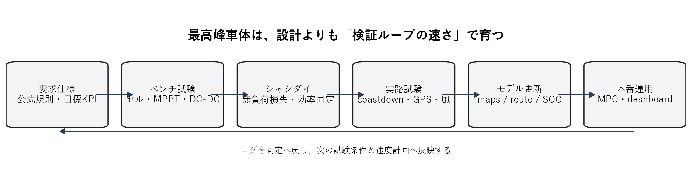
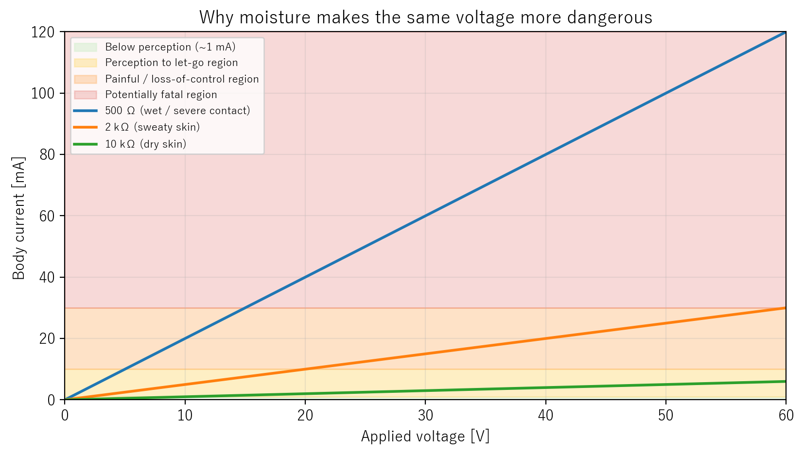
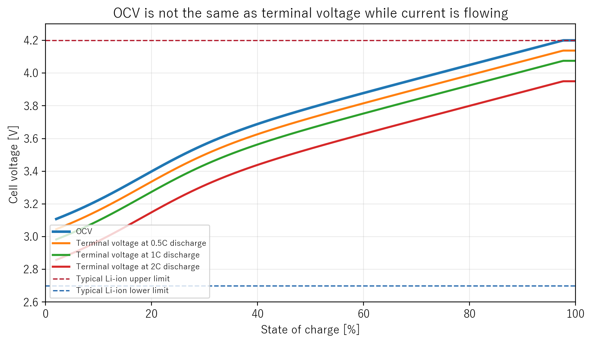
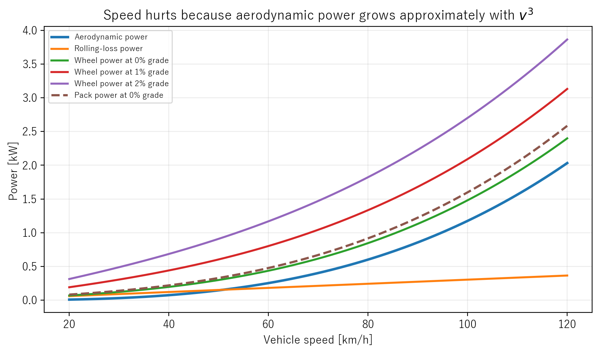
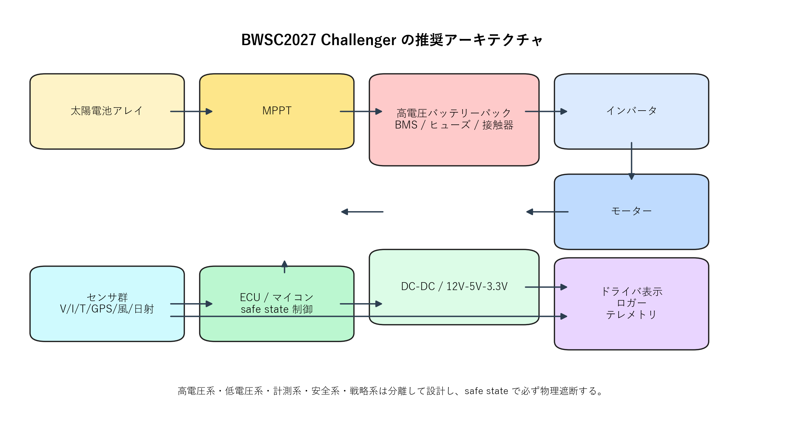
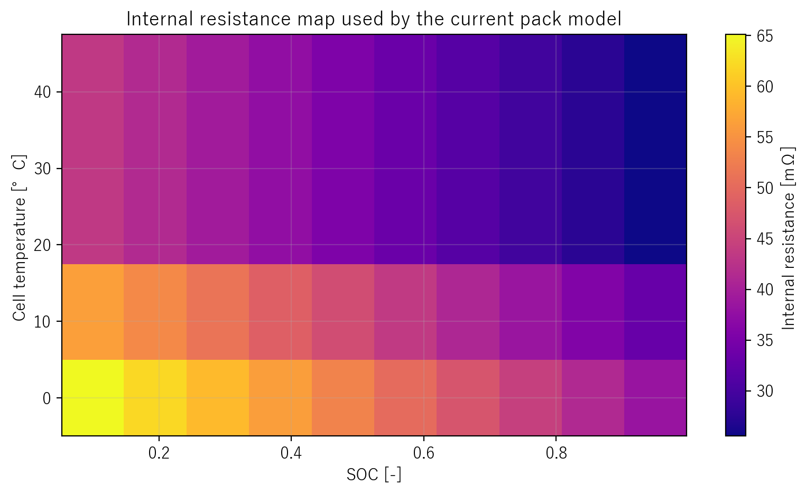
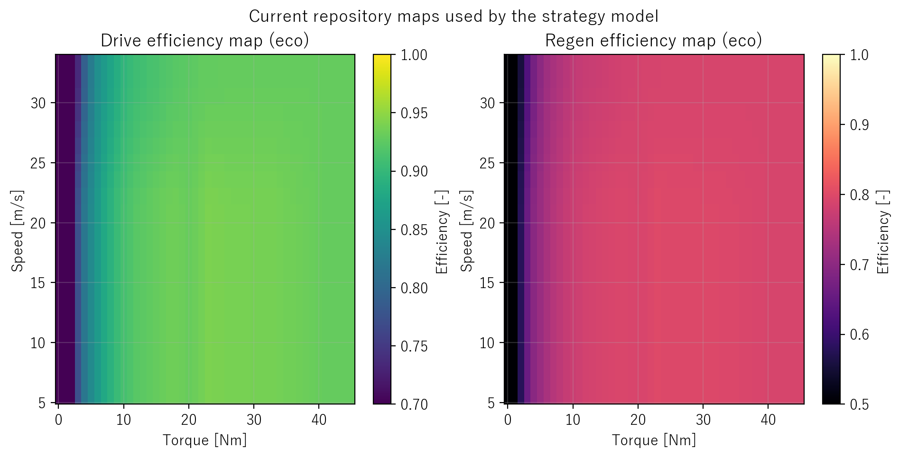

# はじめに

本書は、元資料 `0620_シャシダイナモメータを用いた最適エネルギーマネジメント手法の開発_前提知識資料.pdf` を、**BWSC2027 Challenger 車両を 1 から設計し、計測し、制御し、本番運用する**ための順番に並べ替えた完全版手引きである。元資料の強みである電気・電装の根本理解を残しつつ、そこに不足していた以下を全面的に補った。

- BWSC2027 の公式前提
- 車両全体アーキテクチャ
- 空力、転がり、重量、熱、配線、EMC、テレメトリ
- シャシダイと実路を使った同定手順
- 現在の `solar_ws0129-main` を使う戦略計算と本番運用
- 設計レビューで落としてはいけない安全・製造・運用チェック

本書の再構成方針は単純である。

1. まず **何が公式に固定されているか** を押さえる。
2. 次に **何を満たす車が強いか** を定義する。
3. その後で **電気・電装の根本原理** を設計判断に結びつける。
4. さらに **車体・電池・モーター・センサ・ソフト** を一体のシステムとして設計する。
5. 最後に **試験、同定、戦略、本番運用** へ落とし込む。

この資料だけで設計を進められるように、各章ではできるだけ次の 3 観点で整理した。

- 何を決めるか
- 何を測るか
- 何で壊れるか

また、**2026年6月21日時点**で変わりうる値については、必ず具体的な日付を添えて書いている。BWSC2027 の route notes はまだ未公開であるため、その部分だけは本書の最後に「後で必ず差し替える一覧」として明示した。

# 2026年6月21日時点で検証済みの BWSC2027 公式条件

まず、勝てる車を作る前に、**そもそもレギュレーションを満たさない車は出走すらできない**。ここは設計の最上位拘束条件であり、思想や好みより先に固定する。

この節の公式値は、特記なき限り 2027 Event Regulations と 2027 Team Manager's Guide を 2026年6月21日に確認した内容である[^reg2027][^guide2027]。

| 項目 | 2026年6月21日時点で確認できる条件 | 設計への意味 |
| --- | --- | --- |
| 開催期間 | `2027-08-22` から `2027-08-29` | 冬季開催を前提に日射・気温・結露・朝夕気温差を考える。 |
| ルート | Darwin から Adelaide、約 `3,020 km` | 完走条件は短距離性能ではなく、数千 km の総合効率と信頼性で決まる。 |
| 公道条件 | 通常交通下の公道イベント | 静的性能より視界、灯火、姿勢安定、再発進性、整備性が重要。 |
| 車体外形 | 走行時に `5800 mm × 2300 mm × 1650 mm` の直方体内 | キャノピー、後輪カバー、ソーラーパネル展開形状を最初から寸法管理する。 |
| 車輪数 | 走行時に少なくとも 3 輪 | 3輪/4輪の選択は空力だけでなく転倒安定、整備性、タイヤ管理に波及する。 |
| Challenger 太陽電池面積 | `6 m^2` 以下 | 面積上限いっぱいをどう使うかが発電設計の中心になる。 |
| Challenger 蓄電エネルギー | `11 MJ` 以下 | 約 `3055 Wh` が上限であり、バッテリー容量で逃げ切る設計はできない。 |
| 蓄電パック数 | 最大 2 パック | パック分割、封印、搬送、サービス性を初期から考える。 |
| セル運用範囲 | 電圧・電流・温度はメーカー仕様内に自動的に制限 | BMS は表示装置ではなく、**保護を自動で実行する機構**として作る必要がある。 |
| safe state | 正負極両側接触器によるガルバニック遮断、PV 側も自動遮断、外部ループ電流なし | MOSFET のみで「止めたつもり」は不可。物理遮断を前提に高圧系を作る。 |
| 夜間走行 | 日没後から日の出前の公道走行は禁止 | 1 日の速度計画は、日射だけでなく「翌朝に持ち越す SOC」を必ず含む。 |
| Control stop 時間 | `17:00` で停止、翌 `08:00` から再開 | 夕方の余剰発電と朝の立ち上がりを含む日単位戦略が必要。 |
| Challenger パック封印 | 毎日 `19:15` までに封印、`06:15` までは開封不可 | 夜間整備の自由度は限定される。配線変更や電池交換前提の運用は破綻する。 |
| 競技継続条件 | 開放路で `60 km/h` を維持できない、または次の control stop に間に合わないと「no longer competing」対象 | 最高速よりも、向かい風や登坂時に**最低限の巡航を維持できる余力**が必要。 |
| Route notes | 2027年6月から電子配布予定 | 最終 stop、速度制限、都市部処理、道路工事情報はまだ確定していない。 |

この表から分かる最重要点は次の 4 つである。

- **6 m² の太陽電池と 11 MJ のバッテリー** で 3000 km を走る競技である。
- **公道で止まらず、壊れず、見え、曲がり、再始動できること** がレースの最低条件である。
- **safe state、封印、BMS 自動保護** は書類上の飾りではなく、車両構造そのものを決める。
- **route notes が未公開の時点では、ルート依存値をサンプルで埋めるしかない**。よって今やるべきは、路面・風・損失が変わっても破綻しない設計を作ることになる。

## 現在のチーム用デモプロファイルが示す設計出発点

`config/solar/bwsc_2027_demo.yaml` に入っている現在の代表値は、**公式最終値ではなく、設計・戦略の叩き台**である。ただし、どの量が支配的かを掴むには十分に有用である。

| パラメータ | 現在値 | 読み方 |
| --- | ---: | --- |
| 車両質量 `m` | `224 kg` | ドライバー・バラスト・荷物の実運用条件で再確認が必要。 |
| 抗力面積 `CdA` | `0.093 m^2` | 空力改善の最重要 KPI。速度三乗損失に効く。 |
| 転がり抵抗係数 `Crr` | `0.005` | タイヤ、アライメント、荷重、路面で変わる。 |
| 補機電力 `P_aux` | `8 W` | 実車では通信、表示、冷却で増えやすい。 |
| パネル面積 `pv_area` | `6.0 m^2` | すでに公式上限いっぱいで計画されている。 |
| MPPT 効率 | `0.95` | 実測 sweep で再同定すべき。 |
| インバータ効率 | `0.98` | 速度域・トルク域で一定とは限らない。 |
| 公称蓄電量 `E_nom` | `3055 Wh` | `10.998 MJ` に相当し、11 MJ 制限ほぼ上限である。 |
| パック電圧範囲 | `75.0 V` から `108.75 V` | MPPT、DC-DC、接触器、絶縁設計に直結する。 |
| 最大放電電流 `I_max` | `40 A` | モーター側要求と BMS 設定の整合が必要。 |
| 最大充電電流 `I_chg_min` | `-16.5 A` | 回生と MPPT 両方の充電条件を整理する必要がある。 |
| レース距離 `race_km` | `3035.5 km` | 公式 route notes 公開後に必ず再設定する。 |

この現在値から、**レギュレーション上限に近い軽量・低抗力・低電流車**を狙っていることが分かる。逆に言えば、この設計思想を壊す最大要因は次である。

- 実車重量が見積もりより増える
- 実タイヤ `Crr` が机上値より悪い
- 配線損失と補機電力が過小見積もり
- 風、勾配、温度、SOC 推定誤差が戦略を狂わせる

# 最高峰車体を作るための開発思想

「最高峰」とは、単に速い車ではない。本書では次を同時に満たす車を最高峰と呼ぶ。

1. **公式規則を無理なく満たす**
2. **safe state と電池保護が確実**
3. **低損失で長時間の巡航ができる**
4. **必要なデータを十分に測れる**
5. **戦略ソフトに渡すモデル誤差が小さい**
6. **故障しても原因を絞り込める**

## 勝ち筋は「1 回の名設計」ではなく「検証ループの速さ」

{ width=92% }

ソーラーカー開発では、机上の一発正解はほぼ存在しない。強いチームは、**試験して、同定して、モデルを更新し、また試験する**速度が速い。特に BWSC2027 のようにバッテリー許容量が小さい条件では、数 % のモデル誤差がそのままレース順位に効く。

## 開発初期に固定すべき要求仕様

元資料の後半にある「最初に決めるべき要求仕様」は極めて重要であり、ここを曖昧にすると部品選定が全部後戻りになる。最初に決めるべき量は次である。

- バッテリー公称電圧、最大電圧、最小電圧
- 最大放電電流、最大回生電流、最大充電電流
- モーター最大機械出力、巡航時平均電力
- 太陽電池最大発電電力
- MPPT 入出力電圧範囲、電流範囲
- 補機電圧系統、補機最大電流
- 計測周期、ロギング周期、テレメトリ周期
- 風、水、粉塵、熱に対する耐環境条件
- safe state 発動条件と解除条件

ここで重要なのは、**平均値ではなく最大値と異常時を先に決める**ことである。巡航時に 1 kW 級でも、加速、横風、登坂、制御異常、突入電流、回生切替では瞬間的に全く別の世界になる。

## 最低限の開発ゲート

設計レビューは、感覚でなくゲートで回すべきである。

| ゲート | 合格条件 |
| --- | --- |
| 仕様凍結 | 規則要件、電圧・電流・温度上限、safe state 条件が文書化済み。 |
| ベンチゲート | セル、MPPT、DC-DC、接触器、BMS が単体で仕様内動作。 |
| HV 安全ゲート | 絶縁、プリチャージ、遮断、ヒューズ選定、故障時動作が検証済み。 |
| シャシダイゲート | 無負荷損失、駆動効率、回生挙動、センサ整合が測定済み。 |
| 実路ゲート | `CdA`、`Crr`、補機電力、GPS、風、日射データの一貫性確認済み。 |
| ソフトゲート | `simulate`, `forecast`, `identify`, `live_wifi` が再現可能。 |
| レース受け入れ | 1 日運用を模擬し、ログ・通信・safe state・再始動まで完了。 |

> **理解コラム 1: 速い車より、速度を維持できる車が強い**
>
> BWSC はラップタイム競技ではない。平均速度の高い車が勝つ。平均速度は、最高速よりも、向かい風・勾配・発熱・SOC 低下・通信不良のときにどれだけ落ち込まないかで決まる。したがって、トップ車体の本質は「ピーク性能」より「崩れにくさ」である。

# 電気・電装の基礎を設計判断に結びつける

元資料の前半は電気基礎として非常に重要である。ただし、ソーラーカー設計に使うには、単語の説明だけでなく**どの設計判断に効くか**まで結びつける必要がある。

## 電圧、電流、抵抗、回路

電気の最小理解は次の 5 語で足りる。

- 電荷: 電気的性質そのもの
- 電子: 負の電荷を持つ粒子
- 電圧: 電荷を動かそうとする位置エネルギー差
- 電流: 電荷の移動
- 抵抗: 電流の流れにくさ

それらの関係がオームの法則である。

$$
V = RI
$$

$$
I = \frac{V}{R}
$$

$$
P = VI = I^2R = \frac{V^2}{R}
$$

そして、**電流が流れるためには閉回路が必要**である。電圧があるだけでは電流は流れない。電池の片側から出て、負荷を通り、反対側へ戻る経路が成立したときだけ電流は流れる。

> **理解コラム 2: 電圧は「掛かる」、電流は「流れる」**
>
> 電圧は水位差のようなものであり、物体の両端に「掛かる」。電流はその差によって実際に「流れる」。この違いを混同すると、絶縁、感電、safe state の理解が曖昧になる。絶縁体でも電圧は生じうるが、理想的には自由電子がなく、大きな電流は流れない。

## 導体、絶縁体、液体導電

金属が電流を流しやすいのは自由電子があるからである。水道水や汗が危険なのは、金属のように自由電子があるからではなく、**イオンが動けるから**である。純水は比較的流しにくいが、水道水、汗、泥水、海水は不純物とイオンを含み、人体抵抗を大きく下げる。

{ width=84% }

この図が示すように、電圧が同じでも、抵抗が下がれば人体電流は急増する。だから、

- 雨天時のコネクタ露出
- 汗をかいた整備者による HV 作業
- 濡れた床上でのバッテリー取り扱い

は、机上よりはるかに危険になる。

## GND、アース、漏電、safe state

GND とアースは同じ言葉ではない。

- GND: 回路内で `0 V` と決めた基準電位
- アース: 大地へつながる保護接地
- 保護接地: 故障電流を人体ではなく低抵抗経路へ逃がすための接地

感電は「高電圧に触れたから」ではなく、**人体を通る閉回路ができたから**起こる。したがって設計で考えるべきは、

- どこに電圧が存在するか
- 故障時にどこへ戻り電流が流れるか
- 人体がその経路に入りうるか

である。

漏電検知や絶縁監視もこの考え方の延長にある。本来流れるべき経路以外へ電流が流れたら異常である。BWSC の safe state 要求が厳しいのは、事故時に**救助者が「外に出ている配線には電流がいない」と信じられる状態**を作る必要があるからである。

> **理解コラム 3: safe state は「止める状態」ではない**
>
> safe state は単なる主電源 OFF ではない。救助者、整備者、ドライバーが車両に触れても、外部に危険な高電圧が残っていないと期待できる状態である。だから BWSC 規則では、正極側だけでなく負極側も接触器で切り、PV 側も自動遮断し、MOSFET をガルバニック絶縁と見なしていない。

## 直流、CV、CC、短絡、重い負荷

ソーラーカーの主要電力系は直流である。バッテリー、MPPT、DC-DC、マイコン電源、テレメトリ機器は基本的に DC 系として考える。

定電圧電源では、

- 負荷抵抗が大きければ電流は小さい
- 負荷抵抗が小さければ電流は大きい

負荷が極端に小さくなった状態が短絡である。短絡時に危険なのは、**電圧が高いからではなく、ほぼ抵抗ゼロなので非常に大きな電流が流れるから**である。

CC モードは、その大電流を抑える仕組みである。これは実験用電源だけでなく、バッテリー充電、プリチャージ、突入電流抑制の考え方にそのままつながる。

## バッテリー、OCV、端子電圧、C レート

バッテリーは理想電圧源ではない。電流が流れていないときの電圧を OCV と呼び、電流が流れると内部抵抗と反応遅れで端子電圧は変わる。

$$
V_{term} = OCV(SOC, T) - I R_{int}(SOC, T) - V_{pol}
$$

したがって、**走行中の電圧をそのまま SOC と読み替えてはいけない**。走行中の電圧は、残量だけでなく、電流、温度、内部抵抗、回生状態の影響を受ける。

{ width=84% }

C レートは容量基準での充放電速度である。

$$
C_{rate} = \frac{I}{Q}
$$

例えば `20 Ah` パックに `40 A` を流せば `2C` である。C レートが上がると、

- 端子電圧降下が増える
- `I^2R` 発熱が増える
- 劣化が加速する
- SOC 推定誤差が増える

ので、戦略上も電池寿命上も不利になる。

## 電力、発熱、高電圧化の意味

同じ電力を送るなら、高電圧・低電流の方が有利である。

$$
P = VI
$$

$$
P_{loss} = I^2R
$$

電流が 2 倍になると導体損失は 4 倍になる。このため、

- ソーラーアレイ側は可能な範囲で高電圧・低電流へ寄せる
- パック側も必要電力を満たす範囲で電流を抑える
- コネクタ、バスバー、接触器、ヒューズは最大電流で選定する

という設計思想が必要になる。

# ソーラーカーの支配方程式

ここから先は、基礎式を「車両のどこに効くか」でまとめる。

## 電力収支

ソーラーカーの最も基本的な式は次である。

$$
P_{net} = P_{solar} - P_{drive} - P_{aux} - P_{loss}
$$

ここで、

- $P_{solar}$: 太陽電池から得る電力
- $P_{drive}$: 車輪を回すための電力
- $P_{aux}$: 補機が消費する電力
- $P_{loss}$: 配線、変換、内部抵抗、熱などの損失

である。

$P_{net} > 0$ なら電池は充電され、$P_{net} < 0$ なら放電される。BWSC の戦略とは、結局この差分を route、time、weather に合わせて管理することに他ならない。

## 太陽電池発電

概算レベルでは、ソーラーアレイ出力は次で見積もれる。

$$
P_{solar} \approx G_{POA} A_{pv} \eta_{panel} \eta_{mppt} \eta_{wiring}
$$

ここで $G_{POA}$ はパネル面入射日射、$A_{pv}$ はセル面積、$\eta_{panel}$ はセル効率、$\eta_{mppt}$ は MPPT 効率である。実際には温度、部分影、姿勢、汚れ、封止、配線長、逆流防止素子がさらに効く。

## 走行抵抗

走行時の主抵抗は空気抵抗、転がり抵抗、勾配抵抗である。

$$
F_{air} = \frac{1}{2}\rho C_d A v^2
$$

$$
F_{roll} = C_{rr} m g
$$

$$
F_{grade} = m g \sin \theta \approx m g \cdot grade
$$

$$
F_{total} = F_{air} + F_{roll} + F_{grade}
$$

$$
P_{wheel} = F_{total} v
$$

空力の本質はここに尽きる。

$$
P_{air} \propto v^3
$$

速度を上げると電力が急激に重くなる。だからトップ車体ほど、単にモーターを強くするのでなく、**CdA を削り、横風で姿勢を乱さず、同じ平均速度をより小さい電力で出す**ことに全力を使う。

{ width=86% }

この図を見ると、低速では転がりが効き、高速では空力が支配することが分かる。1 % や 2 % の勾配でも必要電力が無視できない理由も見える。

## SOC と熱

SOC は電流積分で追うのが基本である。

$$
SOC(t) = SOC(0) - \frac{1}{Q} \int_0^t I(\tau)\, d\tau
$$

電池発熱の一次近似は次である。

$$
P_{heat} \approx I^2 R_{int}
$$

したがって、**同じ平均エネルギーでも、スパイク電流の多い運転は不利**である。MPC やドライバー指示で速度変化を滑らかにする意味は、単なる乗り心地ではなく、発熱、電圧降下、劣化、センサ誤差、safe state リスクを全部下げる点にある。

# BWSC2027 Challenger の推奨アーキテクチャ

元資料後半の「BWSC 電装系の全体構成」は、そのままでは部品一覧に見えるが、本質は**サブシステム間の責務分離**にある。

{ width=92% }

## サブシステム分解

本書では、競争力に効く単位として次の 9 系統に分ける。

1. 発電系: 太陽電池アレイ、バイパス、逆流防止、MPPT
2. 蓄電系: バッテリーパック、BMS、セル監視、封印機構
3. 高圧安全系: 接触器、プリチャージ、ヒューズ、絶縁監視、HVIL、E-stop
4. 駆動系: インバータ、モーター、回生制御、車輪側機械結合
5. 低圧補機系: DC-DC、5 V / 3.3 V、灯火、ホーン、ファン
6. 計測系: 電圧・電流・温度・GPS・IMU・日射・風・速度
7. HMI 系: ドライバ表示、警告灯、ブザー、伴走車表示
8. 通信・ログ系: CAN/UART/UDP、ロガー、SSD/SD、時刻同期
9. 戦略・制御系: ECU、マイコン、safe state 制御、MPC、dashboard

## 各系の設計原則

| 系統 | 最重要原則 |
| --- | --- |
| 発電系 | 最大出力より、面積カウントと部分影耐性を先に考える。 |
| 蓄電系 | 容量より、保護・封印・熱・ばらつき管理を先に考える。 |
| 高圧安全系 | 平常時より、故障時に必ず安全側へ倒れる構造を作る。 |
| 駆動系 | 高出力より、効率マップが分かっていることを重視する。 |
| 低圧補機系 | 消費電力の小ささと再起動しない安定性を両立する。 |
| 計測系 | 測れない量は最適化できない。すべての重要損失を計測可能にする。 |
| HMI 系 | ドライバーに 1 秒で意味が伝わる表示に絞る。 |
| 通信・ログ系 | 生きているだけでなく、後で解析可能な時系列として残す。 |
| 戦略・制御系 | サンプル値で動くことと、本番値で勝てることを分けて考える。 |

> **理解コラム 4: 電装は「配線」ではなく「情報の流れ」でもある**
>
> 例えばモーター電流が増えると、電池電圧降下、DC-DC 入力変動、マイコン電源ノイズ、通信断、表示リセットという連鎖が起こりうる。つまり電装設計は、電力系、信号系、ソフト系を別々に作ってよい分野ではない。

# 太陽電池アレイと MPPT

## 何を決めるか

- セル型番
- 直列数と並列数
- 面積カウント方法
- 封止方法
- 部分影時のバイパス構成
- 逆流防止方式
- MPPT 入力電圧と入力電流の余裕率
- アレイと MPPT の物理配置、熱経路、配線長

## 何を測るか

- セル `V_OC`, `I_SC`, `V_mp`, `I_mp`
- 温度係数
- 実装後の面積計算
- 部分影時 IV 変化
- MPPT 実効効率
- 発電時のコネクタ温度
- 雨天・朝露・汚れでの絶縁と出力低下

## 何で壊れるか

- 部分影によるホットスポット
- 低温時 `V_OC` 上昇で MPPT 入力過電圧
- 配線・端子の発熱
- 逆流防止不足による夜間逆電流
- 不適切封止による水侵入、剥離、機械割れ

## 面積上限 6 m² の意味

Challenger の太陽電池面積上限は `6 m^2` であり、単にセルの「見た目」ではなく、バスバー、フィンガ、接続パッド、インターコネクトで覆われた部分も含めて数えられる[^reg2027]。したがって、CAD 面積計算を後回しにすると、最後に規則違反が発覚する。

## 直列数は低温 `V_OC` で決める

MPPT 最大入力電圧は、室温ではなく**寒冷時の開放電圧**で見る。

$$
V_{OC,cold} = N_s V_{OC,25} \left[ 1 + \alpha_{VOC} (T_{cold} - 25) \right]
$$

ここで $\alpha_{VOC}$ は通常負であるため、温度が下がるほど $V_{OC}$ は上がる。よって、朝の冷えたアレイで過電圧にならない余裕を必ず見る。

## MPPT 選定チェック

MPPT 選定では次を最低限確認する。

- 最大入力電圧
- 最小入力電圧
- 最大入力電流
- 最大入力電力
- 出力電圧範囲
- 出力電流範囲
- 逆流防止機能
- 変換効率
- 過温度保護
- ログ取得方法
- 故障時の振る舞い

> **理解コラム 5: 太陽電池側は「高電圧・低電流」が有利**
>
> 同じ発電電力なら、電流が小さいほど配線損失 `I^2R` は急減する。だからアレイ側は高電圧設計に寄りやすい。ただし、高電圧化は絶縁要求、MPPT 定格、safe state 要件を重くする。最適は「高いほどよい」ではなく、「安全要求と部品定格の中で最も損失が小さい点」である。

# バッテリーパック、BMS、高圧安全

## 何を決めるか

- セル種別、セル型番、ロット
- 直列数、並列数、総エネルギー
- バスバー材質と断面積
- パックケース材質、防水、防塵、ベント
- BMS 機能範囲
- 接触器定格
- プリチャージ抵抗と時定数
- ヒューズ定格
- 絶縁監視方式
- サービスプラグ、HVIL、封印構造

## 何を測るか

- セル容量ばらつき
- セル内部抵抗ばらつき
- OCV-SOC カーブ
- 温度依存内部抵抗
- パック温度分布
- 接触器開閉波形
- プリチャージ完了時間
- safe state 後の残留電圧

## 何で壊れるか

- 過充電
- 過放電
- 大電流による発熱
- 低温充電
- セルばらつきによる一部セル先行劣化
- 接触器溶着
- 突入電流
- 絶縁低下
- 配線緩み

## 11 MJ 制限の使い方

BWSC 2027 の Challenger 蓄電上限は `11 MJ` である[^reg2027]。公式エネルギー計算はメーカー公称電圧と容量に基づき、次で与えられる。

$$
E = 3600 V q
$$

ここで $E$ はジュール、$V$ はセル公称電圧、$q$ はセル容量 `Ah` である。現在のデモプロファイル `3055 Wh` は、

$$
3055 \ \mathrm{Wh} \times 3600 = 10.998 \ \mathrm{MJ}
$$

に相当し、ほぼ上限いっぱいである。つまり、**これ以上はバッテリーで逃げられない**。勝負はアレイ効率、低損失、観測精度、戦略に移る。

## 直列・並列と熱

$$
V_{pack} = N_s V_{cell}
$$

$$
Q_{pack} = N_p Q_{cell}
$$

$$
P_{heat} \approx I^2 R_{int}
$$

直列を増やせば電圧が上がり、同じ電力で必要電流を下げられる。並列を増やせば容量と許容電流は増えるが、質量、体積、セルばらつき管理が重くなる。トップ車体では、**電力要求を下げる設計**と**電流を下げる電圧設計**を同時に進める。

{ width=82% }

この種の `Rint` マップが無いと、

- 電圧降下予測
- 回生受入れ限界
- 発熱見積もり
- SOC 推定補正

の全部が弱くなる。

## BMS に最低限必要な機能

- 全セル電圧測定
- セル過電圧 / 低電圧検出
- セル温度測定
- 低温充電禁止
- 過電流 / 短絡検出
- SOC 推定
- セルバランス
- 接触器制御
- プリチャージ制御との連携
- 異常ログ保存
- safe state 要求出力

SOC 推定の第一歩はクーロンカウントである。

$$
SOC(t) = SOC(0) - \frac{1}{Q}\int_0^t I(\tau)d\tau
$$

ただし電流オフセット誤差は積分で蓄積するため、休止時 OCV 補正、モデル補正、温度補正を組み合わせる必要がある。MPC 側で SOC を扱うなら、**BMS が出した SOC をそのまま信じるだけでは不十分**である。

## 接触器、プリチャージ、safe state

BWSC の safe state 要求は、正極側と負極側の両方を接触器で切ることを要求している[^reg2027]。これは極めて重要である。

プリチャージの時定数は次で見積もれる。

$$
\tau = RC
$$

$$
V_C(t) = V_{bat}\left(1 - e^{-t/(RC)}\right)
$$

起動の基本順序は次である。

1. 安全確認
2. マイナス側接触器投入
3. プリチャージ経路投入
4. インバータ入力電圧確認
5. プラス側メイン接触器投入
6. プリチャージ経路解放

安全停止の基本順序は、**どの故障モードでも最終的に接触器が開き続ける方向へ倒れる**ように作る。

## 高圧安全レビューの実務チェック

- safe state 後 5 秒以内に外部キャパシタが `60 V` 未満になるか[^reg2027]
- 太陽電池側の外部導体に危険電圧が残らないか
- 接触器片側溶着時にもう一方で安全を確保できるか
- BMS 故障時に接触器は開放側へ倒れるか
- HVIL 断線で安全側へ遷移するか
- サービスプラグ抜去時に手順違反しても感電しにくい構造か
- 整備者の手が入る部分に HV 警告ラベルと絶縁カバーがあるか

> **理解コラム 6: MOSFET は「切れているように見えても」絶縁ではない**
>
> 半導体は故障モードとして短絡があり得る。よって高圧安全の最終責任を MOSFET に持たせてはいけない。safe state は、機械接点によるガルバニック遮断を前提に組む。

# モーター、低圧補機、センサ、EMC

## モーターとインバータ

駆動系では、最高出力値よりも**どの回転数・トルクで効率が高いか**が重要である。現在の repo では効率マップを読み込んで戦略計算に使う構成になっている。

{ width=92% }

何を決めるか:

- 巡航速度域での高効率点
- 回生を有効に使える速度域
- コントローラ冷却方式
- 相線断面とコネクタ定格
- 実車最大トルク要求と `I_max` の整合

何を測るか:

- トルク、回転数、電流、電圧
- 巡航効率
- 加速 / 登坂 / 横風時の消費電力
- 回生時の充電電流と受入れ限界

何で壊れるか:

- 過電流
- 過温度
- 相線接触不良
- ハーネス振動破断
- 回生時の過電圧

## 低圧補機電源

補機電源は軽視されやすいが、実戦ではここが通信断と再起動の主因になる。

最低でも次の分離を推奨する。

- 高圧パック
- 12 V 灯火・ファン・接触器コイル
- 5 V 通信・センサ
- 3.3 V マイコン / 一部 IMU / ADC

補機電源では次を必ず測る。

- 各電源レール電圧
- 瞬低発生有無
- 最大補機電流
- 車速変動や接触器動作時のリセット有無

## センサ設計

勝つために最低限必要な計測量は次である。

- パック電圧
- パック電流
- SOC
- バッテリー温度
- モーター温度
- インバータ温度
- 車速
- 位置 `lat`, `lon`, `alt`
- 走行距離 `s_km`
- パネル面入射日射 `G_POA`
- 周囲温度
- 風速・風向または headwind

このうち `speed_kmh`, `soc`, `batt_current_a`, `batt_voltage_v`, `lat`, `lon` が欠けると、MPC の精度は急激に落ちる。

## ノイズ、GND、EMC

元資料のノイズ節で最も重要なのは、「フィルタは万能ではない」という点である。ノイズ対策は次の順に行う。

1. ノイズ源を小さくする
2. 伝搬経路を断つ
3. 受けにくい回路にする
4. 最後にフィルタする

実務上の推奨は次である。

- 電流センサと ADC GND を雑に共有しない
- 高電流相線とセンサ線を並走させない
- 差動信号はツイストペア
- CAN、エンコーダ、重要 UART はシールドまたは物理距離を取る
- 接触器コイル、ファン、ポンプには逆起電力対策を入れる
- ログで異常値除去する前に、物理層でノイズを減らす

# 空力、タイヤ、重量、熱、パッケージング

元資料は電装中心だったが、**最高峰車体**を作るにはここが不足していた。電気設計だけで勝つことはできない。

## 空力

空力は `CdA` で効く。重要なのは次である。

- 前面投影面積を減らす
- 剥離を抑える
- ヨー角での安定性を持たせる
- 横風でドライバーが速度を落とさなくてよい形にする
- 冷却空気導入を最小損失で行う

空力設計でありがちな誤りは、「正面写真だけきれい」な車体である。BWSC では横風、路面段差、速度変動、灯火、整備アクセスまで含めて評価する。

## タイヤと転がり抵抗

タイヤは単なる消耗品ではない。`Crr` を決める主因の一つである。

見るべき量:

- 空気圧と温度依存
- 荷重依存 `Crr`
- アライメント依存
- 摩耗進行
- パンク時の制御性

強い車は、タイヤメーカー公表値だけでなく、**自車重量と空気圧条件で実測**している。

## 重量と質量配分

軽いことは有利だが、ただ軽いだけでは危険である。重要なのは次である。

- 総質量
- 前後輪荷重
- 左右差
- バッテリー位置
- 重心高さ
- ドライバー交代時のバラスト条件

重量配分はタイヤ摩耗、制動姿勢、横風応答、サスペンション設定、接地荷重、発電時の姿勢安定まで波及する。

## 熱設計

熱源は主に次である。

- バッテリー `I^2R`
- インバータ損失
- モーター銅損・鉄損
- MPPT 損失
- 補機 DC-DC 損失

冷却では「冷やす」だけでなく、

- どこを何度以下に保つか
- センサでどう監視するか
- どこで出力制限へ入るか
- 故障時にどこまで自走継続するか

を決める必要がある。

## 実装と防水

オーストラリアでは、熱だけでなく雨、朝露、粉塵、振動、石跳ねが全部来る。よって、

- 防水コネクタ
- ケーブルグランド
- 振動緩和
- ストレインリリーフ
- 点検可能なハーネスルート
- 排水経路

を設計初期から入れる。完成直前に配線をねじ込む方式では、強い車体にはならない。

# 計測・同定・シャシダイ

この章は、元資料と現在の repo、さらにローカルのシャシダイ手順をつなぐ最重要章である。**モデルが弱いと戦略は勝てない**。

## まず集めるべきデータ

repo が最低限欲しがっている走行ログ列は次である。

- `time`
- `speed_kmh`
- `batt_voltage_v`
- `batt_current_a`
- `soc`
- `batt_temp_c`
- `lat`
- `lon`
- `alt_m`

強く推奨される列は次である。

- `s_km`
- `G_poa`
- `Tamb_C`
- `Tcell_C`
- `wind_speed_ms`
- `wind_dir_deg`
- `course_deg`
- `headwind_ms`

## シャシダイを使う理由

シャシダイは単に「その場で回せる」装置ではない。車体を止めたまま、

- 駆動効率
- 無負荷損失
- 回生挙動
- センサ校正
- 電源・通信の安定性

を分離して見られる装置である。実路だけでは風や勾配が混ざってしまい、駆動系だけの純粋な損失を切り出しにくい。

## ローカル手順書に基づく無負荷損失試験

`シャシダイナモ無負荷損失_試験手順書.pdf` の要点は次である。

1. ローラーとタイヤにマーカーテープを貼る
2. カメラを固定し、同一画角で動画撮影する
3. 空転状態で回転数ごとに定常撮影する
4. 接地状態でも同じ回転数点で定常撮影する
5. 並行して `Pin`, `Vbatt`, `rpm` を記録する

この試験の本質は、「タイヤ接地があるときの損失」と「ローラー単独損失」を分離することにある。ここが分かると、

- 走行抵抗モデルの補正
- シャシダイ上の擬似走行モデル
- 効率マップ生成時のオフセット補正

がしやすくなる。

## ベンチから route / map を作る流れ

repo の `identify` パイプラインは概ね次を想定している。

- `battery_rest.csv` から OCV カーブ
- `battery_pulse.csv` から `Rint` マップ
- `panel_sweep.csv` から panel / MPPT マップ
- `drive_timeseries.csv` から `CdA`, `Crr`, `P_aux`
- `gps_track.csv` から route waypoint / slope profile

強い運用にするなら、各 CSV は「後で読める」ように次を守る。

- 単位を列名に埋め込む
- UTC または timezone を明示する
- セッションごとにファイルを分ける
- 欠損表現を統一する

## 何が揃えばモデル更新できるか

| モデル要素 | 必要データ |
| --- | --- |
| OCV-SOC | 休止電圧、SOC、温度 |
| 内部抵抗 | パルス電流、電圧応答、温度 |
| 駆動効率 | 速度、トルク、入力電力、出力推定 |
| 回生効率 | 速度、負トルク、充電電流、温度 |
| 空力・転がり | 実路 coastdown、長距離時系列、GPS |
| route profile | `lat`, `lon`, `alt`, `s_km` |
| 風補正 | 車両 / 伴走車風観測と予報の同時記録 |

> **理解コラム 7: sample データで動くことと、勝てることは別**
>
> `sample.csv` は launch や画面を壊さず動かすためには有用だが、戦略には使えない。勝てる戦略は、実車から取った `CdA`, `Crr`, `Rint`, `panel_eff`, `wind` の上にしか立たない。

# `solar_ws0129-main` による戦略計算と本番運用

現在の repo は、戦略と本番運用の母体としてかなり強い。重要なのは、**何ができていて、何がまだサンプルなのか**を区別することだ。

## この repo が担う 3 層

1. 事前準備: route / weather / map / 同定 / シミュレーション
2. 本番ライブ: 通信、予報更新、風補正、MPC、dashboard、logging
3. 事後改善: ログ再解析と次回モデル更新

## 主要モード

| Mode | 目的 | 主 launch |
| --- | --- | --- |
| `sim` | 画面付きシミュレーション確認 | `launch/solarcar_sim.launch.py` |
| `measure` | 実測ログ・地図取得 | `launch/solar_measurement.launch.py` |
| `live` | ROS topic 直結の本番運用 | `launch/solar_race_live.launch.py` |
| `live_wifi` | UDP JSON 文字列連携付き本番運用 | `launch/solar_race_live_wifi.launch.py` |

## 最重要コマンド

```powershell
.\SolarSim.ps1 -Action build
.\SolarSim.ps1 -Action forecast
.\SolarSim.ps1 -Action simulate
.\SolarSim.ps1 -Action identify
.\SolarSim.ps1 -Mode measure -Action up
.\SolarSim.ps1 -Mode live_wifi -Action up
.\SolarSim.ps1 -Mode live_wifi -Action graph
.\SolarSim.ps1 -Mode live_wifi -Action stop
```

## 重要なファイル入口

- 設定入口: `config/solar/bwsc_2027_demo.yaml`
- route: `data/route/*.csv`
- race schedule: `data/race/*.yaml`
- weather: `data/weather/*.csv`
- maps: `maps/*.csv`
- ROS 本体: `mpc_solarcar/*.py`
- dashboard: `dashboard/*`

## `mpc_node` が何をしているか

`mpc_node` は大きく 2 層で動く。

- 上位 planner: 時間 / 距離先読みで目標速度と SOC 進行を決める
- 下位 planner: 1 Hz 近傍で速度司令を滑らかに生成する

さらに live では、

- forecast CSV 再読込
- route profile 補間
- measured speed / distance / SOC の優先利用
- calibration 状態の反映

を行っている。

## `live_wifi` の価値

`live_wifi` は、予報取得、風補正、MPC、司令再送、dashboard、logging を一体で回せる点が強い。戦略担当、伴走車、車両側マイコンの間の情報ループがここで閉じる。

{ width=95% }

本番で最優先で見るべきものは次である。

1. `Speed Command`
2. `Battery SoC`
3. `Wind Plan`
4. `Next Stop / Finish ETA`
5. `Network Status`
6. `Forecast Status`

## まだ sample のままなもの

現在の repo で、本番投入前に必ず差し替えるべきものは次である。

- `route_waypoints_csv`
- `route_profile_csv`
- `speed_profile_csv`
- `forecast_csv`
- `stop_yaml`
- `drive_schedule_yaml`
- `maps/*.csv`
- sender / receiver 本番実装

つまり、この repo は**器としては強い**が、最終的な勝負を決めるのは入力品質である。

# レース週運用

## 役割分担

最低限の役割分担は次を推奨する。

| 役割 | 主責務 |
| --- | --- |
| Strategy Lead | forecast、route、schedule、最終速度判断 |
| Telemetry Lead | Pi 通信、dashboard、ログ保全 |
| Vehicle Control Lead | ECU / マイコン、watchdog、safe state |
| Battery Lead | パック監視、封印、充放電、安全対応 |
| Data / Identification Lead | ログ整理、map 更新、事後解析 |
| Chase Operator | 伴走車監視、通報、記録 |
| Driver Liaison | ドライバーへの指示整理、状態共有 |

## 走行前日のチェック

1. 公式 route notes の反映状況を確認
2. `stop_yaml` と `speed_profile_csv` を再確認
3. `model.*` と `maps/*.csv` が最新か確認
4. WiFi / IP / port の一致確認
5. `live_wifi` dry run
6. `graph` 出力確認
7. ログ保存先空き容量確認
8. fallback GPS のまま forecast を取っていないか確認

## 当日朝の流れ

1. Planner PC 起動
2. Pi / ECU 起動
3. 低圧補機電圧確認
4. `.\SolarSim.ps1 -Mode live_wifi -Action up`
5. dashboard で `network`, `forecast`, `wind model`, `command status` 確認
6. safe state 動作確認
7. 司令受信確認

## 走行中の判断基準

次の関係を見る癖を徹底する。

- `Speed Command` と `meas` がズレるなら車両側追従不良
- `Pack Current` が高いのに速度が伸びないなら風・勾配・機械損失を疑う
- `SoC` の落ち方が速いなら route / wind / `Crr` 誤差を疑う
- `Forecast Status` が `src=fallback` のままなら本気の戦略判断をしない
- `Wind Model Status` が観測待ちなら風計測系を確認する

## Overnight の考え方

公式には、control stop 時間は `17:00` で停止し、翌 `08:00` に再開する[^reg2027]。さらに Challenger パックは `19:15` までに封印し、`06:15` までは開封不可である[^reg2027]。したがって夜に自由に触れる部分と触れない部分を最初から分けておく。

夜にやるべきこと:

- ログ退避
- 配線点検
- タイヤ、機械、灯火、低圧系点検
- 風・予報・当日誤差の振り返り
- 翌朝戦略の更新

夜に前提としてはいけないこと:

- パックを開けて何とかする
- その場で BMS や接触器構造を変更する
- route notes 未反映のまま速度計画を固定する

# 製作、品質保証、チーム運営

## 文書として残すべきもの

最高峰車体は、現物だけでなく文書が強い。

- 要求仕様書
- 規則適合マトリクス
- 単線結線図
- パック構造図
- BMS 仕様書
- safe state 状態遷移図
- ハーネス一覧
- センサ一覧
- 校正記録
- ソフト version と設定 YAML
- 試験記録
- 故障履歴

## 受け入れ試験の最終項目

- HV 起動 / 停止が全温度帯で安定
- プリチャージが毎回成立
- safe state 後の残留電圧が規則内
- 低圧瞬低で ECU / 通信が落ちない
- 1 日相当の連続運用でログ欠落なし
- dashboard 上で主要値が埋まる
- ドライバーが表示を 1 秒で読める
- 伴走車が通信断、風誤差、SOC 異常を判断できる

## チーム運営の原則

ローカルの `心得.pdf` にある内容は、技術的にも正しい。特に次は重要である。

- 分からない状態を責めず、共有して早く直す
- まず小さく作って試す
- 失敗ログを残す
- 期限と見積もりを共有する
- 分業しつつ、最終責任者を曖昧にしない

ソーラーカーは個人技ではなく、**情報流通の速いチームが勝つ**。

# 2026年6月21日時点で不足しているものと更新順序

## まだ足りないもの

1. 2027 official route notes
2. 最終 control stop 情報
3. 実車の `CdA`, `Crr`, `P_aux`
4. 実パックの OCV / `Rint` / 温度依存
5. 実 MPPT / panel 効率マップ
6. 本番 sender / receiver 実装
7. 現地ネットワーク設計
8. 本番 day-by-day 運用ルール

## route notes 公開後に必ず差し替えるファイル

- `config/solar/bwsc_2027_demo.yaml`
- `data/route/bwsc_route_waypoints_*.csv`
- `data/route/bwsc_route_profile_*.csv`
- `data/route/bwsc_speed_profile_*.csv`
- `data/race/bwsc_control_stops_*.yaml`
- `data/race/bwsc_drive_schedule_2027.yaml`
- `data/weather/*.csv`
- `maps/*.csv`

## 最短の更新順

1. official route notes 反映
2. route / stop / speed profile 更新
3. 実路試験で `CdA`, `Crr`, `P_aux` 再同定
4. battery rest / pulse で OCV / `Rint` 更新
5. panel sweep / MPPT sweep で発電系 map 更新
6. `simulate` で感度比較
7. `live_wifi` dry run
8. 1 日模擬運用

# まとめ

BWSC2027 で強い Challenger を作るには、次を同時に達成する必要がある。

1. 規則を正確に満たす
2. 6 m² と 11 MJ の中で損失を最小化する
3. 安全に高圧を扱う
4. 車両状態を十分に測る
5. 同定したモデルを戦略へ戻す
6. 本番で情報が落ちない

本書の核心を一文で言えば、**勝つ車は、低損失な車ではなく、低損失を計測・再現・運用できる車である**。

元資料の電気基礎はそのための土台であり、ここに本書では、

- 公式レギュレーション
- 車両アーキテクチャ
- 機械・熱・防水
- シャシダイと実路同定
- repo を使った MPC 戦略と本番運用

を結びつけた。

この資料を起点に、次は必ず **実測値で上書きする文化** を作ってほしい。そこまで回り始めれば、車体は毎回確実に強くなる。

# 付録 A. 現在の repo で重要なファイル

## A.1 実運用の入口

- `SolarSim.ps1`
- `config/solar/bwsc_2027_demo.yaml`
- `launch/solar_race_live_wifi.launch.py`
- `mpc_solarcar/mpc_node.py`
- `mpc_solarcar/telemetry_text_bridge_node.py`
- `mpc_solarcar/wind_correction_node.py`

## A.2 同定と生成

- `scripts/solar_sim.py`
- `scripts/fetch_weather_forecast.py`
- `scripts/run_identification_pipeline.py`
- `scripts/build_route_profile_from_gps.py`
- `scripts/build_ocv_curve.py`
- `scripts/build_rint_map_from_timeseries.py`
- `scripts/build_pv_maps_from_csv.py`
- `scripts/fit_vehicle_params.py`

## A.3 入力データ

- `data/route/`
- `data/weather/`
- `data/race/`
- `maps/`
- `templates/identification/`
- `templates/network/`

# 付録 B. 設計レビュー用の即席チェックリスト

## B.1 高圧系

- 正負極両側接触器で切れているか
- プリチャージ時定数を設計値で説明できるか
- safe state 後の残留電圧を測ったか
- BMS が自動で保護動作するか
- 絶縁監視結果をログに残せるか
- 封印手順が実車構造と矛盾しないか

## B.2 発電系

- 6 m² 面積計算が CAD で確定しているか
- 低温 `V_OC` で MPPT 過電圧にならないか
- 部分影時のホットスポット対策があるか
- 逆流防止があるか
- MPPT 実効効率を測ったか

## B.3 駆動系

- 巡航域の高効率点を説明できるか
- 回生受入れ限界を把握しているか
- モーター / インバータ温度を測れるか
- 相線、コネクタ、ヒューズが最大電流で成立するか

## B.4 計測・通信

- `speed_kmh`, `soc`, `batt_current_a`, `batt_voltage_v`, `s_km`, `lat`, `lon` が揃うか
- 風観測が取れるか
- ログ時刻が揃うか
- 通信断検知と watchdog があるか
- dashboard の主要値が埋まるか

## B.5 機械・熱

- 実車重量と重心を測ったか
- `Crr` を実圧条件で測ったか
- cooling path を説明できるか
- 防水、排水、振動対策があるか
- サービスアクセスでハーネスを壊さないか

# 付録 C. 出典

[^reg2027]: Bridgestone World Solar Challenge, *2027 Event Regulations* (Version 1.0, published 2026-05-07), https://assets.worldsolarchallenge.org/app/uploads/2026/05/06130905/2027-BWSC-Event-Regulations-V1.0-Published-07052026.pdf, accessed 2026-06-21.

[^guide2027]: Bridgestone World Solar Challenge, *2027 Team Manager's Guide* (Version 1, published 2026-05-07), https://assets.worldsolarchallenge.org/app/uploads/2026/05/06130911/2027-BWSC-Team-Managers-Guide-V1-Published-07052026.pdf, accessed 2026-06-21.

本書のローカル再構成に利用した主なチーム内資料:

- `0620_シャシダイナモメータを用いた最適エネルギーマネジメント手法の開発_前提知識資料.pdf`
- `docs/bwsc2027_team_manual.md`
- `docs/solar_workflow.md`
- `docs/solar_live_wifi_manual.md`
- `config/solar/bwsc_2027_demo.yaml`
- `data/race/bwsc_drive_schedule_2027.yaml`
- `mpc_solarcar/mpc_node.py`
- `シャシダイナモ無負荷損失_試験手順書.pdf`
- Bridgestone World Solar Challenge, `Route Map`, https://worldsolarchallenge.org/about-us/route-map, accessed 2026-06-21
