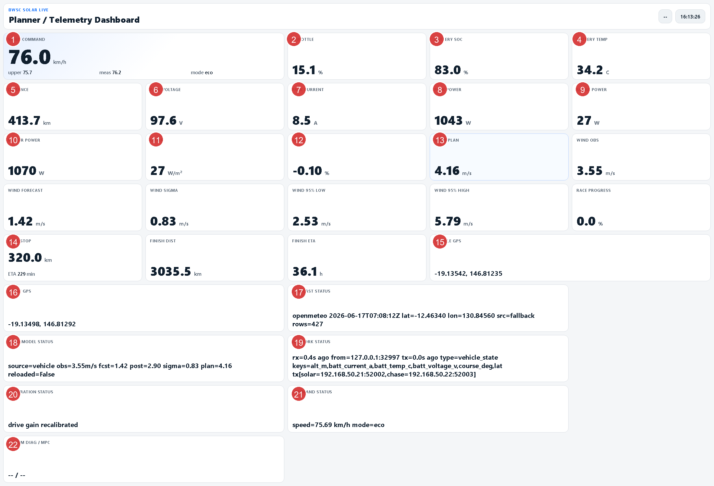
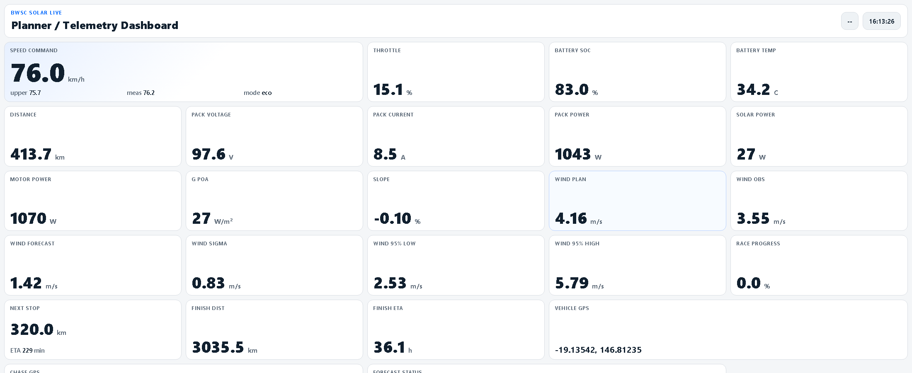
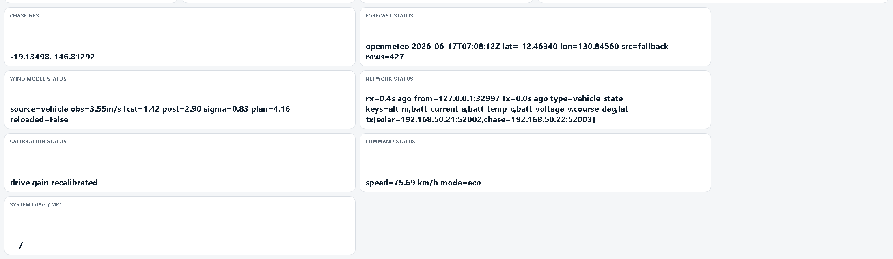

# BWSC2027 Team Operations Manual

## 1. この文書の目的

この文書は、和歌山大学ソーラーカーチームのメンバーが、**本パッケージを作者不在でも理解し、準備し、運用し、改善できる状態**になるための引き継ぎ資料です。

対象読者:

- 戦略担当
- 伴走車オペレータ
- 車両制御・マイコン担当
- 実測・同定担当
- 新規加入メンバー

この文書のゴール:

1. この workspace が何をしているかを理解する
2. 何が未確定で、何を集める必要があるかを理解する
3. `PowerShell` から各モードを起動・停止できる
4. `live_wifi` を BWSC2027 本番運用へつなげられる
5. dashboard を見て、正常・異常・次に取るべき行動を判断できる

## 2. BWSC2027 の公式前提

このパッケージは BWSC2027 を想定して整理していますが、**大会固有値は必ず公式資料で再確認**してください。

2026年6月17日時点で、公式サイト上で確認できる重要事項:

- 開催期間: `2027-08-22` から `2027-08-29`
- ルート: `Darwin -> Adelaide`
- ルート長の目安: 約 `3,020 km`
- Team Manager's Guide では、2027 route notes は **2027年6月から電子配布予定**

公式資料:

- Event Regulations: <https://worldsolarchallenge.org/2027-event/regulations>
- 2027 Event Regulations PDF: <https://assets.worldsolarchallenge.org/app/uploads/2026/05/06130905/2027-BWSC-Event-Regulations-V1.0-Published-07052026.pdf>
- 2027 Team Manager's Guide PDF: <https://assets.worldsolarchallenge.org/app/uploads/2026/05/06130911/2027-BWSC-Team-Managers-Guide-V1-Published-07052026.pdf>
- Route Map: <https://worldsolarchallenge.org/about-us/route-map>
- 2027 dates article: <https://worldsolarchallenge.org/latest-news/2027-dates-regulations-announced>

重要:

- **2027 route notes はまだ repo に入っていません**
- control stop の最終定義もまだ未反映です
- この repo の route / stop / weather の一部は sample です

## 3. このパッケージが担う役割

本パッケージは、ソーラーカー戦略運用を次の 3 層で支えます。

### 3.1 事前準備

- 実測データ整理
- 同定
- route/profile/map の生成
- 天候予報 CSV 取得
- 大会全体シミュレーション

### 3.2 本番ライブ運用

- 車両状態受信
- 伴走車状態受信
- 天候 API 自動取得
- 風予報のオンライン補正
- 上位プラン再計画
- 下位速度司令 1 Hz 生成
- ソーラーカー / 伴走車への指令送信
- dashboard 表示
- ログ保存

### 3.3 事後改善

- ログ再解析
- map / model 更新
- 次回シミュレーション精度向上

## 4. 主要モード

通常入口:

- 実行: `.\SolarSim.ps1`
- 設定: `config/solar/bwsc_2027_demo.yaml`

主要モード:

| Mode | 目的 | 主 launch |
| --- | --- | --- |
| `sim` | 画面付きシミュレーション確認 | `launch/solarcar_sim.launch.py` |
| `measure` | 実測ログ・地図取得 | `launch/solar_measurement.launch.py` |
| `live` | ROS topic 直結の本番運用 | `launch/solar_race_live.launch.py` |
| `live_wifi` | WiFi/UDP 文字列連携付き本番運用 | `launch/solar_race_live_wifi.launch.py` |

最重要コマンド:

```powershell
.\SolarSim.ps1 -Action build
.\SolarSim.ps1 -Action simulate
.\SolarSim.ps1 -Action forecast
.\SolarSim.ps1 -Action identify
.\SolarSim.ps1 -Mode measure -Action up
.\SolarSim.ps1 -Mode live_wifi -Action up
.\SolarSim.ps1 -Mode live_wifi -Action graph
.\SolarSim.ps1 -Mode live_wifi -Action stop
```

## 5. ディレクトリの見方

| パス | 役割 |
| --- | --- |
| `config/solar/` | 運用設定 |
| `launch/` | ROS2 launch |
| `mpc_solarcar/` | ROS2 node 本体 |
| `dashboard/` | dashboard フロント |
| `data/route/` | route waypoint / route profile / speed profile |
| `data/weather/` | offline 予報 CSV |
| `data/race/` | control stop / drive schedule |
| `maps/` | 効率 map / Rint / panel map |
| `templates/identification/` | 同定 CSV 雛形 |
| `templates/network/` | ネットワーク JSON / systemd / ESP32 雛形 |
| `scripts/` | simulate / identify / forecast / sender example / graph export |
| `outputs/` | 生成物とログ |
| `docs/` | この資料群 |

## 6. 主な ROS ノードと役割

| Node | 役割 | 主入力 | 主出力 |
| --- | --- | --- | --- |
| `mpc_node` | 上位・下位プランナ本体 | forecast, route, battery, vehicle state | `/planner/speed_cmd`, `/planner/summary` |
| `telemetry_text_bridge_node` | UDP JSON と ROS topic の橋渡し | UDP packet, planner topics | vehicle/chase topics, planner UDP |
| `weather_fetch_node` | Open-Meteo 予報取得 | chase GPS or fallback lat/lon | raw forecast CSV |
| `wind_correction_node` | 風予報のオンライン補正 | raw forecast, route, vehicle/chase wind | corrected forecast CSV, `/planner/wind_state` |
| `solar_autocal_node` | 走行中の自動校正 | measured power, G POA, speed | calibration state |
| `distance_node` | `s_km` が無いときの距離積分 | `/vehicle/speed_kmh` | `/vehicle/s_km` |
| `grade_node` | slope 推定 | GPS, altitude | `/vehicle/slope_pct` 相当 |
| `speed_command_bridge_node` | planner command を車両側 topic/UDP へ再配信 | planner speed / mode | vehicle command |
| `dashboard_node` | HTTP dashboard | planner / telemetry topics | `http://localhost:8080` |
| `logger_node` | CSV logging | 各種 topic | `outputs/logs/*.csv` |

## 7. 主な offline script

| Script | 目的 |
| --- | --- |
| `scripts/solar_sim.py` | 大会全体シミュレーション |
| `scripts/fetch_weather_forecast.py` | forecast CSV 取得 |
| `scripts/run_identification_pipeline.py` | 同定一括実行 |
| `scripts/build_route_profile_from_gps.py` | GPS から route 再構成 |
| `scripts/build_ocv_curve.py` | OCV-SOC カーブ生成 |
| `scripts/build_rint_map_from_timeseries.py` | Rint map 生成 |
| `scripts/build_pv_maps_from_csv.py` | panel / MPPT map 生成 |
| `scripts/fit_vehicle_params.py` | `CdA`, `Crr`, `P_aux` などの再推定 |
| `scripts/wifi_vehicle_sender_example.py` | 車両送信例 |
| `scripts/wifi_chase_sender_example.py` | 伴走車送信例 |
| `scripts/wifi_planner_receiver_example.py` | planner packet 受信確認 |

## 8. 現在の repo で「できること」と「まだ未確定なこと」

### 8.1 すでにできること

- `PowerShell` から build / simulate / measure / live / live_wifi / graph が実行できる
- `live_wifi` で UDP JSON 受信・送信ができる
- dashboard が 1 画面で見やすく表示される
- 風補正ロジックが live forecast に組み込まれている
- sample sender で dry run ができる
- PDF 資料が生成できる

### 8.2 まだ本番投入前に埋める必要があること

| 項目 | 現在の状態 | 最終的に必要なもの |
| --- | --- | --- |
| `route_waypoints_csv` | sample | 2027 実ルート + 実測補正 |
| `route_profile_csv` | sample | 実測から生成した slope/profile |
| `speed_profile_csv` | sample | route notes / 制限速度反映版 |
| `forecast_csv` | sample + Open-Meteo | 本番方針を決めた forecast workflow |
| `stop_yaml` | sample | 2027 route notes 反映版 |
| `drive_schedule_yaml` | 2027 仮版 | 2027 公式条件とチーム運用方針に整合した版 |
| `model.*` | 初期値 | 実車同定済み値 |
| `maps/*.csv` | 既存ファイルあり | 由来確認済み・最新版に更新済み |
| `ocv_soc_map` | 空欄 | 必要なら生成、不要なら運用方針明記 |
| `wifi IP/port` | 例示値 | 本番ネットワーク設計確定版 |
| sender program | example のみ | 実センサ読み出し込みの本番版 |
| microcontroller watchdog | 文書化のみ | 実装・検証済み |

## 9. BWSC2027 までに集めるべき情報

### 9.1 最重要の不足情報

2026年6月17日時点で、本番運用に対して最も足りていないものは次です。

1. 2027 official route notes
2. 最終 control stop 情報
3. 実車の最新同定結果
4. 本番 sender / receiver の実装
5. 現地ネットワーク設計
6. 走行当日の運用ルール

### 9.2 収集チェックリスト

| 分類 | 集めるもの | ソース | 反映先 |
| --- | --- | --- | --- |
| 公式 | 2027 Regulations 最終版 | BWSC official | `docs/`, 運用手順 |
| 公式 | 2027 Team Manager's Guide 最終版 | BWSC official | `docs/`, 物流手順 |
| 公式 | 2027 Route Notes | BWSC official, June 2027 expected | `data/route/`, `data/race/` |
| ルート | waypoint, altitude, road note | 実測 + route notes | `route_waypoints_csv`, `route_profile_csv` |
| 速度制限 | 区間速度制限 | route notes | `speed_profile_csv` |
| 停止情報 | control stop open/close, dwell | route notes | `stop_yaml` |
| 車両 | mass, CdA, Crr | coastdown / fit | `config/solar/*.yaml` |
| 駆動 | drive / regen map | 実機測定 | `maps/drive_*`, `maps/regen_*` |
| 電池 | OCV, Rint, temperature effect | bench / log | `maps/`, `ocv_soc_map` |
| 太陽 | panel eff, MPPT eff | sweep / log | `maps/panel_*`, `maps/mppt_*` |
| 天候 | forecast provider 方針 | チーム運用判断 | `live.weather.*` |
| 風 | wind tuning parameter | dry run / log | `live.wind_model.*` |
| 通信 | planner PC / solar Pi / chase Pi IP | チーム設計 | `live.wifi_bridge.*` |
| 通信 | JSON field mapping | firmware / Pi 実装 | sender / receiver program |
| 安全 | comm lost 時の速度方針 | チーム運用判断 | firmware と手順書 |

## 10. 実測・同定で最低限必要なデータ

### 10.1 走行ログ

最低限:

- `time`
- `speed_kmh`
- `batt_voltage_v`
- `batt_current_a`
- `soc`
- `batt_temp_c`
- `lat`
- `lon`
- `alt_m`

強く推奨:

- `s_km`
- `G_poa`
- `Tamb_C`
- `Tcell_C`
- `wind_speed_ms`
- `wind_dir_deg`
- `course_deg`
- `headwind_ms`

### 10.2 ベンチ / 実験データ

必要度が高い順:

1. battery rest data
2. battery pulse data
3. panel / MPPT sweep data
4. long drive timeseries
5. GPS route survey

### 10.3 取得時の注意

- すべて UTC または timezone を明記する
- 単位を列名に埋め込む
- 欠損は `NaN` または空欄で統一する
- 同じ sensor 名を mode ごとに変えない
- 1 ファイル 1 セッション原則にする

## 11. 推奨するチーム内役割分担

| 役割 | 主責務 |
| --- | --- |
| Strategy Lead | `config`, forecast, route, schedule, 最終 run 判断 |
| Telemetry Lead | Pi 通信、dashboard、network 状態監視 |
| Vehicle Control Lead | ESP32/マイコンで command 受信、watchdog、clamp |
| Data/Identification Lead | logs 整理、同定、map 更新 |
| Chase Operator | 伴走車画面監視、通報、ログ保全 |
| Driver Liaison | driver への速度指示伝達、異常時判断支援 |

## 12. セットアップ手順

### 12.1 PC 側

必要:

- Windows
- WSL2
- Ubuntu 22.04
- ROS2 Humble
- `colcon`
- `python3-numpy`, `python3-scipy`, `python3-pandas`, `python3-yaml`, `python3-matplotlib`, `python3-can`, `python3-casadi`

依存関係の定義元:

- `package.xml`
- `setup.py`

### 12.2 初回 build

```powershell
.\SolarSim.ps1 -Action build
```

期待結果:

- `install/`
- `build/`
- `log/`

が更新される。

## 13. モード別の動かし方

### 13.1 大会全体シミュレーション

```powershell
.\SolarSim.ps1 -Action forecast
.\SolarSim.ps1 -Action simulate
```

`simulate` 実行後は `outputs/prerace/<prefix>_report.html` が生成され、`PowerShell` 実行時は自動で開きます。
既定では `simulation.auto_version_outputs: true` なので、profile を保存して値が変わると、出力名に `保存時刻_内容ハッシュ` が付きます。直近結果は `outputs/prerace/latest_simulation_run.json` で追えます。

見るもの:

- `outputs/prerace/*_upper_plan.csv`
- `outputs/prerace/*_report.html`
- `outputs/prerace/*_summary.json`
- `outputs/prerace/*_resolved.yaml`
- 到着時刻
- stop 到達 SoC
- 終了時 SoC
- 平均速度

profile を恒久変更したくない比較では、`solar_sim.py` の `--override section.key=value` を使います。

```powershell
wsl -d Ubuntu-22.04 bash -lc "cd '/mnt/c/Users/user/OneDrive - 和歌山大学/ソーラー/エネマネ/solar_ws0129-main' && source /opt/ros/humble/setup.bash && source install/setup.bash && python3 scripts/solar_sim.py --profile_yaml config/solar/bwsc_2027_demo.yaml --override simulation.output_prefix=bwsc_compare_case1 --override mpc.race_km=50 --override model.CdA=0.10"
```

### 13.2 実測モード

```powershell
.\SolarSim.ps1 -Mode measure -Action up
.\SolarSim.ps1 -Mode measure -Action stop
```

目的:

- 生ログ取得
- route/profile 用 GPS 取得
- slope 推定

### 13.3 本番ライブ WiFi モード

```powershell
.\SolarSim.ps1 -Mode live_wifi -Action up
```

停止:

```powershell
.\SolarSim.ps1 -Mode live_wifi -Action stop
```

graph 保存:

```powershell
.\SolarSim.ps1 -Mode live_wifi -Action graph
```

### 13.4 受け入れ試験

`live_wifi` 起動後、最低限次を満たせば運用開始可と判断しやすいです。

1. dashboard が開く
2. `network status` が `rx=` 更新される
3. `vehicle GPS` と `chase GPS` が埋まる
4. `speed command` と `command status` が出る
5. `forecast status` が更新される
6. `wind model status` が `source=` 付きで出る
7. `outputs/runtime/live_forecast_corrected.csv` が更新される
8. `outputs/logs/solar_live_*.csv` が生成される

## 14. `live_wifi` の通信方式

transport:

- UDP
- UTF-8
- 1 datagram = 1 JSON

推奨 IP:

- Planner PC: `192.168.50.10`
- Solar Pi: `192.168.50.21`
- Chase Pi: `192.168.50.22`

推奨 port:

- `52001`: vehicle/chase -> planner
- `52002`: planner -> solar
- `52003`: planner -> chase

送信例ファイル:

- `templates/network/vehicle_state_example.json`
- `templates/network/chase_state_example.json`
- `templates/network/planner_command_example.json`
- `templates/network/esp32_planner_receiver_example.ino`

## 15. 走行前日のチェックリスト

1. 公式 route notes の反映を確認する
2. `stop_yaml` と `speed_profile_csv` を更新済みか確認する
3. `model.*` と `maps/*.csv` が最新か確認する
4. Pi / ESP32 側の IP と port が一致しているか確認する
5. `live_wifi` dry run を実施する
6. `graph` を出して topic 接続を確認する
7. ログ保存先の空き容量を確認する
8. fallback GPS のまま forecast を取っていないか確認する

## 16. レース当日の運用フロー

### 16.1 朝

1. PC 起動
2. Pi/マイコン起動
3. WiFi 接続確認
4. `.\SolarSim.ps1 -Mode live_wifi -Action up`
5. dashboard で `network status` と `forecast status` 確認
6. planner command の受信確認

### 16.2 走行中

見る優先度:

1. `speed command` と `meas`
2. `SoC`
3. `wind plan`
4. `next stop` と `finish ETA`
5. `network status`
6. `calibration status`

### 16.3 昼・風向変化時

- `wind obs`
- `wind forecast`
- `wind plan`
- `wind model status`

を重点的に見る。

### 16.4 日没・終了時

1. log を閉じる
2. `outputs/logs/*.csv` を退避
3. forecast と corrected forecast を保存
4. 異常があれば時刻と状況をメモ

## 17. dashboard 完全解説

この章のスクリーンショットは、**2026-06-17 の dry run** で `live_wifi` を起動し、sample sender で値を流した例です。  
本番の数値は当然変わります。重要なのは**どの値をどう読むか**です。

### 17.1 全体図



### 17.2 上半分拡大



### 17.3 下半分拡大



### 17.4 番号ごとの説明

| No. | 表示 | 何を表すか | 正常時の見方 | 異常/注意時の行動 |
| --- | --- | --- | --- | --- |
| 1 | Speed Command | 下位 planner が車両へ出した速度司令 | `upper`, `meas`, `mode` と合わせて見る | `meas` が追従しないなら車両側追従不良または clamp を疑う |
| 2 | Throttle | planner が計算した下位入力 | 高いほど駆動要求が大きい | 100% 張り付きなら上位要求過大か車両追従不足 |
| 3 | Battery SoC | バッテリ残量 | 目標 SoC に対して十分かを見る | 急減時は speed command を下げる判断材料 |
| 4 | Battery Temp | 電池温度 | 運用温度帯か確認 | 上昇しすぎなら保護・制限を検討 |
| 5 | Distance | 現在地点の route 距離 `s_km` | next stop / finish と整合しているか | 不自然なら GPS / distance_node を確認 |
| 6 | Pack Voltage | パック電圧 | SoC や負荷と整合しているか | 急低下なら負荷過大や電池異常を疑う |
| 7 | Pack Current | パック電流 | 消費傾向の把握 | 高止まりなら過大消費を疑う |
| 8 | Pack Power | パック電力 | 実質的な電池出力 | 想定以上なら speed / slope / headwind を確認 |
| 9 | Solar Power | 太陽から入っている電力 | 日射と整合するか | 低すぎるなら雲・角度・センサ・パネル異常候補 |
| 10 | Motor Power | 駆動電力 | Pack Power と比較して損失感を掴む | 急上昇なら速度指令や勾配を確認 |
| 11 | G POA | パネル面入射日射 | solar power の説明変数 | `src=fallback` 中は forecast 依存であることに注意 |
| 12 | Slope | 現在勾配 | 負荷増減の説明に使う | 不自然なら GPS / altitude / route profile を確認 |
| 13 | Wind Block | `Wind Plan`, `Obs`, `Forecast`, `Sigma`, `95% Low`, `95% High` のまとまり | planner が何を想定し、どれくらい不確かかを見る | `Obs` と `Forecast` がズレ続けるなら tuning 見直し |
| 14 | Next Stop / Finish | 次 stop までの距離と ETA、finish 残距離/ETA | 戦略判断の中心 | ETA が崩れたら上位プラン再確認 |
| 15 | Vehicle GPS | ソーラーカー位置 | route 上の現在地確認 | 空欄なら車両送信が来ていない |
| 16 | Chase GPS | 伴走車位置 | 伴走車の計測基準確認 | 空欄なら chase sender を確認 |
| 17 | Forecast Status | weather node の取得状態 | `src=gps` が理想、rows も確認 | `src=fallback` のまま本番運用しない |
| 18 | Wind Model Status | 風補正の現在状態 | `source=vehicle/chase`, `obs`, `fcst`, `post`, `sigma`, `plan` を読む | `waiting observation` なら風入力が来ていない |
| 19 | Network Status | 通信の鮮度と送信元 | `rx=0.xs ago` が理想 | `rx=never` や数秒更新なしなら通信断 |
| 20 | Calibration Status | 自動校正の進行状態 | `collecting` は起動直後に自然 | 異常な補正が続くなら log を見直す |
| 21 | Command Status | 再配信された車両 command の要約 | speed と mode が出ていれば正常 | 出ないなら command bridge を確認 |
| 22 | System Diag / MPC | 予備の診断欄 | 将来の診断表示枠 | 値が入るよう拡張可能 |

### 17.5 dashboard で最優先で見るべき 6 項目

1. `Speed Command`
2. `Battery SoC`
3. `Wind Plan`
4. `Next Stop`
5. `Network Status`
6. `Forecast Status`

### 17.6 `--` が出る意味

`--` は主に次を意味します。

- topic がまだ来ていない
- sender 側がその field を送っていない
- live mode では未使用
- node が未計算

本番運用で `--` のままにしてよいものと、だめなもの:

| 項目 | `--` 許容か |
| --- | --- |
| Speed Command | 不可 |
| Battery SoC | 不可 |
| Vehicle GPS | 不可 |
| Network Status | 不可 |
| Forecast Status | 不可 |
| Wind Model Status | 風入力が無い設計なら可だが、通常は不可 |
| System Diag / MPC | 可 |

## 18. 典型的な異常と対処

| 症状 | まず疑うこと | すぐやること |
| --- | --- | --- |
| `network status` が `rx=never` | sender 不起動、port 違い、WiFi 断 | Pi 側 sender と IP/port を確認 |
| `forecast status` が `src=fallback` のまま | chase GPS 未受信 | chase sender を確認 |
| `wind model waiting observation` | wind field 未送信 | `wind_speed_ms`, `wind_dir_deg`, `course_deg` を確認 |
| `meas` が `speed command` に追従しない | 車両制御側問題、safety clamp | 車両 firmware と actual speed を確認 |
| `SoC` が急減 | 消費過大、風、勾配、電池異常 | speed command を見直し、電池電圧/電流確認 |
| `distance` が止まる | GPS / speed topic 欠損 | `/vehicle/speed_kmh` と `/vehicle/s_km` 確認 |
| command は出るが車両が動かない | receiver 実装不足 | マイコン受信ログと clamp 条件確認 |

## 19. チーム引き継ぎの受け入れ基準

この資料を使った引き継ぎが完了したと判断する条件:

1. 新メンバーが `simulate` を単独実行できる
2. 新メンバーが `measure up` を単独実行できる
3. 新メンバーが `live_wifi up` を単独実行できる
4. 新メンバーが dashboard の主要 10 項目を説明できる
5. 新メンバーが sender JSON の必須 field を説明できる
6. 新メンバーが `route`, `weather`, `stop`, `maps` の差し替え場所を知っている
7. 新メンバーが「まだ sample のままなもの」を列挙できる

## 20. 運用開始前に必ず更新すべきファイル

- `config/solar/bwsc_2027_demo.yaml`
- `data/route/bwsc_route_waypoints_*.csv`
- `data/route/bwsc_route_profile_*.csv`
- `data/route/bwsc_speed_profile_*.csv`
- `data/race/bwsc_control_stops_*.yaml`
- `data/weather/*.csv` または live forecast 方針
- `maps/*.csv`
- Pi / ESP32 の sender / receiver 実装

## 21. この資料と併用する文書

- `docs/solar_workflow.pdf`
- `docs/solar_live_wifi_manual.pdf`
- `rqt_graph_solar_live_wifi.png`
- BWSC official regulations
- BWSC Team Manager's Guide
- 2027 route notes

## 22. 最終メッセージ

このパッケージは、**そのまま魔法のように勝手に正解を出すものではありません**。  
強いのは次の 3 点です。

1. 情報を 1 か所に集めて見える化できること
2. シミュレーションと本番を同じ設計思想で回せること
3. 実測を次回改善へ戻せること

逆に、最終的な勝負を決めるのは次です。

- route / stop / weather の入力品質
- vehicle model と map の品質
- 通信実装の安定性
- チームが dashboard を読んで判断できること

この文書を使って、**全員が「自分でも動かせる」と言える状態**まで持っていってください。
